Great. Starting with **`01_Project`** only, as requested.

---

# `01_Project/README.md`

# Volunteer Connect — Project Documentation Hub
**Version:** 1.0.0  
**Document Owner:** Product & Architecture Team  
**Last Updated:** July 17, 2026

## Revision History

| Version | Date | Author | Changes |
|---|---|---|---|
| 1.0.0 | July 17, 2026 | Documentation Team | Initial project folder documentation baseline |

## Table of Contents
1. [Introduction](#introduction)
2. [Project Snapshot](#project-snapshot)
3. [Repository Documentation Map](#repository-documentation-map)
4. [Core Domain Terminology](#core-domain-terminology)
5. [Target Users of This Documentation](#target-users-of-this-documentation)
6. [How to Use This Documentation](#how-to-use-this-documentation)
7. [Project Governance Summary](#project-governance-summary)
8. [Conclusion](#conclusion)
9. [References](#references)

## Introduction
This document is the entry point for the Volunteer Connect documentation set. It defines how documentation is organized, who it serves, and how engineering and business stakeholders should navigate the artifacts.

Volunteer Connect is a full-stack web application designed to connect **Volunteers** with **NGOs** through transparent opportunity discovery, application workflow, attendance tracking, and verified contribution records (Volunteer Passport and Certificate lifecycle).

## Project Snapshot

| Attribute | Value |
|---|---|
| Project Name | Volunteer Connect |
| Tagline | Connecting people who want to help with organizations that need them |
| Domain | Volunteer Management Platform |
| Application Type | Full Stack Web Application |
| Primary Users | Volunteers, NGO Coordinators, Administrators |
| Deployment Target | Cloud-hosted production web platform |
| Documentation Standard | Enterprise-grade, IEEE-aligned structure |

## Repository Documentation Map
The documentation is segmented folder-wise for controlled review and traceability:

1. `01_Project` — Vision, scope, roadmap, baseline project definitions
2. `02_Requirements` — SRS, functional/non-functional/business/user requirements
3. `03_Architecture` — HLD/LLD/component/module and stack decisions
4. `04_Database` — schema, table design, indexing, migrations, backup/recovery
5. `05_API` — complete REST API contract per domain area
6. `06_Business` — workflows, role permissions, volunteer and certificate lifecycles
7. `07_Diagrams` — all formal technical and process diagrams in Mermaid
8. `08_UI_UX` — wireframes, journeys, design rules, responsiveness and accessibility
9. `09_Testing` — strategy, plans, test suites, performance/security validation
10. `10_Deployment` — CI/CD, Docker/K8s, infrastructure and monitoring
11. `11_Security` — authentication, authorization, OWASP controls, audit logging
12. `12_Project_Management` — process, standards, collaboration, release governance

## Core Domain Terminology

| Term | Definition |
|---|---|
| Volunteer | End user who registers, discovers events, applies, attends, and earns certificates/badges |
| NGO | Organization entity that creates events and manages volunteer participation |
| Administrator | Platform governance role for compliance, moderation, and operations oversight |
| Application | Volunteer request to join an event |
| Attendance | Verified participation status for a volunteer in a specific event |
| Certificate | Generated recognition artifact issued after validated attendance/completion |
| Dashboard | Role-specific analytics and operational view |
| Volunteer Passport | Longitudinal record of volunteer contribution history |
| Badge | Milestone-based digital achievement unit linked to contribution thresholds |

## Target Users of This Documentation
- Frontend Engineers
- Backend Engineers
- Database Engineers
- QA Engineers
- DevOps/SRE Engineers
- Security Engineers
- Product Managers
- Academic/Final-Year Project Evaluators
- OSS Contributors and Maintainers

## How to Use This Documentation
1. Start in `01_Project` for business and scope context.
2. Read `02_Requirements/SRS.md` before implementation.
3. Implement architecture based on `03_Architecture`.
4. Enforce data and API contracts from `04_Database` and `05_API`.
5. Validate business flow from `06_Business`.
6. Cross-check behavior with `07_Diagrams`.
7. Build UI under `08_UI_UX` constraints.
8. Execute quality gates in `09_Testing`.
9. Deploy through controls in `10_Deployment`.
10. Validate compliance and hardening via `11_Security`.
11. Follow contribution and governance in `12_Project_Management`.

## Project Governance Summary
- Documentation is versioned.
- Requirement IDs are traceable (e.g., FR-001).
- No unnamed assumptions in implementation.
- API-first integration approach.
- Security-by-default.
- Test evidence required for release promotion.
- Human-in-the-loop review at folder completion checkpoints.

## Conclusion
This README establishes the structural baseline for all project documentation and enables consistent onboarding, implementation, and governance for Volunteer Connect across startup, academic, and production contexts.

## References
- IEEE 29148 (Requirements Engineering)
- OWASP ASVS and OWASP Top 10
- RESTful API Design Best Practices
- PostgreSQL and Prisma official design guidance

---

# `01_Project/PROJECT_OVERVIEW.md`

# Project Overview — Volunteer Connect
**Version:** 1.0.0  
**Last Updated:** July 17, 2026

## Revision History

| Version | Date | Author | Description |
|---|---|---|---|
| 1.0.0 | July 17, 2026 | Architecture Team | Initial overview specification |

## Table of Contents
1. Introduction
2. Product Vision
3. Platform Capabilities
4. Stakeholders
5. Operating Model
6. Success Criteria
7. Risks and Mitigation
8. Conclusion
9. References

## Introduction
Volunteer Connect is a centralized platform for operationalizing social impact participation. It digitizes volunteer discovery, NGO event management, application lifecycle, attendance verification, and recognition issuance.

## Product Vision
To create a transparent, scalable, and trusted ecosystem where:
- NGOs can quickly mobilize verified volunteers.
- Volunteers can identify impactful opportunities and build a credible volunteering profile.
- Administrators can ensure platform quality, fairness, and policy compliance.

## Platform Capabilities
1. Multi-role registration and authentication (Volunteer, NGO, Administrator).
2. Event publishing by NGOs with location, capacity, and schedule metadata.
3. Structured volunteer application and approval workflow.
4. Attendance verification and completion processing.
5. Certificate generation and archival.
6. Volunteer Passport timeline and badge progression.
7. Role-specific dashboards and analytics.
8. Reviews/feedback for quality control.
9. Notification support for lifecycle events.

## Stakeholders

| Stakeholder | Interest | Responsibility |
|---|---|---|
| Volunteers | Opportunity access, impact record | Profile upkeep, applications, attendance |
| NGOs | Reliable volunteer onboarding | Event creation, shortlisting, attendance marking |
| Administrators | Governance and trust | Moderation, policy enforcement, dispute handling |
| Product Team | Value delivery | Prioritization and roadmap management |
| Engineering Team | Reliable system delivery | Design, implementation, test, operations |

## Operating Model
- NGOs create events.
- Volunteers discover and apply.
- NGO reviews and accepts/rejects.
- Volunteer attends event.
- NGO verifies attendance.
- System enables certificate issuance and updates Volunteer Passport.
- Dashboard reflects cumulative metrics and badges.

## Success Criteria

| Metric | Initial Target |
|---|---|
| Volunteer onboarding completion rate | >= 75% |
| Event fill-rate (approved/target seats) | >= 70% |
| Attendance verification within 24 hours | >= 85% of completed events |
| Certificate generation success | >= 99% |
| Monthly active volunteers retention | >= 50% at month 3 |

## Risks and Mitigation

| Risk | Impact | Mitigation |
|---|---|---|
| Fake participation claims | Trust erosion | NGO-based attendance verification + audit logs |
| Data privacy breaches | Legal/reputational damage | Encryption, RBAC, secure token handling |
| Low event quality | Volunteer churn | Review system + admin moderation |
| NGO inactivity | Supply-side decline | NGO health dashboard and engagement campaigns |
| Scalability bottlenecks | Poor UX | Caching, indexed queries, horizontal service scaling |

## Conclusion
Volunteer Connect is positioned as an operational impact platform with strong trust controls, measurable outcomes, and extensible architecture suitable for startup scale and enterprise hardening.

## References
- See `02_Requirements/SRS.md`
- See `03_Architecture/HIGH_LEVEL_ARCHITECTURE.md`
- See `06_Business/WORKFLOWS.md`

---

# `01_Project/PROBLEM_STATEMENT.md`

# Problem Statement — Volunteer Connect
**Version:** 1.0.0  
**Last Updated:** July 17, 2026

## Revision History

| Version | Date | Author | Changes |
|---|---|---|---|
| 1.0.0 | July 17, 2026 | Business Analysis Team | Initial problem articulation |

## Introduction
This document defines the real-world problem domain Volunteer Connect addresses, including user pain points, process inefficiencies, and trust gaps in existing volunteering ecosystems.

## Current-State Problems
1. **Fragmented Opportunity Discovery**
   - Volunteers rely on scattered channels (social posts, local networks, non-standard forms).
2. **Unstructured Application Handling**
   - NGOs manually process requests without workflow tooling.
3. **Attendance Ambiguity**
   - Participation often lacks consistent validation.
4. **Recognition Inconsistency**
   - Certificates are manual, delayed, or unverifiable.
5. **No Portable Contribution Record**
   - Volunteers cannot present a consolidated, trusted volunteer history.
6. **Limited Operational Insights**
   - NGOs and admins lack dashboards for participation quality and event outcomes.

## Root Cause Analysis

| Problem | Root Cause |
|---|---|
| Low matching efficiency | No centralized event discovery with structured metadata |
| Approval delays | Manual communication and weak workflow orchestration |
| Trust deficits | Lack of auditable attendance and certificate lifecycle |
| Volunteer drop-off | Poor feedback loops and weak recognition incentives |
| Governance issues | No robust role-based control and operational oversight |

## Affected Actors
- Volunteers: lose access to quality opportunities and impact visibility.
- NGOs: face volunteer unpredictability and high administrative overhead.
- Administrators: unable to enforce quality and compliance at scale.
- Ecosystem partners: limited confidence in participation credentials.

## Problem Severity and Business Impact

| Dimension | Impact |
|---|---|
| Operational efficiency | High negative impact due to manual workflows |
| Data trust | Critical gap in verification and traceability |
| User retention | Reduced due to poor lifecycle visibility |
| NGO enablement | Reduced due to weak applicant management |
| Ecosystem credibility | At risk due to unverifiable recognition |

## Desired End State
A unified platform where opportunity discovery, application workflow, attendance verification, and credentialing are standardized, auditable, and scalable.

## Conclusion
Volunteer Connect solves a high-impact coordination and trust problem in social volunteering by introducing structured workflows, role-aware controls, and verifiable contribution records.

## References
- `01_Project/OBJECTIVES.md`
- `02_Requirements/BUSINESS_REQUIREMENTS.md`
- `11_Security/AUDIT_LOGS.md`

---

# `01_Project/OBJECTIVES.md`

# Project Objectives — Volunteer Connect
**Version:** 1.0.0  
**Last Updated:** July 17, 2026

## Revision History

| Version | Date | Author | Description |
|---|---|---|---|
| 1.0.0 | July 17, 2026 | Product Team | Defined strategic and operational objectives |

## Table of Contents
1. Introduction
2. Strategic Objectives
3. Functional Objectives
4. Quality Objectives
5. Security Objectives
6. Business Objectives
7. Objective-to-Metric Mapping
8. Conclusion
9. References

## Introduction
This document defines measurable project objectives to align product, engineering, and operations across the Volunteer Connect lifecycle.

## Strategic Objectives
1. Centralize volunteer opportunity discovery.
2. Standardize application and attendance workflows.
3. Build a trusted volunteer recognition and credentialing ecosystem.
4. Provide analytics for impact and operational decision-making.
5. Enable scalable growth without compromising governance.

## Functional Objectives
- Support role-based onboarding for Volunteer, NGO, and Administrator.
- Enable CRUD lifecycle for NGO events.
- Support application states (submitted, shortlisted, approved, rejected, withdrawn).
- Maintain attendance states (pending, present, absent, excused).
- Generate downloadable and verifiable certificates.
- Maintain Volunteer Passport and badge eligibility logic.
- Provide notifications for key lifecycle transitions.

## Quality Objectives
- API availability target: >= 99.5%
- P95 API response time: <= 400 ms for read-heavy endpoints
- Data consistency for workflow states: strong consistency at transaction boundaries
- Frontend lighthouse accessibility baseline: >= 90 (target)

## Security Objectives
- Enforce JWT-based authentication and RBAC authorization.
- Hash all passwords using bcrypt with secure cost factor.
- Implement input validation and output encoding.
- Protect from OWASP Top 10 vectors through secure coding and testing.
- Provide auditable logs for critical state transitions.

## Business Objectives
- Reduce NGO volunteer handling effort by >= 40% versus manual process.
- Increase verified attendance completion.
- Improve volunteer retention via recognition mechanisms.
- Create a robust dataset for social impact reporting.

## Objective-to-Metric Mapping

| Objective ID | Objective | KPI | Target |
|---|---|---|---|
| OBJ-001 | Centralized discovery | Event browse-to-apply conversion | >= 25% |
| OBJ-002 | Workflow standardization | Avg approval turnaround | <= 48 hours |
| OBJ-003 | Trust in participation | Verified attendance ratio | >= 90% of approved |
| OBJ-004 | Recognition reliability | Certificate issue success | >= 99% |
| OBJ-005 | Governance quality | Moderation SLA compliance | >= 95% within SLA |

## Conclusion
The objectives establish an actionable, measurable contract between product intent and implementation outcomes, guiding requirement prioritization and release quality gates.

## References
- `02_Requirements/FUNCTIONAL_REQUIREMENTS.md`
- `02_Requirements/NON_FUNCTIONAL_REQUIREMENTS.md`
- `09_Testing/TEST_PLAN.md`

---

# `01_Project/SCOPE.md`

# Scope Definition — Volunteer Connect
**Version:** 1.0.0  
**Last Updated:** July 17, 2026

## Revision History

| Version | Date | Author | Notes |
|---|---|---|---|
| 1.0.0 | July 17, 2026 | Solution Architecture Team | Initial in-scope/out-of-scope definition |

## Introduction
This document defines the delivery boundaries for Volunteer Connect, including in-scope modules, out-of-scope areas, and phase assumptions.

## In-Scope (Phase Baseline)

### 1. User & Access
- Registration and login for all roles
- JWT session model
- Password hashing and reset workflow

### 2. Volunteer Module
- Profile management
- Event search and filtering
- Application submission and tracking
- Volunteer Passport history view

### 3. NGO Module
- NGO profile and verification status support
- Event creation and management
- Application review and decisioning
- Attendance marking and certificate trigger initiation

### 4. Administrator Module
- User moderation controls
- Event and NGO oversight
- Policy-compliance actions
- Operational dashboard

### 5. Event Lifecycle
- Event metadata, schedule, capacity, location
- Application deadlines
- State management (draft, published, closed, completed)

### 6. Recognition
- Certificate generation (PDF)
- Badge progression logic
- Historical record persistence

### 7. Platform Infrastructure
- PostgreSQL + Prisma data layer
- Cloudinary integration for media assets
- Logging and audit trails
- Deployment-ready environment setup

## Out-of-Scope (Current Baseline)
- Native mobile applications (iOS/Android)
- Built-in payment processing
- Multi-language localization (beyond initial language baseline)
- Real-time chat between volunteers and NGOs
- AI-based recommendation engine (future roadmap candidate)

## Scope Boundaries and Dependencies

| Area | Boundary |
|---|---|
| Geographic | Initial deployment assumption: single-region cloud deployment |
| Identity Verification | Basic platform verification; external KYC integrations excluded |
| Notification Channels | Baseline email/in-app; advanced SMS workflow optional |
| Analytics | Operational dashboards included; advanced BI warehouse excluded |

## Acceptance of Scope
Scope acceptance occurs when:
1. Core workflows pass system and UAT criteria.
2. Security controls meet baseline hardening checklist.
3. Documentation and deployment artifacts are complete.
4. Production readiness review is signed off.

## Conclusion
This scope ensures a production-capable, governance-focused MVP+ baseline while preserving roadmap space for future expansion.

## References
- `01_Project/FEATURES.md`
- `01_Project/ROADMAP.md`
- `10_Deployment/DEPLOYMENT.md`

---

# `01_Project/FEATURES.md`

# Feature Catalog — Volunteer Connect
**Version:** 1.0.0  
**Last Updated:** July 17, 2026

## Revision History

| Version | Date | Author | Summary |
|---|---|---|---|
| 1.0.0 | July 17, 2026 | Product + Engineering | Initial feature inventory and prioritization |

## Table of Contents
1. Introduction
2. Feature Classification
3. Core Feature Matrix
4. Detailed Feature Descriptions
5. Non-Functional Feature Enablers
6. Conclusion
7. References

## Introduction
This document catalogs platform features and maps them to role value and implementation priority.

## Feature Classification
- **P0 (Critical):** Required for production baseline
- **P1 (High):** Strongly recommended for early growth
- **P2 (Enhancement):** Deferred or iterative improvements

## Core Feature Matrix

| Feature ID | Feature Name | Primary Actor | Priority | Status Baseline |
|---|---|---|---|---|
| FEAT-001 | Role-based signup/login | Volunteer/NGO/Admin | P0 | Required |
| FEAT-002 | Profile management | All roles | P0 | Required |
| FEAT-003 | Event creation & publish | NGO | P0 | Required |
| FEAT-004 | Event discovery & filters | Volunteer | P0 | Required |
| FEAT-005 | Application workflow | Volunteer/NGO | P0 | Required |
| FEAT-006 | Attendance management | NGO | P0 | Required |
| FEAT-007 | Certificate generation | NGO/System | P0 | Required |
| FEAT-008 | Volunteer Passport | Volunteer | P1 | Planned |
| FEAT-009 | Badge system | Volunteer | P1 | Planned |
| FEAT-010 | Ratings and reviews | Volunteer/NGO | P1 | Planned |
| FEAT-011 | Notification center | All roles | P1 | Planned |
| FEAT-012 | Admin moderation panel | Administrator | P0 | Required |
| FEAT-013 | Analytics dashboards | NGO/Admin | P1 | Planned |

## Detailed Feature Descriptions

### FEAT-003: Event Creation & Publish
- NGO creates event metadata.
- Validation enforces required fields and logical date ranges.
- Event transitions from Draft → Published → Closed → Completed.

### FEAT-005: Application Workflow
- Volunteer submits application.
- NGO reviews applicant profile.
- NGO issues decision with status and optional notes.
- Volunteer receives status updates and can withdraw before cutoff.

### FEAT-006: Attendance Management
- NGO marks attendance after event completion.
- Attendance lock window prevents delayed tampering (configurable policy).
- Attendance events are audit logged.

### FEAT-007: Certificate Generation
- Triggered when volunteer attendance is marked as present and event completion criteria are met.
- Certificate includes volunteer name, NGO, event title, date, and unique verification ID.
- PDF export with archival metadata.

## Non-Functional Feature Enablers
- Input validation layer
- Rate limiting
- RBAC middleware
- Pagination and filtering standards
- Immutable audit entries for critical workflows

## Conclusion
The feature catalog provides implementation-ready guidance for sprint planning and requirement traceability.

## References
- `02_Requirements/FUNCTIONAL_REQUIREMENTS.md`
- `05_API/API_DOCUMENTATION.md`
- `06_Business/VALIDATION_RULES.md`

---

# `01_Project/ROADMAP.md`

# Product Roadmap — Volunteer Connect
**Version:** 1.0.0  
**Last Updated:** July 17, 2026

## Revision History

| Version | Date | Author | Notes |
|---|---|---|---|
| 1.0.0 | July 17, 2026 | Product Management | Initial phased roadmap definition |

## Introduction
This roadmap defines phased delivery strategy aligned with business goals, technical maturity, and operational readiness.

## Roadmap Principles
1. Deliver trust-critical workflows first.
2. Build core user loops before advanced optimization.
3. Ship secure defaults and testable APIs early.
4. Avoid feature debt by enforcing architecture and quality gates.

## Phase Plan

| Phase | Timeline | Focus | Key Deliverables |
|---|---|---|---|
| Phase 0 | Weeks 1–2 | Foundation | Repo setup, CI baseline, auth skeleton, DB schema draft |
| Phase 1 | Weeks 3–8 | MVP Core | User roles, event module, applications, attendance, admin controls |
| Phase 2 | Weeks 9–12 | Recognition & UX | Certificates, Volunteer Passport baseline, notifications |
| Phase 3 | Weeks 13–16 | Quality & Hardening | Security testing, performance optimization, observability |
| Phase 4 | Weeks 17–20 | Growth Features | Badges, reviews, analytics enhancements |

## Milestones

| Milestone ID | Target | Exit Criteria |
|---|---|---|
| M-001 | Auth and roles complete | Signup/login + RBAC + test coverage |
| M-002 | Event & application lifecycle live | End-to-end API and UI workflow operational |
| M-003 | Attendance + certificate live | Verified lifecycle from attendance to PDF generation |
| M-004 | Production readiness | Monitoring, backup, incident response runbook |
| M-005 | Public launch | UAT sign-off + staged rollout complete |

## Risks to Roadmap
- Scope creep
- Integration bottlenecks
- Security remediation delays
- Low UAT quality feedback cycle
- Infrastructure provisioning lag

## Mitigation Strategy
- Strict change-control on sprint scope
- Contract-first API governance
- Security testing in parallel with feature development
- Incremental release candidates
- Pre-production environment parity

## Conclusion
The roadmap balances delivery speed with system reliability, compliance, and long-term maintainability.

## References
- `01_Project/SCOPE.md`
- `09_Testing/TEST_PLAN.md`
- `10_Deployment/CI_CD.md`

---

# `01_Project/CHANGELOG.md`

# Changelog — Volunteer Connect Documentation
**Version:** 1.0.0  
**Last Updated:** July 17, 2026

## Revision History

| Version | Date | Author | Description |
|---|---|---|---|
| 1.0.0 | July 17, 2026 | Documentation Team | Initial creation of `01_Project` folder documents |

## Introduction
This changelog tracks documentation-level updates for the `01_Project` folder and provides auditability for future revisions.

## Changelog Entries

## [1.0.0] - July 17, 2026
### Added
- `README.md`: Documentation navigation and governance baseline.
- `PROJECT_OVERVIEW.md`: Product definition, stakeholders, success criteria.
- `PROBLEM_STATEMENT.md`: Domain pain points and root cause analysis.
- `OBJECTIVES.md`: Measurable strategic, functional, security objectives.
- `SCOPE.md`: In-scope/out-of-scope and boundary definition.
- `FEATURES.md`: Prioritized feature inventory with identifiers.
- `ROADMAP.md`: Phased delivery and milestone model.
- `FAQ.md`: Operational and implementation FAQ.

### Compliance Notes
- Naming consistency enforced for domain terms:
  - Volunteer Passport
  - NGO
  - Volunteer
  - Administrator
  - Application
  - Attendance
  - Certificate
  - Dashboard

## Change Management Policy
1. All changes require version increment.
2. Major structural updates require architecture review.
3. Security-impacting documentation changes require security sign-off.
4. Backward-incompatible changes must include migration notes.

## Conclusion
This changelog provides traceability and documentation governance required for enterprise and academic audit requirements.

## References
- Semantic Versioning (SemVer) practices
- Internal documentation governance policy (project standard)

---

# `01_Project/FAQ.md`

# Frequently Asked Questions — Volunteer Connect
**Version:** 1.0.0  
**Last Updated:** July 17, 2026

## Revision History

| Version | Date | Author | Change |
|---|---|---|---|
| 1.0.0 | July 17, 2026 | Documentation Team | Initial FAQ for project and stakeholder onboarding |

## Introduction
This FAQ addresses common questions from developers, QA, DevOps, project managers, academic evaluators, and contributors.

## Frequently Asked Questions

### 1) What problem does Volunteer Connect solve?
It solves fragmented volunteer discovery, manual NGO onboarding workflows, weak attendance verification, and non-standard certificate issuance through a unified platform.

### 2) Which user roles are supported?
- Volunteer
- NGO
- Administrator

### 3) What is the primary tech stack?
- Frontend: React + Vite + Tailwind CSS
- Backend: Node.js + Express.js
- Database: PostgreSQL + Prisma ORM
- Auth: JWT + bcrypt
- Storage: Cloudinary

### 4) What is Volunteer Passport?
Volunteer Passport is the volunteer’s cumulative, structured contribution record including event participation, attendance status, and earned recognitions.

### 5) How are certificates issued?
Certificates are generated after attendance is validated as present and event completion criteria are met. A unique verification ID is included.

### 6) Is role-based access control enforced?
Yes. JWT-based authentication and role-aware authorization middleware are mandatory for protected endpoints.

### 7) Is this documentation suitable for production engineering?
Yes. The documentation is structured for enterprise workflows including requirements, architecture, API contracts, security, testing, and deployment.

### 8) Can this project be used for final year engineering projects?
Yes. It is aligned for IEEE-style documentation depth while retaining production-relevant implementation details.

### 9) Are diagrams provided?
Yes. Mermaid-based diagrams are planned and documented under `07_Diagrams`.

### 10) How should contributors begin?
Start with:
1. `01_Project/README.md`
2. `02_Requirements/SRS.md`
3. `03_Architecture/HIGH_LEVEL_ARCHITECTURE.md`
4. `12_Project_Management/CONTRIBUTING.md`

### 11) Is mobile app support included?
Not in current baseline scope. Web application is primary delivery target in this phase.

### 12) How is security handled?
Security is embedded across:
- Authentication and authorization controls
- Password policy and token controls
- OWASP-oriented secure coding/testing
- Audit logs and operational monitoring

## Quick Decision Matrix

| Question | Document to Read |
|---|---|
| What are we building? | `PROJECT_OVERVIEW.md` |
| Why are we building it? | `PROBLEM_STATEMENT.md` |
| What exactly is in/out? | `SCOPE.md` |
| What comes first? | `ROADMAP.md` |
| What capabilities exist? | `FEATURES.md` |

## Conclusion
This FAQ accelerates onboarding and clarifies frequently misunderstood areas of product scope, architecture assumptions, and governance.

## References
- `01_Project/*`
- `02_Requirements/*`
- `11_Security/*`

---

Folder Completed:  
**01_Project**

Files Generated:
1. `README.md`
2. `PROJECT_OVERVIEW.md`
3. `PROBLEM_STATEMENT.md`
4. `OBJECTIVES.md`
5. `SCOPE.md`
6. `FEATURES.md`
7. `ROADMAP.md`
8. `CHANGELOG.md`
9. `FAQ.md`


Great — proceeding with **`02_Requirements`**.

---

# `02_Requirements/SRS.md`

# Software Requirements Specification (SRS) — Volunteer Connect
**Version:** 1.0.0  
**Last Updated:** July 17, 2026  
**Standard Alignment:** IEEE 29148 (adapted)

## Revision History

| Version | Date | Author | Description |
|---|---|---|---|
| 1.0.0 | July 17, 2026 | Requirements Engineering Team | Initial SRS baseline |

## Table of Contents
1. Introduction  
2. Purpose  
3. Scope  
4. Definitions and Acronyms  
5. Stakeholders  
6. Product Perspective  
7. Product Functions  
8. User Classes and Characteristics  
9. Operating Environment  
10. Design and Implementation Constraints  
11. Assumptions and Dependencies  
12. Functional Requirements Summary  
13. Non-Functional Requirements Summary  
14. External Interface Requirements  
15. Data Requirements  
16. Security and Privacy Requirements  
17. Quality Attributes  
18. Acceptance Criteria  
19. Traceability Overview  
20. Conclusion  
21. References  

## 1. Introduction
This SRS defines complete baseline requirements for Volunteer Connect, a role-based volunteer management platform connecting Volunteers and NGOs under Administrator oversight.

## 2. Purpose
To provide a single, implementation-ready requirement source for engineering, QA, security, DevOps, and project stakeholders.

## 3. Scope
Volunteer Connect includes:
- Multi-role authentication and authorization
- Event management and discovery
- Application workflow
- Attendance tracking
- Certificate generation
- Volunteer Passport tracking
- Role-based dashboards and moderation

Out-of-scope (current baseline): native mobile apps, payment integration, AI recommendations.

## 4. Definitions and Acronyms

| Term | Meaning |
|---|---|
| Volunteer | End user applying to NGO events |
| NGO | Organization creating/managing events |
| Administrator | Governance and moderation role |
| Application | Volunteer request to join event |
| Attendance | Verified participation state |
| Certificate | Generated proof of participation |
| Volunteer Passport | Historical volunteering record |
| RBAC | Role-Based Access Control |
| JWT | JSON Web Token |

## 5. Stakeholders
- Product Management
- Engineering (Frontend, Backend, Database)
- QA and Security Teams
- DevOps/SRE
- NGOs and Volunteers
- Platform Administrators

## 6. Product Perspective
Web-based platform with:
- React/Vite/Tailwind frontend
- Node.js/Express backend
- PostgreSQL + Prisma ORM
- Cloudinary for asset storage
- JWT/bcrypt for auth

## 7. Product Functions
1. Role-based onboarding/login
2. NGO event lifecycle management
3. Volunteer event browsing/filtering
4. Application submission and decisioning
5. Attendance marking and lock policy
6. Certificate generation and archival
7. Volunteer Passport and badge progression
8. Admin moderation and dashboards

## 8. User Classes and Characteristics

| User Class | Skills | Access Level | Key Actions |
|---|---|---|---|
| Volunteer | Basic digital literacy | Limited to self data + public event data | Apply, track status, view certificates |
| NGO | Operational event management | Organization-owned resources | Publish events, review applications, mark attendance |
| Administrator | Advanced platform governance | Global privileged access | Moderate users/events, compliance actions |

## 9. Operating Environment
- Browser: modern Chromium/Firefox/Safari (latest two major versions)
- Backend runtime: Node.js LTS
- Database: PostgreSQL 14+
- Deployment: Linux containerized environment (Docker/K8s-ready)

## 10. Design and Implementation Constraints
- RESTful API design standard
- Stateless JWT access model
- Prisma ORM for persistence layer
- Audit log requirements for critical state transitions
- Cloudinary for media assets
- PDF generation via backend service

## 11. Assumptions and Dependencies
- Valid email ownership for account registration
- NGOs provide accurate event information
- Hosting infrastructure supports TLS and persistent storage
- Notification infrastructure available (email/in-app baseline)

## 12. Functional Requirements Summary
Detailed in `FUNCTIONAL_REQUIREMENTS.md` with FR IDs and acceptance criteria.

## 13. Non-Functional Requirements Summary
Detailed in `NON_FUNCTIONAL_REQUIREMENTS.md`, including performance, scalability, security, usability, and reliability requirements.

## 14. External Interface Requirements
- REST API over HTTPS
- JSON request/response payloads
- File upload interface for media assets
- PDF download endpoint for certificates

## 15. Data Requirements
- Relational schema with referential integrity
- Strict enum-like workflow state values
- Immutable audit records for key operations
- Retention for certificates and Volunteer Passport records

## 16. Security and Privacy Requirements
- JWT auth and RBAC authorization
- bcrypt password hashing
- Input validation and sanitization
- Rate limiting and suspicious activity logging
- Data minimization and role-based data visibility

## 17. Quality Attributes
- Availability target: >= 99.5%
- P95 read API latency: <= 400 ms
- Error rate threshold: <= 1% for non-4xx traffic
- Certificate generation success: >= 99%

## 18. Acceptance Criteria
Project baseline accepted when:
1. All P0 requirements implemented and tested.
2. Security controls pass baseline checklist.
3. UAT sign-off completed for core workflows.
4. Deployment and rollback procedures validated.

## 19. Traceability Overview
- Business requirements → Functional requirements (FR)
- FR → API contracts
- FR + NFR → test cases
- Security requirements → security test suite and audit controls

## 20. Conclusion
This SRS defines the contractual requirement baseline for building and validating Volunteer Connect as a production-capable platform.

## 21. References
- `01_Project/PROJECT_OVERVIEW.md`
- `02_Requirements/FUNCTIONAL_REQUIREMENTS.md`
- `02_Requirements/NON_FUNCTIONAL_REQUIREMENTS.md`
- IEEE 29148

---

# `02_Requirements/FUNCTIONAL_REQUIREMENTS.md`

# Functional Requirements — Volunteer Connect
**Version:** 1.0.0  
**Last Updated:** July 17, 2026

## Revision History

| Version | Date | Author | Changes |
|---|---|---|---|
| 1.0.0 | July 17, 2026 | Requirements Team | Initial FR catalog with structured template |

## Table of Contents
1. Introduction  
2. Requirement Template  
3. Functional Requirements (FR-001 to FR-012)  
4. Traceability Notes  
5. Conclusion  
6. References  

## 1. Introduction
This document captures implementation-grade functional requirements with unique IDs and structured lifecycle definitions.

## 2. Requirement Template
Each requirement includes:
- ID
- Title
- Description
- Priority
- Actor
- Preconditions
- Main Flow
- Alternative Flow
- Postconditions
- Acceptance Criteria

---

## 3. Functional Requirements

### FR-001 — User Registration
- **Description:** System shall allow new users to register as Volunteer or NGO.
- **Priority:** High
- **Actor:** Volunteer, NGO
- **Preconditions:** User not already registered with same email.
- **Main Flow:**
  1. User opens registration form.
  2. Enters required details.
  3. System validates fields.
  4. Password hashed and user record stored.
  5. Success response returned.
- **Alternative Flow:** Duplicate email → conflict error.
- **Postconditions:** New account created with selected role.
- **Acceptance Criteria:**
  - Required fields validated.
  - Password never stored in plaintext.
  - Duplicate email prevented.

### FR-002 — User Login and Session Token Issuance
- **Description:** System shall authenticate valid users and issue JWT tokens.
- **Priority:** High
- **Actor:** Volunteer, NGO, Administrator
- **Preconditions:** Registered account exists; account not blocked.
- **Main Flow:**
  1. User submits credentials.
  2. System validates credentials via bcrypt comparison.
  3. System issues JWT access token.
- **Alternative Flow:** Invalid credentials → unauthorized response.
- **Postconditions:** Authenticated session established.
- **Acceptance Criteria:**
  - Only valid credentials succeed.
  - Token includes user ID and role claims.
  - Expiry and signature enforced.

### FR-003 — NGO Event Creation
- **Description:** NGO shall create events with schedule, location, capacity, and description.
- **Priority:** High
- **Actor:** NGO
- **Preconditions:** NGO authenticated and active.
- **Main Flow:**
  1. NGO submits event form.
  2. System validates data.
  3. Event stored in Draft/Published state.
- **Alternative Flow:** Invalid date/capacity → validation error.
- **Postconditions:** Event record created and visible per state.
- **Acceptance Criteria:**
  - Required fields enforced.
  - Capacity > 0.
  - End date/time after start date/time.

### FR-004 — Event Discovery and Filtering
- **Description:** Volunteer shall browse and filter published events.
- **Priority:** High
- **Actor:** Volunteer
- **Preconditions:** Published events exist.
- **Main Flow:**
  1. Volunteer accesses event listing.
  2. Applies filters (location/date/category).
  3. System returns paginated matching events.
- **Alternative Flow:** No matches → empty state response.
- **Postconditions:** Volunteer receives discoverable opportunities.
- **Acceptance Criteria:**
  - Filters function accurately.
  - Pagination metadata returned.
  - Only published/non-expired events shown.

### FR-005 — Event Application Submission
- **Description:** Volunteer shall apply to eligible events.
- **Priority:** High
- **Actor:** Volunteer
- **Preconditions:** Volunteer authenticated; event open for applications.
- **Main Flow:**
  1. Volunteer submits application.
  2. System validates eligibility and deadline.
  3. Application saved with Submitted status.
- **Alternative Flow:** Duplicate application → conflict.
- **Postconditions:** Application linked to volunteer and event.
- **Acceptance Criteria:**
  - One active application per volunteer-event pair.
  - Deadline and eligibility checks enforced.
  - Status initialized correctly.

### FR-006 — Application Review by NGO
- **Description:** NGO shall review and decide applications.
- **Priority:** High
- **Actor:** NGO
- **Preconditions:** Applications exist for NGO-owned event.
- **Main Flow:**
  1. NGO fetches applicants.
  2. NGO approves or rejects applicant.
  3. Status updated and audit logged.
- **Alternative Flow:** Unauthorized event access → forbidden.
- **Postconditions:** Application status finalized for current decision.
- **Acceptance Criteria:**
  - NGO can act only on own event applications.
  - Status transitions are valid.
  - Decision timestamp captured.

### FR-007 — Attendance Management
- **Description:** NGO shall mark attendance for approved volunteers.
- **Priority:** High
- **Actor:** NGO
- **Preconditions:** Event completed or attendance window open.
- **Main Flow:**
  1. NGO opens attendance panel.
  2. Marks status (Present/Absent/Excused).
  3. System stores attendance and audit entry.
- **Alternative Flow:** Mark attempt outside policy window → error.
- **Postconditions:** Attendance state persisted.
- **Acceptance Criteria:**
  - Only approved volunteers can be marked.
  - Attendance statuses restricted to supported enum.
  - Changes logged with actor and timestamp.

### FR-008 — Certificate Generation
- **Description:** System shall generate certificates for eligible attendance records.
- **Priority:** High
- **Actor:** System, NGO
- **Preconditions:** Attendance = Present and event completion rules met.
- **Main Flow:**
  1. Eligibility evaluated.
  2. PDF certificate generated.
  3. Certificate metadata and URI stored.
- **Alternative Flow:** Generation failure → retry with logged error.
- **Postconditions:** Certificate available for authorized download.
- **Acceptance Criteria:**
  - Unique certificate verification ID generated.
  - Certificate tied to volunteer-event record.
  - Download endpoint secured.

### FR-009 — Volunteer Passport Update
- **Description:** System shall update Volunteer Passport after verified participation.
- **Priority:** Medium
- **Actor:** System
- **Preconditions:** Attendance verified and certificate state resolved.
- **Main Flow:**
  1. Trigger post-attendance processing.
  2. Append participation entry to Volunteer Passport.
  3. Recompute contribution metrics.
- **Alternative Flow:** Inconsistent data → rollback and alert.
- **Postconditions:** Volunteer Passport reflects latest valid contributions.
- **Acceptance Criteria:**
  - No duplicate passport entries per attendance record.
  - Metrics remain consistent across recalculations.

### FR-010 — Badge Evaluation
- **Description:** System shall assign badges based on contribution thresholds.
- **Priority:** Medium
- **Actor:** System
- **Preconditions:** Volunteer Passport has qualifying records.
- **Main Flow:**
  1. Evaluate volunteer metrics against badge rules.
  2. Assign new badge if criteria met and not previously awarded.
- **Alternative Flow:** Threshold not met → no change.
- **Postconditions:** Badge inventory updated.
- **Acceptance Criteria:**
  - Badge rules are deterministic.
  - Duplicate badge assignment prevented.

### FR-011 — Admin Moderation Controls
- **Description:** Administrator shall moderate users/events and enforce policy.
- **Priority:** High
- **Actor:** Administrator
- **Preconditions:** Admin authenticated with active privilege.
- **Main Flow:**
  1. Admin reviews flagged records.
  2. Executes action (warn/suspend/restrict/remove).
  3. System logs moderation decision.
- **Alternative Flow:** Invalid target/action combination → error.
- **Postconditions:** Policy action enforced.
- **Acceptance Criteria:**
  - Moderation action audit trail mandatory.
  - Role permissions enforced for all admin operations.

### FR-012 — Notification on Lifecycle Events
- **Description:** System shall notify users on critical events (application decision, attendance confirmation, certificate availability).
- **Priority:** Medium
- **Actor:** System
- **Preconditions:** Trigger event occurs.
- **Main Flow:**
  1. Event trigger generated.
  2. Notification payload prepared.
  3. Delivery attempted via configured channels.
- **Alternative Flow:** Delivery failure → retry queue.
- **Postconditions:** Notification status tracked.
- **Acceptance Criteria:**
  - Trigger-to-notification latency within target threshold.
  - Failed notifications retried with capped attempts.

---

## 4. Traceability Notes
- FR-001/002 map to Auth APIs and security controls.
- FR-003 to FR-007 map to event/application/attendance APIs.
- FR-008 to FR-010 map to certificate and Volunteer Passport modules.
- FR-011 maps to Administrator API + audit logging.
- FR-012 maps to notification subsystem and observability metrics.

## 5. Conclusion
These functional requirements define the minimum complete behavioral contract for Volunteer Connect baseline delivery.

## 6. References
- `05_API/*.md`
- `06_Business/WORKFLOWS.md`
- `09_Testing/TEST_CASES.md`

---

# `02_Requirements/NON_FUNCTIONAL_REQUIREMENTS.md`

# Non-Functional Requirements — Volunteer Connect
**Version:** 1.0.0  
**Last Updated:** July 17, 2026

## Revision History

| Version | Date | Author | Description |
|---|---|---|---|
| 1.0.0 | July 17, 2026 | Architecture + QA + Security | Initial NFR baseline |

## Table of Contents
1. Introduction  
2. Performance  
3. Scalability  
4. Reliability and Availability  
5. Security  
6. Usability and Accessibility  
7. Maintainability  
8. Observability  
9. Compliance and Privacy  
10. Portability  
11. Conclusion  
12. References  

## 1. Introduction
This document defines quality attributes and operational constraints that govern system readiness.

## 2. Performance
- NFR-PERF-001: P95 API response time for standard read endpoints <= 400 ms.
- NFR-PERF-002: P95 write endpoints <= 700 ms under nominal load.
- NFR-PERF-003: Certificate generation completes <= 5 seconds for 95% requests.

## 3. Scalability
- NFR-SCL-001: Support horizontal API scaling via stateless service design.
- NFR-SCL-002: Database indexes required on high-selectivity filter fields.
- NFR-SCL-003: Pagination mandatory for list endpoints.

## 4. Reliability and Availability
- NFR-REL-001: Monthly service availability >= 99.5%.
- NFR-REL-002: Graceful degradation for non-critical subsystems (e.g., notifications).
- NFR-REL-003: Retry and idempotency patterns for critical write operations.

## 5. Security
- NFR-SEC-001: JWT auth required for protected endpoints.
- NFR-SEC-002: RBAC enforcement across all role-sensitive actions.
- NFR-SEC-003: Password hashing with bcrypt.
- NFR-SEC-004: Input validation and sanitization for all external input.
- NFR-SEC-005: Rate limiting on auth and abuse-prone endpoints.
- NFR-SEC-006: Audit logs for security-significant actions.

## 6. Usability and Accessibility
- NFR-UX-001: Responsive UI across desktop/tablet/mobile viewport classes.
- NFR-UX-002: Keyboard navigability for core user flows.
- NFR-UX-003: WCAG-oriented accessible color contrast and semantic markup.

## 7. Maintainability
- NFR-MNT-001: Modular code organization aligned with domain boundaries.
- NFR-MNT-002: Linting and formatting standards enforced in CI.
- NFR-MNT-003: API and schema changes require versioned migration documentation.

## 8. Observability
- NFR-OBS-001: Structured logs with correlation IDs.
- NFR-OBS-002: Metrics for request rate, error rate, latency, queue health.
- NFR-OBS-003: Alerting thresholds for SLA-impacting incidents.

## 9. Compliance and Privacy
- NFR-PRV-001: Data minimization for stored PII.
- NFR-PRV-002: Role-constrained visibility of personal data.
- NFR-PRV-003: Documented retention and deletion policy for user data artifacts.

## 10. Portability
- NFR-PRT-001: Containerized deployment compatibility.
- NFR-PRT-002: Environment-based configuration without code changes.
- NFR-PRT-003: Support staging and production environment parity.

## 11. Conclusion
NFRs define the operational quality bar that must be met in testing and release governance.

## 12. References
- `09_Testing/PERFORMANCE_TESTS.md`
- `11_Security/SECURITY.md`
- `10_Deployment/DEPLOYMENT.md`

---

# `02_Requirements/USER_REQUIREMENTS.md`

# User Requirements — Volunteer Connect
**Version:** 1.0.0  
**Last Updated:** July 17, 2026

## Revision History

| Version | Date | Author | Changes |
|---|---|---|---|
| 1.0.0 | July 17, 2026 | Product + UX Team | Initial user requirement model |

## Introduction
This document captures user-facing expectations by role and ties them to practical outcomes.

## User Personas
1. **Volunteer Persona:** wants discoverable, trustworthy opportunities and recognition.
2. **NGO Persona:** wants efficient volunteer intake and event operations.
3. **Administrator Persona:** wants policy control and ecosystem integrity.

## User Requirements by Role

### Volunteer Requirements
- UR-VOL-001: Register and securely sign in.
- UR-VOL-002: Browse/filter relevant events.
- UR-VOL-003: Apply to events and track status.
- UR-VOL-004: Receive decision notifications.
- UR-VOL-005: View attendance records.
- UR-VOL-006: Access certificates and Volunteer Passport.
- UR-VOL-007: View earned badges and contribution summary.

### NGO Requirements
- UR-NGO-001: Create and manage organization profile.
- UR-NGO-002: Create/publish/update/close events.
- UR-NGO-003: Review applications and decide quickly.
- UR-NGO-004: Mark attendance reliably.
- UR-NGO-005: Trigger/view certificate issuance status.
- UR-NGO-006: Access event performance dashboard.

### Administrator Requirements
- UR-ADM-001: Review flagged accounts/events.
- UR-ADM-002: Enforce moderation actions.
- UR-ADM-003: Access audit logs.
- UR-ADM-004: Monitor platform health and trends.

## User Experience Expectations
- Predictable workflows with clear status labels.
- Fast interaction response and meaningful error messages.
- Mobile-friendly and accessible interface.
- Role-appropriate dashboard clarity.

## Priority Mapping

| Requirement Group | Priority |
|---|---|
| Volunteer core flow | High |
| NGO event operations | High |
| Administrator moderation | High |
| Badge and advanced insights | Medium |

## Conclusion
These user requirements guide UI/UX behavior and validate product-market alignment through role-specific value delivery.

## References
- `08_UI_UX/USER_JOURNEY.md`
- `06_Business/WORKFLOWS.md`
- `01_Project/FEATURES.md`

---

# `02_Requirements/BUSINESS_REQUIREMENTS.md`

# Business Requirements — Volunteer Connect
**Version:** 1.0.0  
**Last Updated:** July 17, 2026

## Revision History

| Version | Date | Author | Notes |
|---|---|---|---|
| 1.0.0 | July 17, 2026 | Business Analysis Team | Initial BRD-aligned requirements |

## Introduction
This document defines business-level outcomes and rules required for strategic success.

## Business Goals
- Enable efficient volunteer-to-NGO matching.
- Improve trust via verifiable participation and credentials.
- Reduce operational overhead for NGOs.
- Establish governance and compliance readiness.

## Business Requirements

| BR ID | Requirement | Priority | Success Indicator |
|---|---|---|---|
| BR-001 | Centralized opportunity platform | High | Growth in active volunteers and events |
| BR-002 | Standardized event lifecycle | High | Reduction in manual processing effort |
| BR-003 | Verified attendance model | High | High attendance verification ratio |
| BR-004 | Certificate trust model | High | High certificate generation + verification reliability |
| BR-005 | Administrator governance framework | High | SLA-based moderation closure |
| BR-006 | Retention through recognition (Volunteer Passport, badges) | Medium | Repeat participation rate |

## Business Rules (Baseline)
1. A Volunteer may not hold more than one active application for the same event.
2. NGOs can manage only events they own.
3. Attendance marking is restricted by event state and policy window.
4. Certificate issuance is permitted only for verified eligible attendance.
5. Administrator actions must be auditable and attributable.

## KPIs

| KPI | Target |
|---|---|
| Volunteer activation rate | >= 75% |
| NGO event publish-to-fill conversion | >= 70% |
| Application decision turnaround | <= 48 hours avg |
| Verified attendance rate | >= 90% of approved participants |
| Certificate issuance success | >= 99% |

## Conclusion
Business requirements define measurable, governance-oriented outcomes linking platform capabilities to ecosystem impact.

## References
- `01_Project/OBJECTIVES.md`
- `06_Business/BUSINESS_LOGIC.md`
- `09_Testing/SYSTEM_TESTS.md`

---

# `02_Requirements/CONSTRAINTS.md`

# Constraints — Volunteer Connect
**Version:** 1.0.0  
**Last Updated:** July 17, 2026

## Revision History

| Version | Date | Author | Description |
|---|---|---|---|
| 1.0.0 | July 17, 2026 | Architecture Team | Initial constraints register |

## Introduction
This document defines constraints that bound design, implementation, deployment, and operations.

## Technical Constraints
1. Frontend stack fixed to React + Vite + Tailwind CSS.
2. Backend stack fixed to Node.js + Express.js.
3. Database fixed to PostgreSQL via Prisma ORM.
4. Authentication fixed to JWT + bcrypt.
5. Media storage fixed to Cloudinary.

## Architectural Constraints
1. REST API communication standard required.
2. Role-based access control mandatory.
3. Audit logging required for critical workflows.
4. Stateless backend services preferred for scalability.

## Operational Constraints
1. Deployment must support containerization.
2. HTTPS mandatory in production.
3. Environment secrets cannot be hardcoded.
4. Backup and rollback controls required before production go-live.

## Compliance and Security Constraints
1. Password plaintext storage prohibited.
2. Sensitive endpoints require strict authorization checks.
3. Input validation required on all write operations.
4. Rate limiting required on authentication and abuse-prone routes.

## Schedule and Resource Constraints
1. Phase-based roadmap with milestone gating.
2. Limited initial team bandwidth favors modular delivery.
3. MVP priorities must not be displaced by enhancement scope.

## Conclusion
These constraints ensure design coherence, production readiness, and governance discipline.

## References
- `03_Architecture/TECHNOLOGY_STACK.md`
- `10_Deployment/ENVIRONMENT_SETUP.md`
- `11_Security/SECURITY.md`

---

# `02_Requirements/ASSUMPTIONS.md`

# Assumptions Register — Volunteer Connect
**Version:** 1.0.0  
**Last Updated:** July 17, 2026

## Revision History

| Version | Date | Author | Notes |
|---|---|---|---|
| 1.0.0 | July 17, 2026 | Solution Architecture + Product | Initial assumptions baseline |

## Introduction
This document captures assumptions used to establish requirement and delivery planning.

## Product Assumptions
1. Users have valid email access for account lifecycle communications.
2. NGOs provide accurate event schedules and participation policies.
3. Volunteers provide truthful profile information.

## Technical Assumptions
1. Node.js LTS runtime is available in deployment environments.
2. PostgreSQL managed service or self-hosted cluster is provisioned.
3. Cloudinary account and API credentials are available.
4. Notification provider integration is available for baseline channels.

## Operational Assumptions
1. Administrator team exists for policy moderation.
2. QA resources are available for integration/system/security testing.
3. DevOps resources are available for CI/CD and release operations.

## Security Assumptions
1. TLS certificates are provisioned and rotated.
2. Secret management follows secure storage practices.
3. Incident response ownership is assigned before production launch.

## Risk of Invalid Assumptions
If assumptions fail:
- delivery timelines may shift,
- security exposure may increase,
- workflow correctness may degrade,
- production reliability may be affected.

## Assumption Validation Plan
- Validate infrastructure assumptions in Phase 0.
- Validate user workflow assumptions during UAT.
- Validate security assumptions with pre-release audits.
- Track assumption status in project governance reviews.

## Conclusion
Assumptions are explicit to prevent hidden dependencies and improve predictability of execution.

## References
- `01_Project/ROADMAP.md`
- `10_Deployment/CI_CD.md`
- `11_Security/AUDIT_LOGS.md`

---

Folder Completed:  
**02_Requirements**

Files Generated:
1. `SRS.md`
2. `FUNCTIONAL_REQUIREMENTS.md`
3. `NON_FUNCTIONAL_REQUIREMENTS.md`
4. `USER_REQUIREMENTS.md`
5. `BUSINESS_REQUIREMENTS.md`
6. `CONSTRAINTS.md`
7. `ASSUMPTIONS.md`


Acknowledged. Proceeding with **`03_Architecture`**.

---

# `03_Architecture/SYSTEM_DESIGN.md`

# System Design — Volunteer Connect
**Version:** 1.0.0  
**Last Updated:** July 17, 2026

## Revision History

| Version | Date | Author | Description |
|---|---|---|---|
| 1.0.0 | July 17, 2026 | Solution Architecture Team | Initial end-to-end system design |

## Table of Contents
1. Introduction  
2. Design Goals  
3. Architectural Style  
4. End-to-End Request Flow  
5. Domain Boundaries  
6. Cross-Cutting Concerns  
7. Data Flow and State Integrity  
8. Failure Handling Strategy  
9. Conclusion  
10. References  

## Introduction
This document defines the complete system design blueprint for Volunteer Connect as a secure, modular, production-ready web platform.

## Design Goals
- Clear separation of concerns (UI, API, data, infrastructure)
- Role-aware secure access model
- Workflow consistency for Application, Attendance, Certificate, Volunteer Passport
- Scalability through stateless backend services
- Operability through logging, monitoring, and traceability

## Architectural Style
- **Frontend:** SPA (React + Vite + Tailwind CSS)
- **Backend:** Layered monolith (Express.js domain modules) with clear service boundaries
- **Data:** Relational transactional store (PostgreSQL + Prisma)
- **Storage:** Cloudinary for media assets
- **Auth:** JWT access token model + bcrypt password hashing

## End-to-End Request Flow
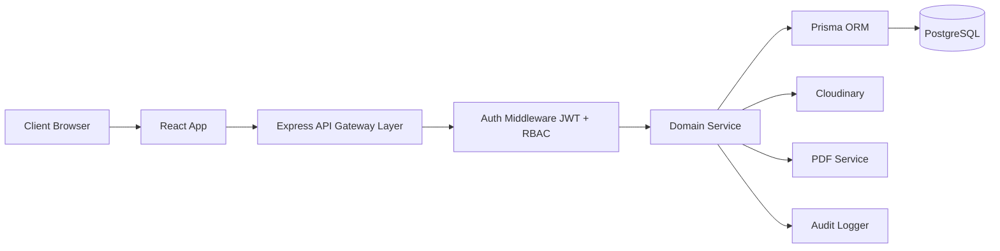

## Domain Boundaries
- Identity & Access
- User/NGO Profile
- Event Lifecycle
- Application Lifecycle
- Attendance & Verification
- Certificate Lifecycle
- Volunteer Passport & Badge Engine
- Notification Services
- Administration & Moderation

## Cross-Cutting Concerns
- Authentication and authorization
- Validation and sanitization
- Error normalization
- Observability (metrics, logs, traces)
- Rate limiting
- Audit logging

## Data Flow and State Integrity
- State transitions are explicit and validated.
- Write operations are transactional when state coupling exists.
- Derived records (Volunteer Passport, badges) are recalculated deterministically.
- Certificate generation bound to verified attendance status.

## Failure Handling Strategy
- Synchronous validation failures return 4xx with structured errors.
- Infrastructure/transient failures return retriable 5xx categories.
- Notification and non-critical async tasks support retries and dead-letter patterns.
- Audit logging failures are surfaced as operational alerts.

## Conclusion
The system design supports rapid delivery while preserving security, maintainability, and production-grade reliability.

## References
- `03_Architecture/HIGH_LEVEL_ARCHITECTURE.md`
- `04_Database/DATABASE_DESIGN.md`
- `11_Security/SECURITY.md`

---

# `03_Architecture/HIGH_LEVEL_ARCHITECTURE.md`

# High-Level Architecture — Volunteer Connect
**Version:** 1.0.0  
**Last Updated:** July 17, 2026

## Revision History

| Version | Date | Author | Change |
|---|---|---|---|
| 1.0.0 | July 17, 2026 | Architecture Team | Initial HLD |

## Introduction
This HLD document defines major platform components and interactions without implementation-level internals.

## HLD Components
1. Web Client (Volunteer/NGO/Admin UI)
2. API Service (Express)
3. Authentication/Authorization Layer
4. Domain Services
5. Relational Database
6. File Storage Service
7. Certificate Generator
8. Notification Dispatcher
9. Admin Moderation and Audit Layer

## HLD Diagram
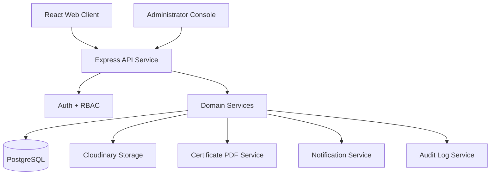

## Interaction Principles
- All client interactions flow through authenticated REST APIs.
- Domain services isolate business logic from controllers.
- Persistence concerns are centralized through Prisma repositories.
- Security and audit policies apply uniformly across modules.

## Availability and Scaling View
- API instances horizontally scalable behind reverse proxy/load balancer.
- Database vertically scalable initially; read optimization through indexing/pagination.
- Static assets served via CDN-backed Cloudinary links where applicable.

## Conclusion
The HLD offers a clean, extensible baseline for staged feature delivery and operational maturity.

## References
- `03_Architecture/LOW_LEVEL_DESIGN.md`
- `10_Deployment/NGINX.md`

---

# `03_Architecture/LOW_LEVEL_DESIGN.md`

# Low-Level Design — Volunteer Connect
**Version:** 1.0.0  
**Last Updated:** July 17, 2026

## Revision History

| Version | Date | Author | Description |
|---|---|---|---|
| 1.0.0 | July 17, 2026 | Backend Architecture Team | Initial LLD structure and service patterns |

## Introduction
This LLD details backend module internals, service layering, and execution paths.

## Backend Layering
1. **Route Layer** — endpoint definitions
2. **Controller Layer** — request parsing and response formatting
3. **Service Layer** — business logic
4. **Repository Layer** — Prisma data access
5. **Infrastructure Layer** — storage/PDF/notification/adapters

## Example Module Flow (Application Decision)
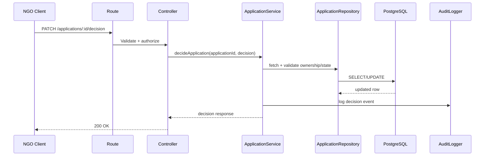

## LLD Design Rules
- No business logic in controllers.
- Services enforce state transition invariants.
- Repositories encapsulate query logic and transaction helpers.
- DTO schemas define validated input/output contracts.

## Error Handling Contract
- `ValidationError` → 400
- `AuthenticationError` → 401
- `AuthorizationError` → 403
- `ConflictError` → 409
- `NotFoundError` → 404
- `InternalError` → 500

## Conclusion
The LLD ensures maintainable module-level implementation aligned with traceable requirement coverage.

## References
- `05_API/API_DOCUMENTATION.md`
- `02_Requirements/FUNCTIONAL_REQUIREMENTS.md`

---

# `03_Architecture/COMPONENT_DIAGRAM.md`

# Component Diagram Specification — Volunteer Connect
**Version:** 1.0.0  
**Last Updated:** July 17, 2026

## Revision History

| Version | Date | Author | Notes |
|---|---|---|---|
| 1.0.0 | July 17, 2026 | Architecture Team | Component-level architectural decomposition |

## Introduction
This document defines deployable and logical components and their interfaces.

## Component Inventory

| Component | Type | Responsibility |
|---|---|---|
| Web App | Frontend | Role-based UI workflows |
| API Service | Backend | REST endpoints and orchestration |
| Auth Component | Backend | Login, token verification, RBAC guard |
| Event Component | Backend | Event lifecycle management |
| Application Component | Backend | Apply/review/decision states |
| Attendance Component | Backend | Attendance marking and constraints |
| Certificate Component | Backend | Eligibility evaluation and PDF issuance |
| Passport Component | Backend | Volunteer Passport aggregation |
| Badge Component | Backend | Badge rule evaluation |
| Admin Component | Backend | Moderation and platform controls |
| Audit Component | Backend | Immutable action/event records |

## Mermaid Component View
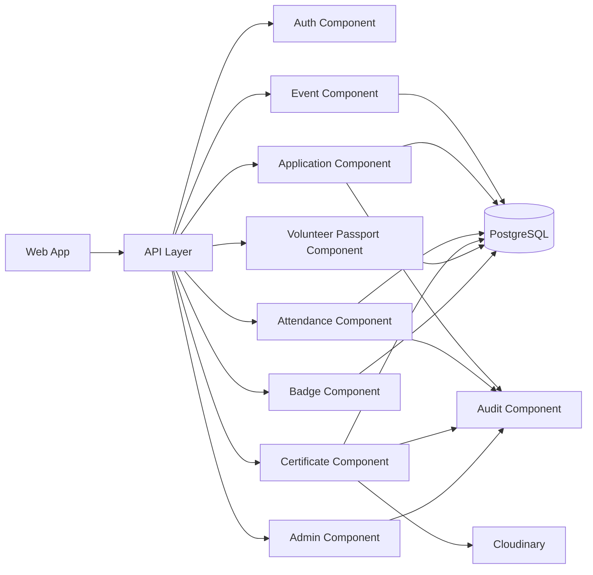

## Interface Contracts
- Component interfaces are implemented as service methods with typed DTO boundaries.
- No cross-component direct DB writes outside designated ownership services.
- Shared utility libraries allowed only for stateless helper functions.

## Conclusion
Component decomposition enforces modularity and supports incremental scaling and testing.

## References
- `03_Architecture/MODULE_DESIGN.md`
- `09_Testing/INTEGRATION_TESTS.md`

---

# `03_Architecture/MICROSERVICES.md`

# Microservices Consideration — Volunteer Connect
**Version:** 1.0.0  
**Last Updated:** July 17, 2026

## Revision History

| Version | Date | Author | Update |
|---|---|---|---|
| 1.0.0 | July 17, 2026 | Architecture Team | Service decomposition strategy and decision rationale |

## Introduction
This document explains microservice readiness and the current architectural decision for Volunteer Connect.

## Current Decision
**Baseline architecture is a modular monolith**, not microservices, to optimize early delivery speed and reduce distributed-system complexity.

## Rationale
- Team size and phase maturity favor cohesive deployment.
- Strong domain separation in code preserves future extraction paths.
- Operational overhead (service mesh, distributed tracing, eventual consistency) deferred to growth phase.

## Future Service Extraction Candidates
1. Notification Service
2. Certificate Generation Service
3. Analytics/Reporting Service
4. Search/Recommendation Service (future roadmap)

## Extraction Criteria
- Sustained load hotspot in isolated domain
- Independent release cadence requirement
- Distinct scaling profile
- Clear bounded context and low coupling

## Migration Pattern (Future)
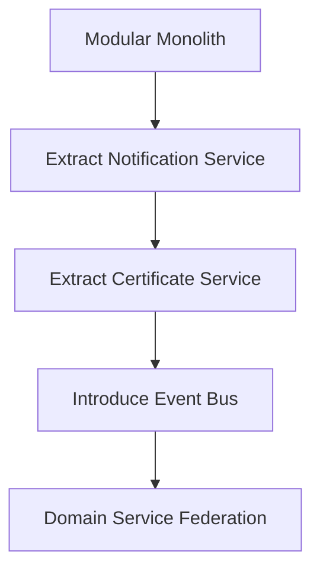

## Risks of Early Microservices
- Increased deployment and debugging complexity
- Distributed transaction challenges
- Higher infrastructure and observability cost

## Conclusion
Volunteer Connect is architected for microservice evolution, but intentionally starts as a modular monolith for controlled, reliable delivery.

## References
- `03_Architecture/HIGH_LEVEL_ARCHITECTURE.md`
- `10_Deployment/KUBERNETES.md`

---

# `03_Architecture/MODULE_DESIGN.md`

# Module Design — Volunteer Connect
**Version:** 1.0.0  
**Last Updated:** July 17, 2026

## Revision History

| Version | Date | Author | Changes |
|---|---|---|---|
| 1.0.0 | July 17, 2026 | Backend Team | Initial module-level contracts |

## Introduction
Defines module boundaries, ownership, inputs/outputs, and dependencies.

## Module Catalog

| Module | Owned Entities | Public Operations |
|---|---|---|
| Auth | UserCredential, Session | register, login, refresh, revoke |
| User | UserProfile | getProfile, updateProfile |
| NGO | NGOProfile | createNGO, verifyNGO, updateNGO |
| Event | Event | createEvent, updateEvent, publishEvent, closeEvent |
| Application | Application | apply, withdraw, review, decide |
| Attendance | Attendance | markAttendance, bulkMark, lockAttendance |
| Certificate | Certificate | generate, getByVolunteer, verify |
| Volunteer Passport | PassportEntry | appendEntry, getTimeline, getSummary |
| Badge | BadgeAward | evaluateBadges, listAwards |
| Notification | Notification | enqueue, dispatch, retry |
| Admin | ModerationAction | listFlags, moderate, auditReview |
| Audit | AuditLog | record, queryByActor, queryByEntity |

## Dependency Rules
- Auth is foundational and can be depended on by all modules.
- Event precedes Application, Attendance, Certificate.
- Attendance is prerequisite to Certificate and Volunteer Passport updates.
- Admin may inspect all modules but modifies via explicit policy endpoints only.

## Module Interaction Diagram
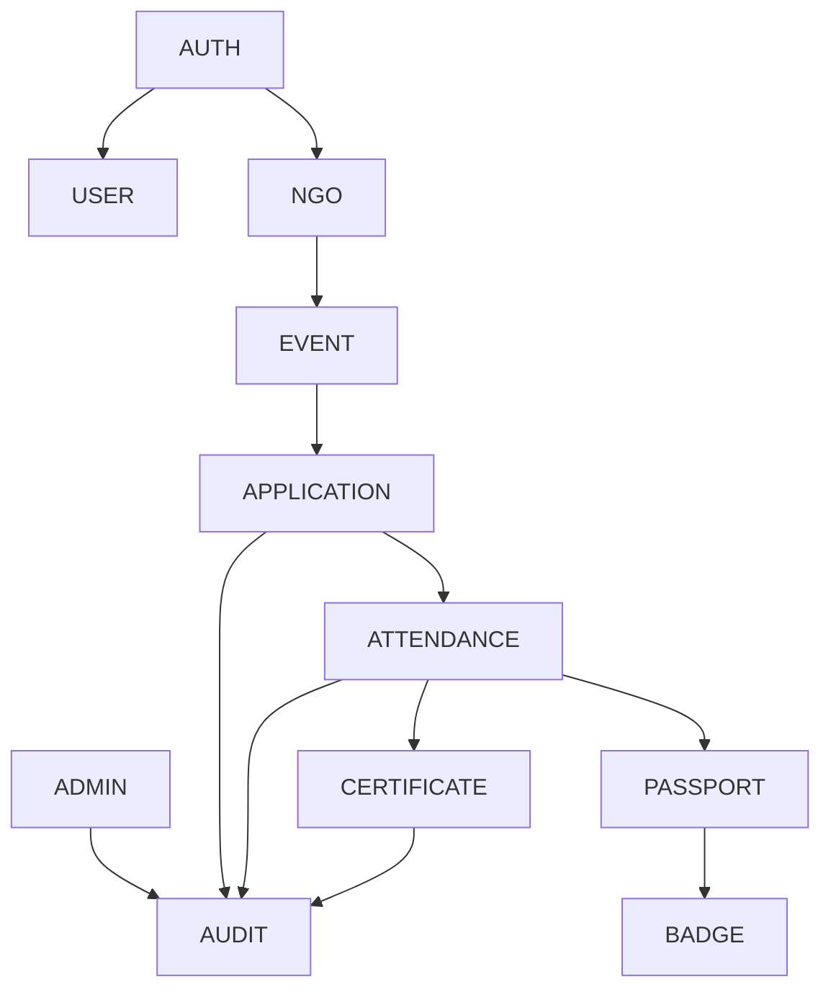

## Conclusion
Module design ensures domain integrity and predictable extension paths without architecture drift.

## References
- `03_Architecture/LOW_LEVEL_DESIGN.md`
- `06_Business/BUSINESS_LOGIC.md`

---

# `03_Architecture/FOLDER_STRUCTURE.md`

# Folder Structure Standard — Volunteer Connect
**Version:** 1.0.0  
**Last Updated:** July 17, 2026

## Revision History

| Version | Date | Author | Notes |
|---|---|---|---|
| 1.0.0 | July 17, 2026 | Engineering Team | Baseline repository structure guidelines |

## Introduction
Defines canonical project structure for maintainability and onboarding consistency.

## Recommended Repository Layout
```text
volunteer-connect/
  client/
    src/
      app/
      components/
      features/
      hooks/
      pages/
      services/
      styles/
      utils/
    public/
  server/
    src/
      config/
      middleware/
      modules/
        auth/
        user/
        ngo/
        event/
        application/
        attendance/
        certificate/
        volunteer-passport/
        badge/
        notification/
        admin/
        audit/
      shared/
      routes/
      app.ts
      server.ts
    prisma/
      schema.prisma
      migrations/
  docs/
    01_Project/
    02_Requirements/
    03_Architecture/
    ...
```

## Backend Module Internal Structure (Example)
```text
modules/event/
  event.routes.ts
  event.controller.ts
  event.service.ts
  event.repository.ts
  event.validators.ts
  event.types.ts
  event.constants.ts
```

## Naming Conventions
- File names: kebab-case or dotted module convention (consistent per layer)
- Types/interfaces: PascalCase
- Variables/functions: camelCase
- Constants/enums: UPPER_SNAKE_CASE where appropriate

## Conclusion
A consistent folder structure reduces cognitive load, streamlines code review, and improves maintainability.

## References
- `12_Project_Management/CODING_GUIDELINES.md`
- `12_Project_Management/GIT_WORKFLOW.md`

---

# `03_Architecture/TECHNOLOGY_STACK.md`

# Technology Stack Decision Record — Volunteer Connect
**Version:** 1.0.0  
**Last Updated:** July 17, 2026

## Revision History

| Version | Date | Author | Description |
|---|---|---|---|
| 1.0.0 | July 17, 2026 | Architecture Council | Initial stack rationale and standards |

## Introduction
This document records selected technologies and architectural justification.

## Stack Summary

| Layer | Technology | Purpose |
|---|---|---|
| Frontend | React | Component-based UI |
| Build Tool | Vite | Fast dev/build pipeline |
| Styling | Tailwind CSS | Utility-first design system |
| Backend | Node.js + Express.js | API and service orchestration |
| Database | PostgreSQL | Relational transactional persistence |
| ORM | Prisma | Type-safe data access and migrations |
| Authentication | JWT + bcrypt | Session token + password security |
| Storage | Cloudinary | Media and certificate asset hosting |
| Mapping (planned integration) | Leaflet + OpenStreetMap | Event location visualization |
| PDF | PDFKit | Certificate generation |
| Testing | Jest / Supertest / UI testing stack | Unit + integration coverage |
| Deployment | Docker / Compose / K8s-ready | Portable runtime |

## Selection Criteria
- Community maturity and ecosystem stability
- Developer productivity
- Security hardening feasibility
- Performance for expected workload
- Deployment portability

## Alternatives Considered
- NestJS for backend framework (rejected: overhead for initial team velocity)
- MongoDB (rejected: relational workflow state and reporting better fit PostgreSQL)
- Firebase Auth (rejected: custom RBAC and lifecycle control required)

## Technology Risk Register

| Risk | Mitigation |
|---|---|
| JWT misuse | short TTL, rotation strategy, secure middleware |
| ORM abstraction misuse | query review and index-aware repository patterns |
| Cloud vendor coupling | adapter pattern and storage abstraction interfaces |

## Conclusion
The chosen stack balances implementation speed, correctness, and long-term maintainability for production growth.

## References
- `01_Project/FEATURES.md`
- `04_Database/DATABASE_SCHEMA.md`
- `10_Deployment/DOCKER.md`

---

Folder Completed:  
**03_Architecture**

Files Generated:
1. `SYSTEM_DESIGN.md`
2. `HIGH_LEVEL_ARCHITECTURE.md`
3. `LOW_LEVEL_DESIGN.md`
4. `COMPONENT_DIAGRAM.md`
5. `MICROSERVICES.md`
6. `MODULE_DESIGN.md`
7. `FOLDER_STRUCTURE.md`
8. `TECHNOLOGY_STACK.md`


Great — proceeding with **`04_Database`**.

---

# `04_Database/DATABASE_DESIGN.md`

# Database Design — Volunteer Connect
**Version:** 1.0.0  
**Last Updated:** July 17, 2026

## Revision History

| Version | Date | Author | Description |
|---|---|---|---|
| 1.0.0 | July 17, 2026 | Database Architecture Team | Initial relational database design baseline |

## Table of Contents
1. Introduction  
2. Design Objectives  
3. Database Platform and Rationale  
4. Logical Data Model Overview  
5. Core Design Principles  
6. Transaction and Consistency Strategy  
7. Security Considerations  
8. Scalability Considerations  
9. Conclusion  
10. References  

## Introduction
This document defines the foundational relational data design for Volunteer Connect, including modeling strategy, data integrity controls, and operational policies.

## Design Objectives
- Preserve integrity across Volunteer, NGO, Event, Application, Attendance, and Certificate lifecycles.
- Enforce business constraints at schema and transaction levels.
- Enable efficient querying for dashboards and role-specific workflows.
- Support auditable and secure data handling.

## Database Platform and Rationale
- **DBMS:** PostgreSQL
- **ORM:** Prisma ORM
- **Reasoning:** ACID transactions, mature indexing support, strong relational constraints, predictable performance for structured workflows.

## Logical Data Model Overview
Primary entities:
- User
- NGOProfile
- Event
- Application
- Attendance
- Certificate
- VolunteerPassportEntry
- BadgeDefinition
- BadgeAward
- Notification
- AuditLog

## Core Design Principles
1. Surrogate primary keys (`UUID`) for all major entities.
2. Foreign key constraints with explicit delete/update behavior.
3. Enumerated workflow states stored as controlled string enums.
4. Soft-delete where historical traceability is required.
5. Timestamp standardization (`createdAt`, `updatedAt`, optional `deletedAt`).

## Transaction and Consistency Strategy
- Application decision and attendance update workflows use transactional boundaries.
- Certificate generation writes metadata atomically with status updates where required.
- Derived artifacts (Volunteer Passport summary) are recomputed deterministically from source records.

## Security Considerations
- Minimal PII storage.
- Hash-only password storage via bcrypt (never plaintext).
- Restrict direct table access to service account roles.
- Audit trail for sensitive updates.

## Scalability Considerations
- Indexed filtering on date, status, role, and ownership keys.
- Cursor/offset pagination support for list-heavy queries.
- Ready for read replica strategy in growth phase.

## Conclusion
The database design supports correctness-first workflow execution and provides strong foundations for scale, analytics, and compliance.

## References
- `04_Database/DATABASE_SCHEMA.md`
- `04_Database/INDEXING.md`
- `02_Requirements/FUNCTIONAL_REQUIREMENTS.md`

---

# `04_Database/ER_DIAGRAM.md`

# Entity Relationship Diagram — Volunteer Connect
**Version:** 1.0.0  
**Last Updated:** July 17, 2026

## Revision History

| Version | Date | Author | Notes |
|---|---|---|---|
| 1.0.0 | July 17, 2026 | Data Modeling Team | Initial ER model in Mermaid |

## Introduction
This document provides the canonical ER representation of core platform entities and relationships.

## ER Diagram (Mermaid)
```mermaid
erDiagram
  USER ||--o| NGO_PROFILE : "owns"
  USER ||--o{ APPLICATION : "submits"
  USER ||--o{ ATTENDANCE : "has"
  USER ||--o{ CERTIFICATE : "receives"
  USER ||--o{ VOLUNTEER_PASSPORT_ENTRY : "accumulates"
  USER ||--o{ BADGE_AWARD : "earns"
  USER ||--o{ NOTIFICATION : "receives"
  USER ||--o{ AUDIT_LOG : "acts_in"

  NGO_PROFILE ||--o{ EVENT : "publishes"
  EVENT ||--o{ APPLICATION : "accepts"
  EVENT ||--o{ ATTENDANCE : "tracks"
  EVENT ||--o{ CERTIFICATE : "issues_for"

  APPLICATION ||--o| ATTENDANCE : "qualifies_for"

  BADGE_DEFINITION ||--o{ BADGE_AWARD : "grants"

  USER {
    uuid id PK
    string full_name
    string email UNIQUE
    string password_hash
    string role
    boolean is_active
    timestamp created_at
    timestamp updated_at
  }

  NGO_PROFILE {
    uuid id PK
    uuid user_id FK
    string ngo_name
    string verification_status
    text description
    timestamp created_at
    timestamp updated_at
  }

  EVENT {
    uuid id PK
    uuid ngo_profile_id FK
    string title
    text description
    string location_text
    decimal latitude
    decimal longitude
    int capacity
    timestamp start_at
    timestamp end_at
    string status
    timestamp created_at
    timestamp updated_at
  }

  APPLICATION {
    uuid id PK
    uuid event_id FK
    uuid volunteer_user_id FK
    string status
    text motivation
    timestamp submitted_at
    timestamp decided_at
  }

  ATTENDANCE {
    uuid id PK
    uuid event_id FK
    uuid volunteer_user_id FK
    uuid application_id FK
    string status
    uuid marked_by_user_id FK
    timestamp marked_at
  }

  CERTIFICATE {
    uuid id PK
    uuid event_id FK
    uuid volunteer_user_id FK
    string certificate_no UNIQUE
    string file_url
    string verification_code UNIQUE
    timestamp issued_at
  }

  VOLUNTEER_PASSPORT_ENTRY {
    uuid id PK
    uuid volunteer_user_id FK
    uuid event_id FK
    uuid attendance_id FK
    int hours_contributed
    timestamp created_at
  }

  BADGE_DEFINITION {
    uuid id PK
    string code UNIQUE
    string name
    int threshold_points
  }

  BADGE_AWARD {
    uuid id PK
    uuid volunteer_user_id FK
    uuid badge_definition_id FK
    timestamp awarded_at
  }

  NOTIFICATION {
    uuid id PK
    uuid user_id FK
    string type
    string channel
    string status
    json payload
    timestamp created_at
  }

  AUDIT_LOG {
    uuid id PK
    uuid actor_user_id FK
    string action
    string entity_type
    uuid entity_id
    json metadata
    timestamp created_at
  }
```

## Relationship Notes
- A User may have exactly one NGOProfile if role = NGO.
- Application enforces uniqueness per (event, volunteer) active lifecycle.
- Certificate issuance depends on attendance eligibility.

## Conclusion
This ER model is the authoritative relationship view for implementation and migration planning.

## References
- `04_Database/RELATIONSHIPS.md`
- `04_Database/TABLE_DESIGN.md`

---

# `04_Database/DATABASE_SCHEMA.md`

# Database Schema Specification — Volunteer Connect
**Version:** 1.0.0  
**Last Updated:** July 17, 2026

## Revision History

| Version | Date | Author | Change |
|---|---|---|---|
| 1.0.0 | July 17, 2026 | Database Team | Initial schema specification |

## Introduction
This document defines canonical schema objects and key constraints.

## Schema Namespaces
- Default application schema: `public`
- Optional separation for analytics/audit in later phases.

## Core Tables
- `users`
- `ngo_profiles`
- `events`
- `applications`
- `attendances`
- `certificates`
- `volunteer_passport_entries`
- `badge_definitions`
- `badge_awards`
- `notifications`
- `audit_logs`

## Enum Domains (application-managed)
- User role: `VOLUNTEER`, `NGO`, `ADMIN`
- Event status: `DRAFT`, `PUBLISHED`, `CLOSED`, `COMPLETED`, `CANCELLED`
- Application status: `SUBMITTED`, `SHORTLISTED`, `APPROVED`, `REJECTED`, `WITHDRAWN`
- Attendance status: `PENDING`, `PRESENT`, `ABSENT`, `EXCUSED`
- Notification status: `QUEUED`, `SENT`, `FAILED`

## Canonical Constraints
1. `users.email` unique not null.
2. `ngo_profiles.user_id` unique FK to users.
3. `events.capacity > 0`.
4. `events.end_at > events.start_at`.
5. Unique certificate identifiers.
6. Unique badge award pair `(volunteer_user_id, badge_definition_id)`.

## Example Prisma-style Fragment
```prisma
model User {
  id           String   @id @default(uuid())
  fullName     String
  email        String   @unique
  passwordHash String
  role         UserRole
  isActive     Boolean  @default(true)
  createdAt    DateTime @default(now())
  updatedAt    DateTime @updatedAt
}
```

## Conclusion
The schema specification anchors persistence consistency and supports contract-first API design.

## References
- `04_Database/TABLE_DESIGN.md`
- `05_API/API_DOCUMENTATION.md`

---

# `04_Database/TABLE_DESIGN.md`

# Table Design Specification — Volunteer Connect
**Version:** 1.0.0  
**Last Updated:** July 17, 2026

## Revision History

| Version | Date | Author | Notes |
|---|---|---|---|
| 1.0.0 | July 17, 2026 | Data Engineering Team | Initial table-level design |

## Introduction
This document defines each table with purpose, columns, constraints, indexes, and sample records.

---

## Table: `users`
**Purpose:** Store authenticated user identities.

| Column | Type | Constraints |
|---|---|---|
| id | UUID | PK |
| full_name | VARCHAR(120) | NOT NULL |
| email | VARCHAR(190) | NOT NULL, UNIQUE |
| password_hash | VARCHAR(255) | NOT NULL |
| role | VARCHAR(20) | NOT NULL |
| is_active | BOOLEAN | NOT NULL DEFAULT true |
| created_at | TIMESTAMP | NOT NULL DEFAULT now() |
| updated_at | TIMESTAMP | NOT NULL |

**Indexes:** unique(email), idx_users_role  
**Relationships:** 1:N with applications, attendances, certificates, notifications, audit_logs  
**Sample Record:**
```json
{
  "id": "7e4c84f0-9ba8-4ce9-8a8d-7087d62d2b70",
  "full_name": "Aarav Patel",
  "email": "aarav.patel@example.org",
  "role": "VOLUNTEER",
  "is_active": true
}
```

---

## Table: `ngo_profiles`
**Purpose:** Store NGO-specific organization profile data.

| Column | Type | Constraints |
|---|---|---|
| id | UUID | PK |
| user_id | UUID | NOT NULL, FK users(id), UNIQUE |
| ngo_name | VARCHAR(160) | NOT NULL |
| verification_status | VARCHAR(30) | NOT NULL |
| description | TEXT | NULL |
| created_at | TIMESTAMP | NOT NULL |
| updated_at | TIMESTAMP | NOT NULL |

**Indexes:** idx_ngo_profiles_verification_status  
**Relationships:** 1:N with events

---

## Table: `events`
**Purpose:** Event lifecycle and discovery metadata.

| Column | Type | Constraints |
|---|---|---|
| id | UUID | PK |
| ngo_profile_id | UUID | NOT NULL, FK ngo_profiles(id) |
| title | VARCHAR(180) | NOT NULL |
| description | TEXT | NOT NULL |
| location_text | VARCHAR(255) | NOT NULL |
| latitude | DECIMAL(10,7) | NULL |
| longitude | DECIMAL(10,7) | NULL |
| capacity | INT | CHECK (capacity > 0) |
| start_at | TIMESTAMP | NOT NULL |
| end_at | TIMESTAMP | NOT NULL, CHECK (end_at > start_at) |
| status | VARCHAR(20) | NOT NULL |
| created_at | TIMESTAMP | NOT NULL |
| updated_at | TIMESTAMP | NOT NULL |

**Indexes:** idx_events_status, idx_events_start_at, idx_events_ngo_profile_id

---

## Table: `applications`
**Purpose:** Volunteer requests to join events.

| Column | Type | Constraints |
|---|---|---|
| id | UUID | PK |
| event_id | UUID | NOT NULL, FK events(id) |
| volunteer_user_id | UUID | NOT NULL, FK users(id) |
| status | VARCHAR(20) | NOT NULL |
| motivation | TEXT | NULL |
| submitted_at | TIMESTAMP | NOT NULL |
| decided_at | TIMESTAMP | NULL |

**Indexes:** idx_applications_event_id, idx_applications_volunteer_user_id, idx_applications_status  
**Uniqueness Strategy:** unique active app per (event_id, volunteer_user_id) via partial unique index.

---

## Table: `attendances`
**Purpose:** Verified participation records.

| Column | Type | Constraints |
|---|---|---|
| id | UUID | PK |
| event_id | UUID | NOT NULL, FK events(id) |
| volunteer_user_id | UUID | NOT NULL, FK users(id) |
| application_id | UUID | NOT NULL, FK applications(id), UNIQUE |
| status | VARCHAR(20) | NOT NULL |
| marked_by_user_id | UUID | NOT NULL, FK users(id) |
| marked_at | TIMESTAMP | NOT NULL |

**Indexes:** idx_attendances_event_id, idx_attendances_status

---

## Table: `certificates`
**Purpose:** Participation certificates and verification metadata.

| Column | Type | Constraints |
|---|---|---|
| id | UUID | PK |
| event_id | UUID | NOT NULL, FK events(id) |
| volunteer_user_id | UUID | NOT NULL, FK users(id) |
| certificate_no | VARCHAR(80) | NOT NULL, UNIQUE |
| verification_code | VARCHAR(120) | NOT NULL, UNIQUE |
| file_url | TEXT | NOT NULL |
| issued_at | TIMESTAMP | NOT NULL |

**Indexes:** idx_certificates_volunteer_user_id, idx_certificates_event_id

---

## Table: `volunteer_passport_entries`
**Purpose:** Structured contribution history per volunteer.

| Column | Type | Constraints |
|---|---|---|
| id | UUID | PK |
| volunteer_user_id | UUID | NOT NULL, FK users(id) |
| event_id | UUID | NOT NULL, FK events(id) |
| attendance_id | UUID | NOT NULL, FK attendances(id), UNIQUE |
| hours_contributed | INT | CHECK (hours_contributed >= 0) |
| created_at | TIMESTAMP | NOT NULL |

**Indexes:** idx_vp_entries_volunteer_user_id, idx_vp_entries_created_at

---

## Table: `badge_definitions`
**Purpose:** Badge rule catalog.

| Column | Type | Constraints |
|---|---|---|
| id | UUID | PK |
| code | VARCHAR(40) | NOT NULL, UNIQUE |
| name | VARCHAR(120) | NOT NULL |
| threshold_points | INT | NOT NULL |

---

## Table: `badge_awards`
**Purpose:** Awarded badges to volunteers.

| Column | Type | Constraints |
|---|---|---|
| id | UUID | PK |
| volunteer_user_id | UUID | NOT NULL, FK users(id) |
| badge_definition_id | UUID | NOT NULL, FK badge_definitions(id) |
| awarded_at | TIMESTAMP | NOT NULL |

**Indexes:** unique(volunteer_user_id, badge_definition_id)

---

## Table: `notifications`
**Purpose:** Delivery-tracked user notifications.

| Column | Type | Constraints |
|---|---|---|
| id | UUID | PK |
| user_id | UUID | NOT NULL, FK users(id) |
| type | VARCHAR(60) | NOT NULL |
| channel | VARCHAR(30) | NOT NULL |
| status | VARCHAR(20) | NOT NULL |
| payload | JSONB | NOT NULL |
| created_at | TIMESTAMP | NOT NULL |

---

## Table: `audit_logs`
**Purpose:** Immutable trace of sensitive actions.

| Column | Type | Constraints |
|---|---|---|
| id | UUID | PK |
| actor_user_id | UUID | NOT NULL, FK users(id) |
| action | VARCHAR(80) | NOT NULL |
| entity_type | VARCHAR(80) | NOT NULL |
| entity_id | UUID | NOT NULL |
| metadata | JSONB | NULL |
| created_at | TIMESTAMP | NOT NULL |

**Indexes:** idx_audit_actor, idx_audit_entity, idx_audit_created_at

## Conclusion
The table design enables robust lifecycle tracking and policy enforcement with strong relational guarantees.

## References
- `04_Database/RELATIONSHIPS.md`
- `04_Database/INDEXING.md`

---

# `04_Database/RELATIONSHIPS.md`

# Relationship Rules — Volunteer Connect Database
**Version:** 1.0.0  
**Last Updated:** July 17, 2026

## Revision History

| Version | Date | Author | Change |
|---|---|---|---|
| 1.0.0 | July 17, 2026 | Data Modeling Team | Initial relationship and cardinality rules |

## Introduction
Defines relational cardinalities, ownership semantics, and cascade/restrict behavior.

## Cardinality Matrix

| Parent | Child | Cardinality | Notes |
|---|---|---|---|
| users | ngo_profiles | 1:0..1 | NGO role only |
| ngo_profiles | events | 1:N | NGO owns events |
| events | applications | 1:N | Volunteers apply to events |
| events | attendances | 1:N | Attendance per approved participant |
| applications | attendances | 1:0..1 | Attendance tied to application |
| users | applications | 1:N | Volunteer submissions |
| users | certificates | 1:N | Issued credentials |
| events | certificates | 1:N | Event-specific issuance |
| users | volunteer_passport_entries | 1:N | Historical records |
| badge_definitions | badge_awards | 1:N | Rule to award mapping |

## Referential Actions Policy
- Core transactional entities use `ON DELETE RESTRICT` to preserve auditability.
- Optional/derived entities may use `ON DELETE CASCADE` only where history is non-critical.
- Soft-delete preferred for user-facing records to preserve traceability.

## Integrity Rules
1. Attendance requires existing application and matching volunteer/event identity.
2. Certificate requires eligible attendance status.
3. Volunteer Passport entry requires attendance record link.
4. Badge award requires valid badge definition and volunteer identity.

## Conclusion
Relationship constraints formalize business truth and reduce logic leakage into application code.

## References
- `04_Database/ER_DIAGRAM.md`
- `06_Business/VALIDATION_RULES.md`

---

# `04_Database/INDEXING.md`

# Indexing Strategy — Volunteer Connect
**Version:** 1.0.0  
**Last Updated:** July 17, 2026

## Revision History

| Version | Date | Author | Notes |
|---|---|---|---|
| 1.0.0 | July 17, 2026 | Performance Engineering Team | Initial indexing plan |

## Introduction
This document specifies index strategy for high-frequency reads, workflow lookups, and dashboard performance.

## Index Design Principles
- Index columns used in WHERE/JOIN/ORDER BY patterns.
- Favor selective, narrow indexes.
- Use composite indexes for frequent multi-column filters.
- Periodically validate with `EXPLAIN ANALYZE`.

## Proposed Indexes

| Table | Index | Type | Purpose |
|---|---|---|---|
| users | uq_users_email | UNIQUE | login lookup |
| users | idx_users_role | BTREE | role-based admin filtering |
| events | idx_events_status_start | BTREE(status, start_at) | published event listing |
| events | idx_events_ngo_status | BTREE(ngo_profile_id, status) | NGO dashboard |
| applications | idx_apps_event_status | BTREE(event_id, status) | applicant management |
| applications | idx_apps_volunteer_submitted | BTREE(volunteer_user_id, submitted_at DESC) | volunteer history |
| applications | uq_apps_active_pair | PARTIAL UNIQUE | prevent duplicate active app |
| attendances | idx_att_event_status | BTREE(event_id, status) | attendance panel |
| certificates | uq_cert_no | UNIQUE | certificate retrieval |
| certificates | uq_cert_verification_code | UNIQUE | verification lookups |
| audit_logs | idx_audit_entity_created | BTREE(entity_type, entity_id, created_at DESC) | investigations |

## Partial Unique Example
```sql
CREATE UNIQUE INDEX uq_apps_active_pair
ON applications(event_id, volunteer_user_id)
WHERE status IN ('SUBMITTED','SHORTLISTED','APPROVED');
```

## Maintenance Guidance
- Reindex high-churn tables during low-traffic windows if needed.
- Review dead tuples and VACUUM/autovacuum tuning.
- Drop unused indexes after query evidence confirms redundancy.

## Conclusion
This indexing plan supports low-latency workflows and scalable list/filter operations.

## References
- `09_Testing/PERFORMANCE_TESTS.md`
- `04_Database/TABLE_DESIGN.md`

---

# `04_Database/DATA_DICTIONARY.md`

# Data Dictionary — Volunteer Connect
**Version:** 1.0.0  
**Last Updated:** July 17, 2026

## Revision History

| Version | Date | Author | Description |
|---|---|---|---|
| 1.0.0 | July 17, 2026 | Data Governance Team | Initial business data dictionary |

## Introduction
Defines business meaning, allowed values, and data stewardship rules for key fields.

## Dictionary Entries (Selected Core Fields)

| Field | Entity | Type | Meaning | Allowed Values / Rule |
|---|---|---|---|---|
| role | users | string | User access classification | VOLUNTEER, NGO, ADMIN |
| verification_status | ngo_profiles | string | NGO profile trust stage | PENDING, VERIFIED, REJECTED |
| status | events | string | Event lifecycle state | DRAFT, PUBLISHED, CLOSED, COMPLETED, CANCELLED |
| status | applications | string | Application lifecycle state | SUBMITTED, SHORTLISTED, APPROVED, REJECTED, WITHDRAWN |
| status | attendances | string | Participation result | PENDING, PRESENT, ABSENT, EXCUSED |
| certificate_no | certificates | string | Human-readable certificate ID | Unique per certificate |
| verification_code | certificates | string | Verification lookup key | Unique, non-guessable |
| threshold_points | badge_definitions | int | Required points for badge | >= 0 |
| action | audit_logs | string | Audited operation name | controlled operation catalog |

## Data Stewardship
- Product + Engineering jointly own lifecycle fields.
- Security team governs audit and sensitive fields.
- Data changes must be migration-traceable.

## Data Quality Rules
- No null for critical identifiers and workflow states.
- Enumerated fields constrained by service-level validation + schema policy.
- UTC timestamps only for consistency.

## Conclusion
The data dictionary ensures semantic consistency between business logic, API contracts, and storage schema.

## References
- `06_Business/BUSINESS_LOGIC.md`
- `05_API/ERROR_CODES.md`

---

# `04_Database/MIGRATIONS.md`

# Database Migrations Strategy — Volunteer Connect
**Version:** 1.0.0  
**Last Updated:** July 17, 2026

## Revision History

| Version | Date | Author | Notes |
|---|---|---|---|
| 1.0.0 | July 17, 2026 | Platform Engineering | Initial migration lifecycle policy |

## Introduction
Defines migration standards for schema evolution using Prisma and controlled release workflows.

## Migration Principles
1. All schema changes are version-controlled.
2. Forward-only migrations preferred for auditability.
3. Destructive operations require backup and approval gate.
4. Migration scripts must be deterministic and idempotency-aware.

## Migration Workflow
1. Update schema model.
2. Generate migration.
3. Review SQL diff.
4. Apply on local/dev environment.
5. Run automated tests.
6. Apply on staging with data snapshot.
7. Promote to production during maintenance window (if needed).

## Example Commands
```bash
npx prisma migrate dev --name add_attendance_lock_policy
npx prisma migrate deploy
npx prisma generate
```

## Rollback Strategy
- Preferred: forward-fix migration.
- Emergency rollback: restore from backup + point-in-time recovery.
- Document recovery steps in deployment runbook.

## Migration Validation Checklist
- FK constraints valid
- Index creation verified
- Query plans acceptable
- API compatibility confirmed
- Monitoring enabled post-deploy

## Conclusion
Controlled migrations protect data integrity while enabling iterative delivery.

## References
- `10_Deployment/CI_CD.md`
- `04_Database/BACKUP_RECOVERY.md`

---

# `04_Database/BACKUP_RECOVERY.md`

# Backup and Recovery Plan — Volunteer Connect Database
**Version:** 1.0.0  
**Last Updated:** July 17, 2026

## Revision History

| Version | Date | Author | Change |
|---|---|---|---|
| 1.0.0 | July 17, 2026 | DevOps + DBA Team | Initial backup/recovery baseline |

## Table of Contents
1. Introduction  
2. Backup Objectives  
3. Backup Types and Schedule  
4. Retention Policy  
5. Recovery Objectives (RPO/RTO)  
6. Recovery Procedures  
7. Validation and Drills  
8. Security of Backups  
9. Conclusion  
10. References  

## Introduction
This document defines operational safeguards for database continuity and incident recovery.

## Backup Objectives
- Prevent irreversible data loss.
- Support fast recovery from corruption, accidental deletion, or infrastructure failure.
- Preserve audit-critical records.

## Backup Types and Schedule

| Backup Type | Frequency | Scope | Storage |
|---|---|---|---|
| Full Backup | Daily | Entire database | Encrypted object storage |
| Incremental/WAL Archive | Every 5–15 min | Transaction logs | Encrypted archive |
| Snapshot (optional) | Before major migrations | Full instance snapshot | Cloud snapshot service |

## Retention Policy

| Category | Retention |
|---|---|
| Daily full backups | 30 days |
| Weekly backup copies | 12 weeks |
| Monthly backups | 12 months |
| WAL archives | 14 days minimum |

## Recovery Objectives
- **RPO (Recovery Point Objective):** <= 15 minutes  
- **RTO (Recovery Time Objective):** <= 2 hours

## Recovery Procedures (High-Level)
1. Declare incident and freeze write traffic.
2. Restore latest valid full backup.
3. Replay WAL up to recovery target.
4. Validate integrity and service health.
5. Re-enable traffic in phased manner.
6. Publish post-incident report.

## Validation and Drills
- Quarterly recovery drills required.
- Backup restore verification in non-production environment.
- Document actual RPO/RTO achievement per drill.

## Security of Backups
- Encryption at rest and in transit.
- Access restricted to least-privilege ops roles.
- Backup access events logged and reviewed.

## Conclusion
A disciplined backup and recovery process is mandatory for production reliability and trust.

## References
- `10_Deployment/MONITORING.md`
- `11_Security/DATA_PRIVACY.md`
- `11_Security/AUDIT_LOGS.md`

---

Folder Completed:  
**04_Database**

Files Generated:
1. `DATABASE_DESIGN.md`
2. `ER_DIAGRAM.md`
3. `DATABASE_SCHEMA.md`
4. `TABLE_DESIGN.md`
5. `RELATIONSHIPS.md`
6. `INDEXING.md`
7. `DATA_DICTIONARY.md`
8. `MIGRATIONS.md`
9. `BACKUP_RECOVERY.md`


Excellent. Proceeding with **`05_API`**.

---

# `05_API/API_DOCUMENTATION.md`

# API Documentation — Volunteer Connect
**Version:** 1.0.0  
**Last Updated:** July 17, 2026

## Revision History

| Version | Date | Author | Description |
|---|---|---|---|
| 1.0.0 | July 17, 2026 | Backend/API Team | Initial REST API master specification |

## Table of Contents
1. Introduction  
2. API Standards  
3. Authentication Model  
4. Common Request/Response Conventions  
5. Pagination, Filtering, Sorting  
6. Idempotency and Concurrency  
7. API Versioning  
8. Service Health Endpoints  
9. Conclusion  
10. References  

## Introduction
This is the master API contract for Volunteer Connect. Domain-specific endpoint details are separated into module files in this folder.

## API Standards
- Base URL (example): `/api/v1`
- Protocol: HTTPS only
- Content Type: `application/json`
- File upload: `multipart/form-data` where required
- Date-time: ISO 8601 UTC

## Authentication Model
- JWT bearer token for protected endpoints.
- Header format:
```http
Authorization: Bearer <access_token>
```
- Roles:
  - `VOLUNTEER`
  - `NGO`
  - `ADMIN`

## Common Response Envelope
```json
{
  "success": true,
  "message": "Operation successful",
  "data": {},
  "meta": {}
}
```

## Common Error Envelope
```json
{
  "success": false,
  "error": {
    "code": "VALIDATION_ERROR",
    "message": "Invalid request payload",
    "details": []
  }
}
```

## Pagination, Filtering, Sorting
- Query params:
  - `page`, `limit`
  - `sortBy`, `sortOrder`
  - domain filters (status/date/location/etc.)
- Pagination metadata:
```json
{
  "meta": {
    "page": 1,
    "limit": 20,
    "total": 132,
    "pages": 7
  }
}
```

## Idempotency and Concurrency
- POST endpoints may accept `Idempotency-Key` for client retry safety.
- State transitions validated server-side to prevent invalid updates.

## API Versioning
- URI versioning (`/api/v1/...`)
- Breaking changes require incremented major version and migration notes.

## Service Health Endpoints

### GET `/api/v1/health`
- **Auth:** None
- **Description:** liveness check
- **Success:** `200 OK`

### GET `/api/v1/ready`
- **Auth:** None
- **Description:** readiness probe (db dependency check)
- **Success:** `200 OK` / `503 Service Unavailable`

## Conclusion
This document defines global API behavior; module-specific contracts follow in dedicated files.

## References
- `05_API/ERROR_CODES.md`
- `11_Security/AUTHENTICATION.md`

---

# `05_API/AUTH_API.md`

# Authentication API — Volunteer Connect
**Version:** 1.0.0  
**Last Updated:** July 17, 2026

## Revision History

| Version | Date | Author | Notes |
|---|---|---|---|
| 1.0.0 | July 17, 2026 | Auth Team | Initial auth endpoint contracts |

## Endpoints

## 1) Register
- **Method:** POST  
- **Route:** `/api/v1/auth/register`
- **Description:** Register Volunteer or NGO account
- **Authentication:** None

### Request Body
```json
{
  "fullName": "Aarav Patel",
  "email": "aarav@example.org",
  "password": "StrongPassword@123",
  "role": "VOLUNTEER"
}
```

### Success Response (`201`)
```json
{
  "success": true,
  "message": "User registered successfully",
  "data": {
    "userId": "uuid",
    "role": "VOLUNTEER"
  }
}
```

### Error Responses
- `400` validation error
- `409` email already exists

---

## 2) Login
- **Method:** POST  
- **Route:** `/api/v1/auth/login`
- **Description:** Authenticate and issue token
- **Authentication:** None

### Request Body
```json
{
  "email": "aarav@example.org",
  "password": "StrongPassword@123"
}
```

### Success Response (`200`)
```json
{
  "success": true,
  "data": {
    "accessToken": "jwt-token",
    "expiresIn": 3600,
    "user": {
      "id": "uuid",
      "role": "VOLUNTEER"
    }
  }
}
```

### Error Responses
- `401` invalid credentials
- `423` account locked/inactive

---

## 3) Refresh Token (if enabled)
- **Method:** POST  
- **Route:** `/api/v1/auth/refresh`
- **Authentication:** Refresh token policy dependent

### Success Response (`200`)
```json
{
  "success": true,
  "data": {
    "accessToken": "new-jwt-token"
  }
}
```

---

## 4) Logout
- **Method:** POST  
- **Route:** `/api/v1/auth/logout`
- **Authentication:** Bearer token
- **Description:** Revoke session/blacklist token (implementation policy)

### Success Response (`200`)
```json
{
  "success": true,
  "message": "Logged out successfully"
}
```

## Security Notes
- bcrypt password hashing
- Rate limiting required on auth routes
- Generic login failure message to reduce account enumeration risk

## References
- `11_Security/JWT.md`
- `11_Security/PASSWORD_POLICY.md`

---

# `05_API/USER_API.md`

# User API — Volunteer Connect
**Version:** 1.0.0  
**Last Updated:** July 17, 2026

## Endpoints

## 1) Get My Profile
- **Method:** GET  
- **Route:** `/api/v1/users/me`
- **Authentication:** VOLUNTEER/NGO/ADMIN

### Success (`200`)
```json
{
  "success": true,
  "data": {
    "id": "uuid",
    "fullName": "Aarav Patel",
    "email": "aarav@example.org",
    "role": "VOLUNTEER"
  }
}
```

## 2) Update My Profile
- **Method:** PATCH  
- **Route:** `/api/v1/users/me`
- **Authentication:** VOLUNTEER/NGO/ADMIN

### Request Body
```json
{
  "fullName": "Aarav P.",
  "phone": "+1-555-123-4567",
  "bio": "Community volunteer"
}
```

### Success (`200`)
```json
{
  "success": true,
  "message": "Profile updated",
  "data": {}
}
```

## 3) List Users (Admin)
- **Method:** GET  
- **Route:** `/api/v1/users`
- **Authentication:** ADMIN
- **Query:** `role`, `isActive`, `page`, `limit`

## Errors
- `403` unauthorized role
- `404` user not found
- `422` invalid field formats

## References
- `06_Business/ROLE_PERMISSIONS.md`

---

# `05_API/NGO_API.md`

# NGO API — Volunteer Connect
**Version:** 1.0.0  
**Last Updated:** July 17, 2026

## Endpoints

## 1) Create/Update NGO Profile
- **Method:** POST/PATCH  
- **Route:** `/api/v1/ngos/me`
- **Auth:** NGO

### Request Body
```json
{
  "ngoName": "Helping Hands Foundation",
  "description": "Focused on education and health outreach",
  "website": "https://example.org"
}
```

## 2) Get NGO Profile
- **Method:** GET  
- **Route:** `/api/v1/ngos/me`
- **Auth:** NGO

## 3) NGO Public Profile
- **Method:** GET  
- **Route:** `/api/v1/ngos/:ngoId`
- **Auth:** Public/Authenticated (policy-based)

## 4) NGO Verification Status (Admin/NGO)
- **Method:** GET  
- **Route:** `/api/v1/ngos/:ngoId/verification`
- **Auth:** NGO owner or ADMIN

## 5) Update Verification (Admin)
- **Method:** PATCH  
- **Route:** `/api/v1/ngos/:ngoId/verification`
- **Auth:** ADMIN

### Request Body
```json
{
  "verificationStatus": "VERIFIED",
  "remarks": "Documents validated"
}
```

## References
- `02_Requirements/BUSINESS_REQUIREMENTS.md`

---

# `05_API/EVENTS_API.md`

# Events API — Volunteer Connect
**Version:** 1.0.0  
**Last Updated:** July 17, 2026

## Endpoints

## 1) Create Event
- **Method:** POST  
- **Route:** `/api/v1/events`
- **Auth:** NGO

### Request Body
```json
{
  "title": "Beach Cleanup Drive",
  "description": "Community shoreline cleanup event",
  "locationText": "Santa Monica Beach",
  "capacity": 100,
  "startAt": "2026-08-01T08:00:00Z",
  "endAt": "2026-08-01T12:00:00Z",
  "status": "DRAFT"
}
```

### Success (`201`)
```json
{
  "success": true,
  "data": { "eventId": "uuid" }
}
```

## 2) Update Event
- **Method:** PATCH  
- **Route:** `/api/v1/events/:eventId`
- **Auth:** NGO owner

## 3) Publish Event
- **Method:** PATCH  
- **Route:** `/api/v1/events/:eventId/publish`
- **Auth:** NGO owner

## 4) List Events (Discover)
- **Method:** GET  
- **Route:** `/api/v1/events`
- **Auth:** Public/Authenticated
- **Query:** `status`, `location`, `dateFrom`, `dateTo`, `page`, `limit`

## 5) Get Event Details
- **Method:** GET  
- **Route:** `/api/v1/events/:eventId`

## 6) Close/Complete Event
- **Method:** PATCH  
- **Route:** `/api/v1/events/:eventId/status`
- **Auth:** NGO owner / ADMIN (policy override)

## Common Errors
- `404` event not found
- `403` ownership mismatch
- `409` invalid state transition

## References
- `06_Business/WORKFLOWS.md`

---

# `05_API/APPLICATION_API.md`

# Application API — Volunteer Connect
**Version:** 1.0.0  
**Last Updated:** July 17, 2026

## Endpoints

## 1) Apply to Event
- **Method:** POST  
- **Route:** `/api/v1/events/:eventId/applications`
- **Auth:** VOLUNTEER

### Request Body
```json
{
  "motivation": "I have prior waste management volunteer experience."
}
```

### Success (`201`)
```json
{
  "success": true,
  "data": { "applicationId": "uuid", "status": "SUBMITTED" }
}
```

## 2) Withdraw Application
- **Method:** PATCH  
- **Route:** `/api/v1/applications/:applicationId/withdraw`
- **Auth:** VOLUNTEER owner

## 3) List My Applications
- **Method:** GET  
- **Route:** `/api/v1/applications/me`
- **Auth:** VOLUNTEER

## 4) List Event Applications
- **Method:** GET  
- **Route:** `/api/v1/events/:eventId/applications`
- **Auth:** NGO owner / ADMIN

## 5) Decide Application
- **Method:** PATCH  
- **Route:** `/api/v1/applications/:applicationId/decision`
- **Auth:** NGO owner / ADMIN

### Request Body
```json
{
  "decision": "APPROVED",
  "remarks": "Selected based on prior experience"
}
```

## Error Responses
- `409` duplicate active application
- `422` decision not permitted in current state

## References
- `02_Requirements/FUNCTIONAL_REQUIREMENTS.md` (FR-005, FR-006)

---

# `05_API/CERTIFICATE_API.md`

# Certificate API — Volunteer Connect
**Version:** 1.0.0  
**Last Updated:** July 17, 2026

## Endpoints

## 1) Generate Certificate
- **Method:** POST  
- **Route:** `/api/v1/certificates/generate`
- **Auth:** NGO owner / SYSTEM job / ADMIN
- **Description:** Generate certificate for eligible attendance

### Request Body
```json
{
  "eventId": "uuid",
  "volunteerUserId": "uuid"
}
```

## 2) List My Certificates
- **Method:** GET  
- **Route:** `/api/v1/certificates/me`
- **Auth:** VOLUNTEER

## 3) Download Certificate
- **Method:** GET  
- **Route:** `/api/v1/certificates/:certificateId/download`
- **Auth:** VOLUNTEER owner / NGO owner / ADMIN

## 4) Verify Certificate
- **Method:** GET  
- **Route:** `/api/v1/certificates/verify/:verificationCode`
- **Auth:** Public/Authenticated (policy-based)

### Success (`200`)
```json
{
  "success": true,
  "data": {
    "valid": true,
    "certificateNo": "VC-2026-000123",
    "volunteerName": "Aarav Patel",
    "eventTitle": "Beach Cleanup Drive",
    "issuedAt": "2026-08-02T10:00:00Z"
  }
}
```

## Errors
- `404` certificate not found
- `409` eligibility not satisfied

---

# `05_API/ATTENDANCE_API.md`

# Attendance API — Volunteer Connect
**Version:** 1.0.0  
**Last Updated:** July 17, 2026

## Endpoints

## 1) Mark Attendance (Single)
- **Method:** POST  
- **Route:** `/api/v1/events/:eventId/attendance`
- **Auth:** NGO owner / ADMIN

### Request Body
```json
{
  "volunteerUserId": "uuid",
  "applicationId": "uuid",
  "status": "PRESENT"
}
```

## 2) Bulk Attendance Update
- **Method:** POST  
- **Route:** `/api/v1/events/:eventId/attendance/bulk`
- **Auth:** NGO owner / ADMIN

### Request Body
```json
{
  "records": [
    { "volunteerUserId": "uuid1", "applicationId": "uuidA", "status": "PRESENT" },
    { "volunteerUserId": "uuid2", "applicationId": "uuidB", "status": "ABSENT" }
  ]
}
```

## 3) Get Event Attendance
- **Method:** GET  
- **Route:** `/api/v1/events/:eventId/attendance`
- **Auth:** NGO owner / ADMIN

## 4) Get My Attendance
- **Method:** GET  
- **Route:** `/api/v1/attendance/me`
- **Auth:** VOLUNTEER

## Error Responses
- `422` invalid status
- `409` attendance lock window exceeded
- `403` unauthorized event ownership

---

# `05_API/REVIEW_API.md`

# Review API — Volunteer Connect
**Version:** 1.0.0  
**Last Updated:** July 17, 2026

## Endpoints

## 1) Submit Review
- **Method:** POST  
- **Route:** `/api/v1/reviews`
- **Auth:** VOLUNTEER or NGO (policy-based)
- **Description:** Submit review after completed interaction/event

### Request Body
```json
{
  "eventId": "uuid",
  "targetType": "NGO",
  "targetId": "uuid",
  "rating": 5,
  "comment": "Well organized and impactful event."
}
```

## 2) List Reviews by Event
- **Method:** GET  
- **Route:** `/api/v1/events/:eventId/reviews`
- **Auth:** Public/Authenticated

## 3) List Reviews for NGO
- **Method:** GET  
- **Route:** `/api/v1/ngos/:ngoId/reviews`

## 4) Moderate Review
- **Method:** PATCH  
- **Route:** `/api/v1/reviews/:reviewId/moderate`
- **Auth:** ADMIN

### Request Body
```json
{
  "action": "HIDE",
  "reason": "Policy violation"
}
```

## Errors
- `403` review action not permitted
- `422` rating out of bounds (expected 1–5)

---

# `05_API/NOTIFICATION_API.md`

# Notification API — Volunteer Connect
**Version:** 1.0.0  
**Last Updated:** July 17, 2026

## Endpoints

## 1) List My Notifications
- **Method:** GET  
- **Route:** `/api/v1/notifications/me`
- **Auth:** Any authenticated user

## 2) Mark Notification as Read
- **Method:** PATCH  
- **Route:** `/api/v1/notifications/:notificationId/read`
- **Auth:** Notification owner

## 3) Mark All as Read
- **Method:** PATCH  
- **Route:** `/api/v1/notifications/me/read-all`
- **Auth:** Any authenticated user

## 4) Dispatch Notification (Internal/Admin)
- **Method:** POST  
- **Route:** `/api/v1/notifications/dispatch`
- **Auth:** ADMIN/SYSTEM

### Request Body
```json
{
  "userId": "uuid",
  "type": "APPLICATION_DECISION",
  "channel": "IN_APP",
  "payload": {
    "applicationId": "uuid",
    "status": "APPROVED"
  }
}
```

## Errors
- `404` user/notification not found
- `429` rate-limited dispatch attempts

---

# `05_API/ADMIN_API.md`

# Administrator API — Volunteer Connect
**Version:** 1.0.0  
**Last Updated:** July 17, 2026

## Endpoints

## 1) Dashboard Summary
- **Method:** GET  
- **Route:** `/api/v1/admin/dashboard`
- **Auth:** ADMIN

## 2) List Flagged Entities
- **Method:** GET  
- **Route:** `/api/v1/admin/flags`
- **Auth:** ADMIN
- **Query:** `entityType`, `status`, `page`, `limit`

## 3) Moderate User
- **Method:** PATCH  
- **Route:** `/api/v1/admin/users/:userId/moderate`
- **Auth:** ADMIN

### Request Body
```json
{
  "action": "SUSPEND",
  "reason": "Repeated policy violations"
}
```

## 4) Moderate Event
- **Method:** PATCH  
- **Route:** `/api/v1/admin/events/:eventId/moderate`
- **Auth:** ADMIN

## 5) Audit Log Query
- **Method:** GET  
- **Route:** `/api/v1/admin/audit-logs`
- **Auth:** ADMIN
- **Query:** `actorUserId`, `entityType`, `dateFrom`, `dateTo`, `page`, `limit`

## 6) System Configuration (Controlled)
- **Method:** PATCH  
- **Route:** `/api/v1/admin/config`
- **Auth:** ADMIN (restricted by policy)

## Errors
- `403` forbidden for non-admin
- `422` invalid moderation action

---

# `05_API/ERROR_CODES.md`

# API Error Codes — Volunteer Connect
**Version:** 1.0.0  
**Last Updated:** July 17, 2026

## Revision History

| Version | Date | Author | Notes |
|---|---|---|---|
| 1.0.0 | July 17, 2026 | API Governance Team | Initial standardized error catalog |

## Standard Error Contract
```json
{
  "success": false,
  "error": {
    "code": "ERROR_CODE",
    "message": "Human-readable message",
    "details": []
  }
}
```

## Error Code Catalog

| HTTP | Code | Meaning |
|---|---|---|
| 400 | VALIDATION_ERROR | Input payload/query failed validation |
| 401 | AUTHENTICATION_REQUIRED | Missing/invalid auth token |
| 401 | INVALID_CREDENTIALS | Login credentials invalid |
| 403 | AUTHORIZATION_DENIED | Role/ownership does not permit action |
| 404 | RESOURCE_NOT_FOUND | Requested entity does not exist |
| 409 | CONFLICT_STATE | Invalid state transition or duplicate rule violation |
| 409 | DUPLICATE_APPLICATION | Active application already exists |
| 422 | BUSINESS_RULE_VIOLATION | Domain rule failed |
| 429 | RATE_LIMIT_EXCEEDED | Too many requests |
| 500 | INTERNAL_SERVER_ERROR | Unhandled server error |
| 503 | SERVICE_UNAVAILABLE | Dependency unavailable/maintenance |

## Example
```json
{
  "success": false,
  "error": {
    "code": "CONFLICT_STATE",
    "message": "Cannot approve a withdrawn application",
    "details": [
      { "field": "status", "value": "WITHDRAWN" }
    ]
  }
}
```

## Logging Guidance
- Include correlation ID per request.
- Never expose internal stack traces to clients.
- Security-sensitive errors should use generic outward messages.

## References
- `11_Security/SECURITY.md`
- `03_Architecture/LOW_LEVEL_DESIGN.md`

---

Folder Completed:  
**05_API**

Files Generated:
1. `API_DOCUMENTATION.md`
2. `AUTH_API.md`
3. `USER_API.md`
4. `NGO_API.md`
5. `EVENTS_API.md`
6. `APPLICATION_API.md`
7. `CERTIFICATE_API.md`
8. `ATTENDANCE_API.md`
9. `REVIEW_API.md`
10. `NOTIFICATION_API.md`
11. `ADMIN_API.md`
12. `ERROR_CODES.md`


Proceeding with **`06_Business`**.

---

# `06_Business/BUSINESS_LOGIC.md`

# Business Logic Specification — Volunteer Connect
**Version:** 1.0.0  
**Last Updated:** July 17, 2026

## Revision History

| Version | Date | Author | Description |
|---|---|---|---|
| 1.0.0 | July 17, 2026 | Business Architecture Team | Initial business logic baseline |

## Table of Contents
1. Introduction  
2. Domain Logic Principles  
3. Core Business Rules  
4. State Transition Rules  
5. Rule Enforcement Layers  
6. Exception Handling Rules  
7. Conclusion  
8. References  

## Introduction
This document formalizes domain logic that governs Volunteer Connect workflows and ensures consistent behavior across UI, API, and data layers.

## Domain Logic Principles
1. **Single source of truth:** Final rule enforcement at service layer.
2. **State-safe transitions:** Invalid lifecycle jumps are rejected.
3. **Ownership-bound operations:** Users can only act on authorized resources.
4. **Auditability:** Critical actions are trace-logged.
5. **Deterministic outcomes:** Badge and certificate logic must be reproducible.

## Core Business Rules

| Rule ID | Rule | Applies To |
|---|---|---|
| BL-001 | One active application per volunteer-event pair | Application |
| BL-002 | NGO can manage only own events and related applications | Event/Application |
| BL-003 | Attendance can be marked only for approved volunteers | Attendance |
| BL-004 | Certificate generation requires eligible attendance status | Certificate |
| BL-005 | Volunteer Passport entry cannot duplicate an attendance record | Volunteer Passport |
| BL-006 | Badge is awarded once per badge definition per volunteer | Badge |
| BL-007 | Admin moderation must include action reason | Administration |
| BL-008 | Sensitive actions require audit log entry | All critical domains |

## State Transition Rules

### Event
- DRAFT → PUBLISHED
- PUBLISHED → CLOSED / CANCELLED
- CLOSED → COMPLETED
- Invalid: COMPLETED → PUBLISHED

### Application
- SUBMITTED → SHORTLISTED / APPROVED / REJECTED / WITHDRAWN
- SHORTLISTED → APPROVED / REJECTED / WITHDRAWN
- APPROVED → WITHDRAWN (only before policy cutoff)
- Invalid: REJECTED → APPROVED

### Attendance
- PENDING → PRESENT / ABSENT / EXCUSED
- Invalid: PRESENT → PENDING (after lock)

## Rule Enforcement Layers
- **API layer:** structural validation
- **Service layer:** business invariant checks
- **DB layer:** integrity constraints and unique indexes

## Exception Handling Rules
- Business violations return `422 BUSINESS_RULE_VIOLATION`.
- Invalid transitions return `409 CONFLICT_STATE`.
- Unauthorized ownership actions return `403 AUTHORIZATION_DENIED`.

## Conclusion
Business logic definitions in this document are binding for all implementations and tests.

## References
- `02_Requirements/BUSINESS_REQUIREMENTS.md`
- `05_API/ERROR_CODES.md`
- `09_Testing/TEST_CASES.md`

---

# `06_Business/WORKFLOWS.md`

# Workflow Specification — Volunteer Connect
**Version:** 1.0.0  
**Last Updated:** July 17, 2026

## Revision History

| Version | Date | Author | Notes |
|---|---|---|---|
| 1.0.0 | July 17, 2026 | Business Analysis + Product | Initial workflow definitions |

## Introduction
Defines end-to-end user and system workflows for core platform operations.

## Workflow 1: Volunteer Application Lifecycle
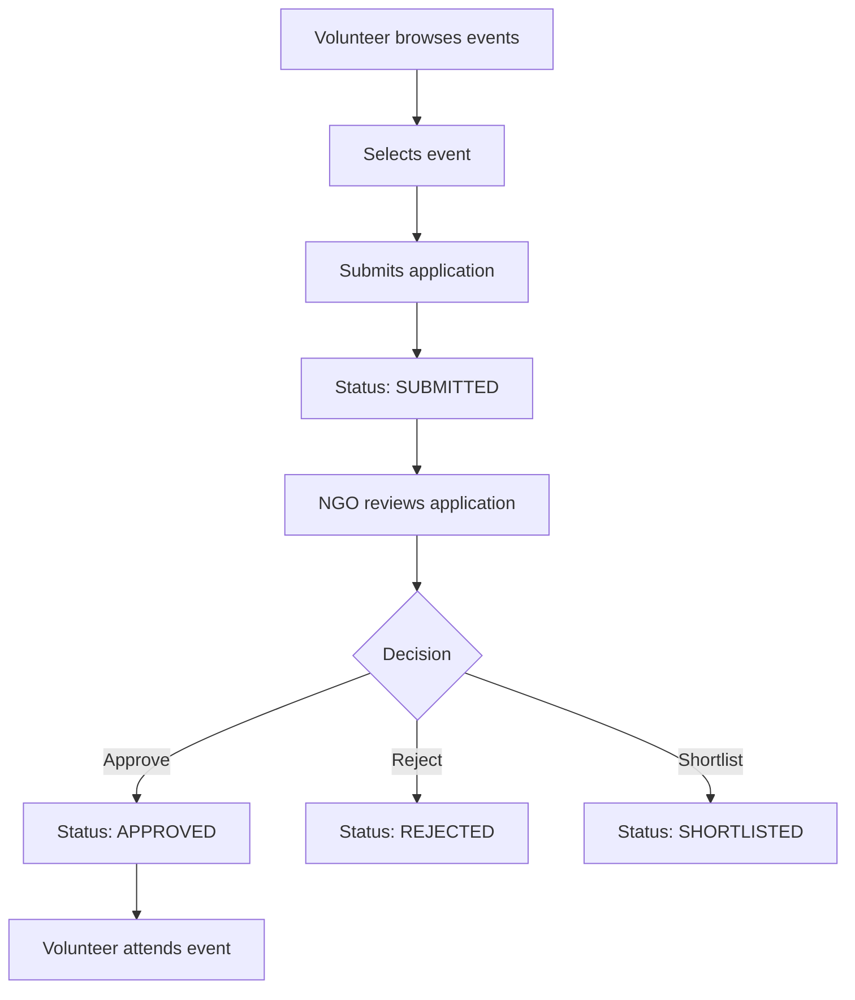

## Workflow 2: Attendance and Certificate Lifecycle
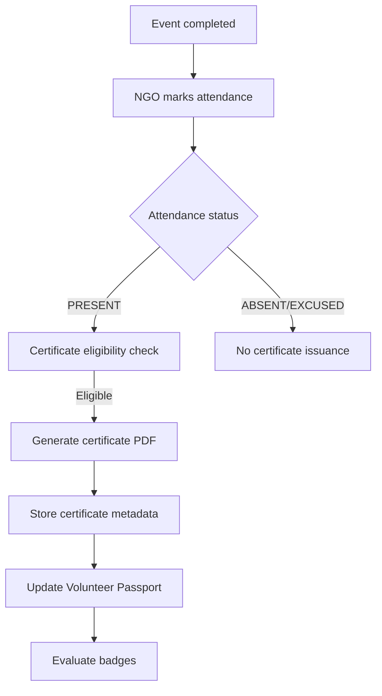

## Workflow 3: Admin Moderation
1. Admin reviews flagged user/event/review.
2. Admin inspects context and audit history.
3. Admin applies moderation action with reason.
4. System persists action and logs audit entry.
5. Impacted user receives notification.

## Workflow 4: Badge Progression
1. System calculates contribution metrics post-passport update.
2. Badge thresholds evaluated against definitions.
3. New qualifying badges assigned.
4. Duplicate awards blocked by unique constraint.

## Conclusion
These workflows are authoritative behavioral blueprints for engineering, QA, and operations.

## References
- `07_Diagrams/FLOWCHARTS.md`
- `02_Requirements/FUNCTIONAL_REQUIREMENTS.md`

---

# `06_Business/VALIDATION_RULES.md`

# Validation Rules — Volunteer Connect
**Version:** 1.0.0  
**Last Updated:** July 17, 2026

## Revision History

| Version | Date | Author | Description |
|---|---|---|---|
| 1.0.0 | July 17, 2026 | Backend + QA Team | Initial validation rulebook |

## Introduction
Defines validation constraints for request payloads, query parameters, and domain invariants.

## Input Validation Rules

### User
- `email`: required, valid format, unique.
- `password`: must satisfy password policy.
- `role`: must be one of VOLUNTEER, NGO, ADMIN (admin creation restricted).

### Event
- `title`: required, min 5 chars, max 180 chars.
- `capacity`: integer > 0.
- `startAt`, `endAt`: ISO date-time; `endAt > startAt`.
- `status`: allowed states only.

### Application
- One active application per volunteer-event.
- Submission only when event status = PUBLISHED and deadline not crossed.

### Attendance
- Allowed statuses: PENDING, PRESENT, ABSENT, EXCUSED.
- Attendance creation requires approved application.

### Certificate
- Requires attendance status PRESENT.
- Certificate number and verification code must be unique.

## Query Validation Rules
- `page >= 1`, `limit` within safe max (e.g., <= 100).
- Date range query must have `dateFrom <= dateTo`.
- Sort fields must be whitelisted.

## Security Validation Rules
- Reject unexpected fields (strict schema mode).
- Sanitize user-generated text to mitigate injection/XSS payloads.
- Validate ownership and role authorization before mutation actions.

## Conclusion
Validation rules guarantee data quality, security, and predictable state behavior.

## References
- `11_Security/OWASP.md`
- `05_API/ERROR_CODES.md`

---

# `06_Business/ROLE_PERMISSIONS.md`

# Role Permissions Matrix — Volunteer Connect
**Version:** 1.0.0  
**Last Updated:** July 17, 2026

## Revision History

| Version | Date | Author | Notes |
|---|---|---|---|
| 1.0.0 | July 17, 2026 | Security + Product Team | Initial RBAC permissions matrix |

## Introduction
Defines what each role can read/create/update/delete/moderate across platform entities.

## Permission Matrix

| Capability | Volunteer | NGO | Administrator |
|---|---|---|---|
| Register/Login | Yes | Yes | Yes |
| View published events | Yes | Yes | Yes |
| Create event | No | Yes | No* |
| Update own event | No | Yes | Yes (override) |
| Apply to event | Yes | No | No |
| Decide applications | No | Yes (own event) | Yes |
| Mark attendance | No | Yes (own event) | Yes |
| Generate certificate | No | Yes (eligible, own event) | Yes |
| View own certificates | Yes | No | Yes |
| View Volunteer Passport (own) | Yes | No | Yes |
| Moderate users/events/reviews | No | No | Yes |
| Access audit logs | No | No | Yes |

\* Administrator may create/manage system events only if policy enables.

## Enforcement Strategy
- JWT claim includes role.
- Middleware checks role + ownership.
- Service layer re-validates permission for sensitive actions.
- Audit logs capture privileged actions.

## Conclusion
This matrix is the authoritative RBAC contract for backend enforcement and QA authorization tests.

## References
- `11_Security/AUTHORIZATION.md`
- `05_API/ADMIN_API.md`

---

# `06_Business/CERTIFICATE_GENERATION.md`

# Certificate Generation Lifecycle — Volunteer Connect
**Version:** 1.0.0  
**Last Updated:** July 17, 2026

## Revision History

| Version | Date | Author | Description |
|---|---|---|---|
| 1.0.0 | July 17, 2026 | Certificate Service Team | Initial lifecycle and business controls |

## Introduction
Defines policy, generation steps, data model dependencies, and failure recovery for certificates.

## Eligibility Rules
1. Event must be in valid completion stage.
2. Volunteer must have attendance marked `PRESENT`.
3. Duplicate certificate issuance prohibited per volunteer-event record.
4. NGO ownership or admin privilege required for generation trigger.

## Lifecycle Steps


## Certificate Data Elements
- Certificate Number
- Verification Code
- Volunteer Name
- Event Name
- NGO Name
- Issue Timestamp
- File URL
- Signature metadata (optional phase extension)

## Failure Handling
- PDF render failure → retry.
- Storage upload failure → retry and mark as failed pending.
- DB persistence failure → rollback and alert.
- Idempotent generation key prevents duplicates on retried calls.

## Verification Flow
Public or authenticated endpoint validates:
- existence of verification code
- certificate status and issuance metadata
- optional anti-tamper signature check (future enhancement)

## Conclusion
Certificate generation is a trust-critical workflow requiring deterministic eligibility checks and robust failure handling.

## References
- `05_API/CERTIFICATE_API.md`
- `04_Database/TABLE_DESIGN.md`

---

# `06_Business/VOLUNTEER_PASSPORT.md`

# Volunteer Passport Specification — Volunteer Connect
**Version:** 1.0.0  
**Last Updated:** July 17, 2026

## Revision History

| Version | Date | Author | Notes |
|---|---|---|---|
| 1.0.0 | July 17, 2026 | Product + Data Team | Initial Volunteer Passport model |

## Introduction
Volunteer Passport is the canonical longitudinal record of volunteer activity and outcomes.

## Purpose
- Provide trusted participation history.
- Enable recognition logic (badges, milestones).
- Improve volunteer profile credibility for future opportunities.

## Entry Creation Rules
- Generated from verified attendance records.
- One passport entry per valid attendance record.
- Includes references to event and contribution metrics.

## Passport Fields
- Volunteer ID
- Event ID
- Attendance ID
- Contribution hours
- Event completion date
- Certificate reference (if issued)

## Passport Update Flow
1. Attendance finalized.
2. Eligibility check for passport entry.
3. Entry inserted.
4. Summary metrics recalculated.
5. Badge engine triggered.

## Summary Metrics
- Total events attended
- Total verified hours
- Certificates earned
- Recent activity streak (optional)

## Volunteer View Requirements
- Chronological timeline
- Filter by date/event type
- Link to certificate where available

## Conclusion
Volunteer Passport is the foundational trust and retention artifact in Volunteer Connect.

## References
- `06_Business/BADGE_SYSTEM.md`
- `05_API/CERTIFICATE_API.md`

---

# `06_Business/BADGE_SYSTEM.md`

# Badge System Specification — Volunteer Connect
**Version:** 1.0.0  
**Last Updated:** July 17, 2026

## Revision History

| Version | Date | Author | Description |
|---|---|---|---|
| 1.0.0 | July 17, 2026 | Gamification + Product Team | Initial badge framework |

## Introduction
Defines badge taxonomy, award rules, and issuance safeguards.

## Badge Objectives
- Reinforce volunteer retention
- Recognize consistent impact
- Provide progression milestones

## Badge Categories (Baseline)

| Badge Code | Badge Name | Criteria |
|---|---|---|
| FIRST_STEP | First Contribution | First verified event attendance |
| FIVE_EVENTS | Community Contributor | 5 verified events |
| TEN_EVENTS | Impact Builder | 10 verified events |
| HUNDRED_HOURS | Time Champion | 100 verified hours |
| CONSISTENT_3M | Consistency Star | Activity in 3 consecutive months |

## Award Rules
1. Badge conditions evaluated post-passport update.
2. Volunteer receives a badge once per badge code.
3. Award event is logged and optionally notified.
4. Manual badge overrides require admin authorization and reason.

## Award Flow
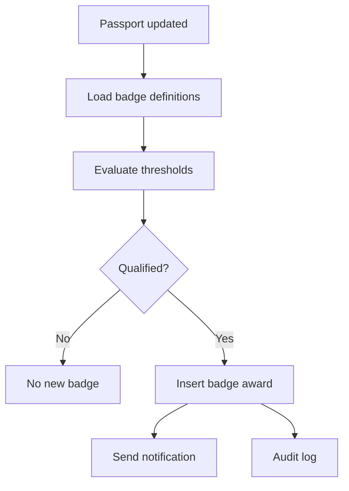

## Abuse Prevention
- Badge assignment derived from verified records only.
- Duplicate award blocked by DB unique index.
- Manual awards require admin audit trail.

## Conclusion
The badge engine creates meaningful, transparent progression while preserving data integrity.

## References
- `04_Database/TABLE_DESIGN.md`
- `06_Business/VOLUNTEER_PASSPORT.md`

---

# `06_Business/LEADERBOARD.md`

# Leaderboard Specification — Volunteer Connect
**Version:** 1.0.0  
**Last Updated:** July 17, 2026

## Revision History

| Version | Date | Author | Notes |
|---|---|---|---|
| 1.0.0 | July 17, 2026 | Product Analytics Team | Initial leaderboard policy |

## Introduction
Leaderboard provides comparative visibility of volunteer engagement metrics while maintaining fairness and privacy controls.

## Ranking Dimensions
- Verified hours contributed
- Number of completed events
- Certificates earned
- Optional composite score (configurable)

## Leaderboard Scope
- Global leaderboard
- Time-bound leaderboard (monthly/quarterly)
- Category-specific leaderboard (future extension)

## Ranking Rules
1. Only verified participation contributes to ranking.
2. Ties resolved by most recent verified contribution timestamp.
3. Suspended users excluded from public leaderboard.
4. Admin can reprocess rankings after moderation actions.

## Example Composite Score
```text
score = (events_attended * 10) + (hours_contributed * 1) + (certificates_earned * 5)
```

## Privacy and Display Rules
- Display name may be masked based on user preference policy.
- Sensitive profile fields never exposed in ranking output.
- Opt-out policy may be supported in future phase.

## Data Refresh Policy
- Batch recomputation daily for baseline.
- On-demand refresh for admin review (rate-limited).

## Conclusion
Leaderboard motivates participation while preserving trust, fairness, and governance controls.

## References
- `06_Business/BUSINESS_LOGIC.md`
- `11_Security/DATA_PRIVACY.md`

---

Folder Completed:  
**06_Business**

Files Generated:
1. `BUSINESS_LOGIC.md`
2. `WORKFLOWS.md`
3. `VALIDATION_RULES.md`
4. `ROLE_PERMISSIONS.md`
5. `CERTIFICATE_GENERATION.md`
6. `VOLUNTEER_PASSPORT.md`
7. `BADGE_SYSTEM.md`
8. `LEADERBOARD.md`


Proceeding with **`07_Diagrams`**.

---

# `07_Diagrams/FLOWCHARTS.md`

# Flowcharts — Volunteer Connect
**Version:** 1.0.0  
**Last Updated:** July 17, 2026

## Revision History

| Version | Date | Author | Description |
|---|---|---|---|
| 1.0.0 | July 17, 2026 | Architecture + BA Team | Initial process flowcharts |

## Introduction
This document contains high-value operational flowcharts for key system workflows.

## 1) Registration and Login
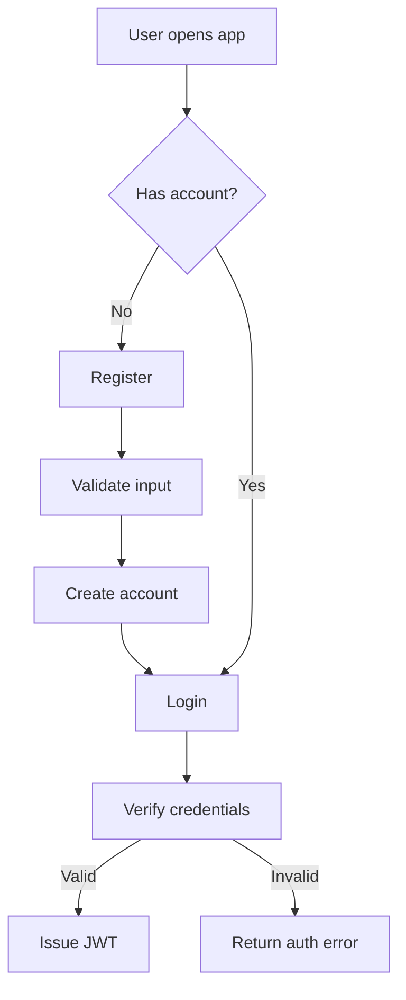

## 2) Event Publishing (NGO)
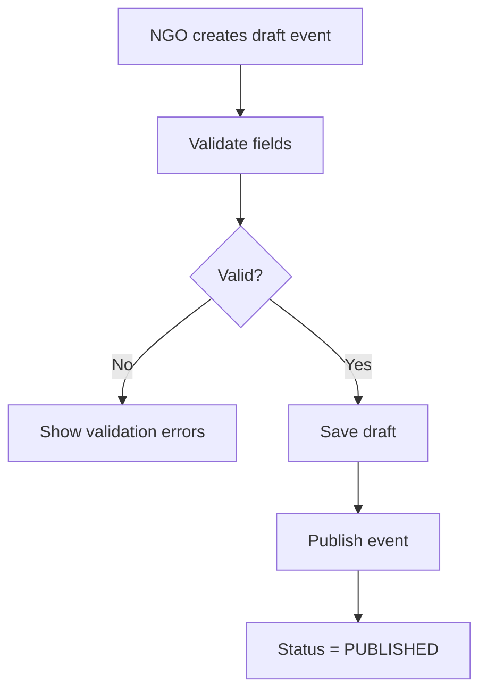

## 3) Application Decision Workflow
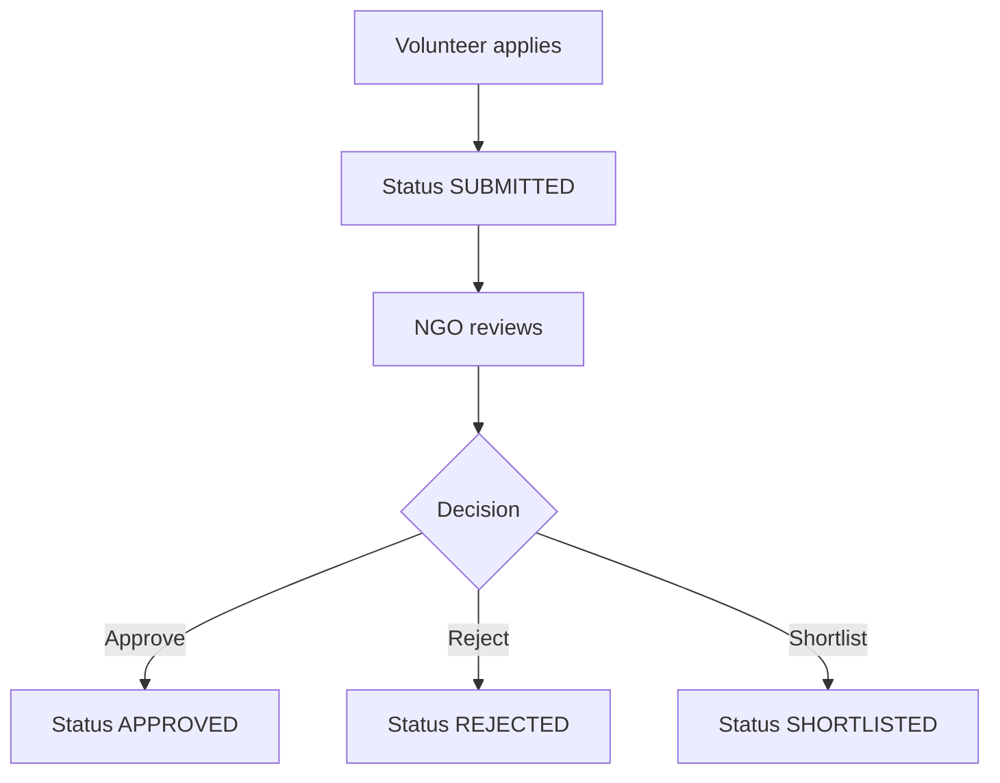

## 4) Attendance to Certificate
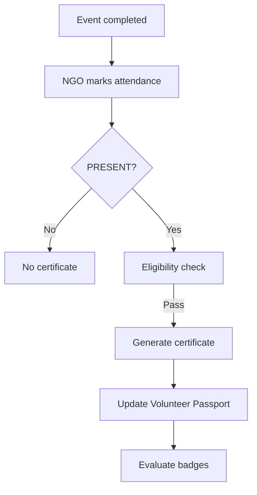

## Conclusion
These flowcharts provide implementation and QA references for core lifecycle paths.

## References
- `06_Business/WORKFLOWS.md`
- `02_Requirements/FUNCTIONAL_REQUIREMENTS.md`

---

# `07_Diagrams/USE_CASES.md`

# Use Cases — Volunteer Connect
**Version:** 1.0.0  
**Last Updated:** July 17, 2026

## Revision History

| Version | Date | Author | Change |
|---|---|---|---|
| 1.0.0 | July 17, 2026 | BA Team | Initial use case catalog |

## Introduction
This document defines principal functional use cases by actor.

## Actor List
- Volunteer
- NGO
- Administrator
- System (background jobs)

## Use Case Catalog

| UC ID | Use Case | Primary Actor | Outcome |
|---|---|---|---|
| UC-001 | Register Account | Volunteer/NGO | New account created |
| UC-002 | Login | Any role | Authenticated session |
| UC-003 | Create Event | NGO | Event drafted/published |
| UC-004 | Apply to Event | Volunteer | Application submitted |
| UC-005 | Decide Application | NGO | Approved/rejected status |
| UC-006 | Mark Attendance | NGO | Attendance recorded |
| UC-007 | Generate Certificate | System/NGO | Certificate issued |
| UC-008 | View Volunteer Passport | Volunteer | Historical timeline displayed |
| UC-009 | Moderate Platform Entity | Administrator | Policy action enforced |

## Detailed Example — UC-004 Apply to Event
- **Preconditions:** Volunteer authenticated, event published.
- **Main Flow:** Open event → submit application → validation → status SUBMITTED.
- **Alternative:** Duplicate active application → conflict error.
- **Postconditions:** Application record created.
- **Acceptance:** one active application per event-volunteer.

## Conclusion
Use cases define actor-driven behavior for UI design, API design, and testing.

## References
- `07_Diagrams/USE_CASE_DIAGRAM.md`
- `09_Testing/TEST_CASES.md`

---

# `07_Diagrams/USE_CASE_DIAGRAM.md`

# Use Case Diagram — Volunteer Connect
**Version:** 1.0.0  
**Last Updated:** July 17, 2026

## Revision History

| Version | Date | Author | Notes |
|---|---|---|---|
| 1.0.0 | July 17, 2026 | BA + Architecture Team | Initial Mermaid use case representation |

## Introduction
Visual actor-to-capability mapping for system boundary understanding.

## Diagram
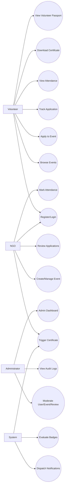

## Conclusion
The use case diagram clarifies role responsibilities and system capabilities at a glance.

## References
- `06_Business/ROLE_PERMISSIONS.md`

---

# `07_Diagrams/CLASS_DIAGRAM.md`

# Class Diagram — Volunteer Connect
**Version:** 1.0.0  
**Last Updated:** July 17, 2026

## Revision History

| Version | Date | Author | Description |
|---|---|---|---|
| 1.0.0 | July 17, 2026 | Architecture Team | Initial domain class structure |

## Introduction
Represents core domain models and associations for implementation alignment.

## Diagram
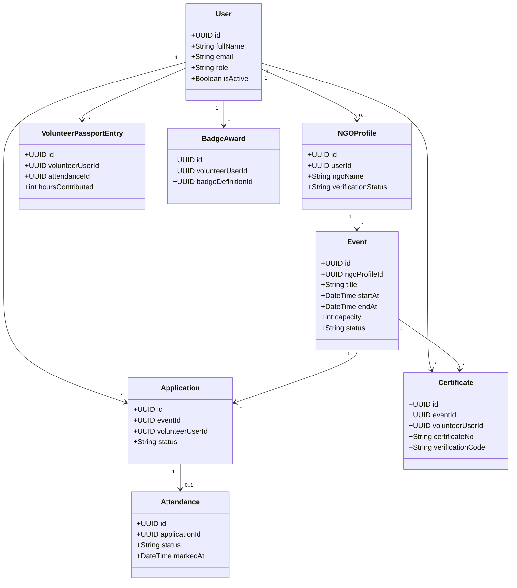

## Conclusion
This class diagram provides a shared model for backend domain code and database mapping.

## References
- `04_Database/ER_DIAGRAM.md`

---

# `07_Diagrams/OBJECT_DIAGRAM.md`

# Object Diagram — Volunteer Connect (Snapshot Example)
**Version:** 1.0.0  
**Last Updated:** July 17, 2026

## Revision History

| Version | Date | Author | Notes |
|---|---|---|---|
| 1.0.0 | July 17, 2026 | Architecture Team | Initial object instance snapshot |

## Introduction
Shows an example runtime snapshot of linked domain objects.

## Diagram
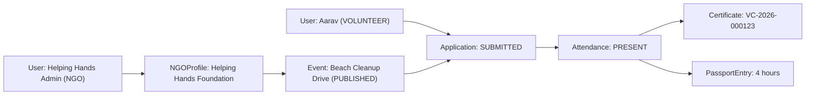

## Conclusion
Object snapshots assist debugging, onboarding, and scenario-based test design.

## References
- `09_Testing/SYSTEM_TESTS.md`

---

# `07_Diagrams/ACTIVITY_DIAGRAM.md`

# Activity Diagram — Volunteer Connect
**Version:** 1.0.0  
**Last Updated:** July 17, 2026

## Revision History

| Version | Date | Author | Description |
|---|---|---|---|
| 1.0.0 | July 17, 2026 | Process Engineering Team | Initial activity flows |

## Introduction
Models step-by-step activities across actor and system responsibilities.

## Volunteer Participation Activity
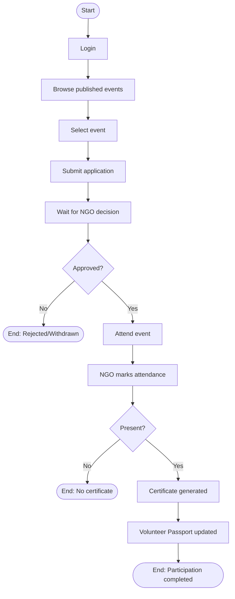

## Conclusion
Activity diagrams clarify operational sequencing and decision paths.

## References
- `06_Business/WORKFLOWS.md`

---

# `07_Diagrams/STATE_DIAGRAM.md`

# State Diagram — Volunteer Connect
**Version:** 1.0.0  
**Last Updated:** July 17, 2026

## Revision History

| Version | Date | Author | Notes |
|---|---|---|---|
| 1.0.0 | July 17, 2026 | BA + Backend Team | Initial state models |

## Introduction
Defines valid states and transitions for key lifecycle entities.

## Application State Diagram
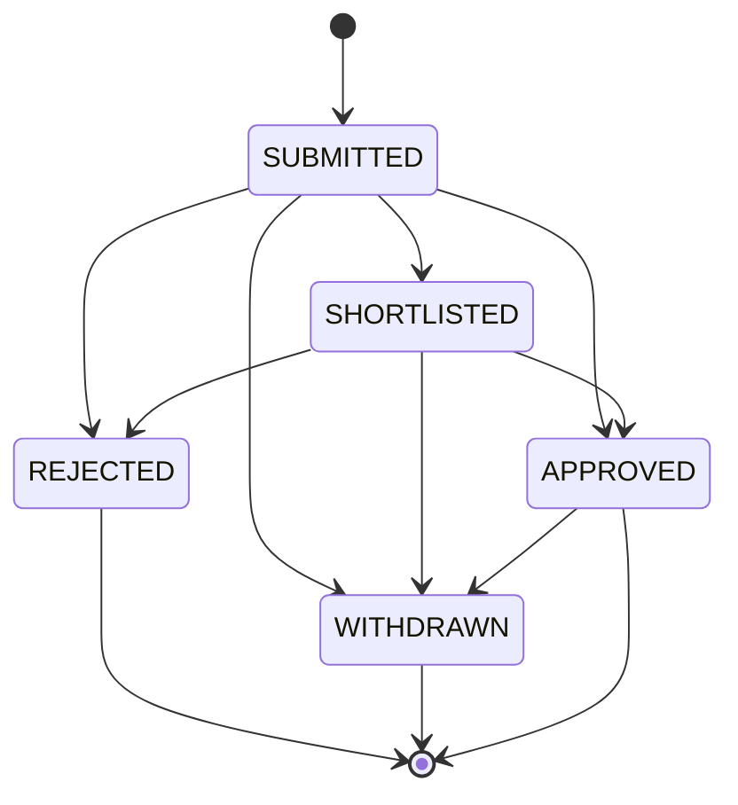

## Event State Diagram
```mermaid
stateDiagram-v2
  [*] --> DRAFT
  DRAFT --> PUBLISHED
  PUBLISHED --> CLOSED
  PUBLISHED --> CANCELLED
  CLOSED --> COMPLETED
  CANCELLED --> [*]
  COMPLETED --> [*]
```

## Conclusion
State diagrams enforce lifecycle correctness and prevent invalid transitions.

## References
- `06_Business/BUSINESS_LOGIC.md`

---

# `07_Diagrams/SEQUENCE_DIAGRAMS.md`

# Sequence Diagrams — Volunteer Connect
**Version:** 1.0.0  
**Last Updated:** July 17, 2026

## Revision History

| Version | Date | Author | Changes |
|---|---|---|---|
| 1.0.0 | July 17, 2026 | Architecture Team | Initial sequence diagrams for critical paths |

## Introduction
Captures request-to-persistence-to-response interactions for critical workflows.

## 1) Login Sequence
```mermaid
sequenceDiagram
  participant U as User
  participant API as Auth API
  participant SVC as AuthService
  participant DB as Database

  U->>API: POST /auth/login
  API->>SVC: validateCredentials()
  SVC->>DB: find user by email
  DB-->>SVC: user record
  SVC-->>API: token payload
  API-->>U: 200 + JWT token
```

## 2) Application Decision Sequence
```mermaid
sequenceDiagram
  participant NGO as NGO User
  participant API as Application API
  participant SVC as ApplicationService
  participant DB as Database
  participant AUD as AuditService

  NGO->>API: PATCH /applications/:id/decision
  API->>SVC: decide(status)
  SVC->>DB: validate ownership + state
  SVC->>DB: update application status
  SVC->>AUD: write audit log
  API-->>NGO: 200 success
```

## 3) Certificate Generation Sequence
```mermaid
sequenceDiagram
  participant NGO as NGO
  participant API as Certificate API
  participant SVC as CertificateService
  participant DB as Database
  participant PDF as PDF Engine
  participant ST as Cloud Storage

  NGO->>API: POST /certificates/generate
  API->>SVC: generate(eventId, volunteerId)
  SVC->>DB: verify attendance eligibility
  SVC->>PDF: render certificate PDF
  PDF-->>SVC: file
  SVC->>ST: upload file
  ST-->>SVC: file URL
  SVC->>DB: persist certificate metadata
  API-->>NGO: 201 certificate generated
```

## Conclusion
Sequence diagrams serve as implementation references for integration paths and failure diagnostics.

## References
- `05_API/*.md`
- `03_Architecture/LOW_LEVEL_DESIGN.md`

---

# `07_Diagrams/DEPLOYMENT_DIAGRAM.md`

# Deployment Diagram — Volunteer Connect
**Version:** 1.0.0  
**Last Updated:** July 17, 2026

## Revision History

| Version | Date | Author | Description |
|---|---|---|---|
| 1.0.0 | July 17, 2026 | DevOps + Architecture | Initial deployment topology |

## Introduction
Represents runtime infrastructure components and deployment boundaries.

## Diagram
```mermaid
graph TD
  U[User Browser] --> CDN[CDN/Static Hosting]
  U --> LB[Nginx / Load Balancer]
  LB --> API1[API Instance 1]
  LB --> API2[API Instance 2]
  API1 --> DB[(PostgreSQL)]
  API2 --> DB
  API1 --> ST[Cloudinary]
  API2 --> ST
  API1 --> MON[Monitoring/Logging]
  API2 --> MON
```

## Deployment Notes
- Stateless API instances allow horizontal scaling.
- Database runs as managed service or HA cluster.
- TLS termination at Nginx/load balancer layer.

## Conclusion
Deployment topology supports availability, observability, and growth readiness.

## References
- `10_Deployment/DEPLOYMENT.md`

---

# `07_Diagrams/NETWORK_DIAGRAM.md`

# Network Diagram — Volunteer Connect
**Version:** 1.0.0  
**Last Updated:** July 17, 2026

## Revision History

| Version | Date | Author | Notes |
|---|---|---|---|
| 1.0.0 | July 17, 2026 | DevOps Team | Initial network segmentation view |

## Introduction
Defines logical network zones and traffic paths.

## Diagram
```mermaid
graph LR
  INTERNET[Internet] --> WAF[WAF/Firewall]
  WAF --> DMZ[Nginx Reverse Proxy]
  DMZ --> APPNET[Private App Subnet]
  APPNET --> API[Express API Pods/Containers]
  API --> DBNET[Private DB Subnet]
  DBNET --> DB[(PostgreSQL)]
  API --> EXT[External Services: Cloudinary/Email]
  API --> OBS[Logging & Monitoring]
```

## Network Security Policies
- Only reverse proxy exposed publicly.
- Database subnet inaccessible from internet.
- Outbound egress control for external integrations.
- Security groups restrict lateral movement.

## Conclusion
Network zoning reduces attack surface and aligns with least-privilege access design.

## References
- `11_Security/SECURITY.md`
- `10_Deployment/NGINX.md`

---

# `07_Diagrams/DATA_FLOW_DIAGRAM.md`

# Data Flow Diagram (DFD) — Volunteer Connect
**Version:** 1.0.0  
**Last Updated:** July 17, 2026

## Revision History

| Version | Date | Author | Description |
|---|---|---|---|
| 1.0.0 | July 17, 2026 | Data Architecture Team | Initial level-1 DFD |

## Introduction
This DFD shows data movement among actors, processes, and data stores.

## Level-1 DFD
```mermaid
flowchart TD
  V[Volunteer] --> P1[Process: Application Management]
  N[NGO] --> P2[Process: Event & Attendance Management]
  A[Administrator] --> P3[Process: Moderation & Audit]

  P1 --> D1[(Applications Store)]
  P2 --> D2[(Events Store)]
  P2 --> D3[(Attendance Store)]
  P2 --> P4[Process: Certificate Generation]
  P4 --> D4[(Certificates Store)]
  P4 --> E1[External: Cloudinary/PDF Storage]

  P3 --> D5[(Audit Logs Store)]
  P1 --> P5[Process: Notification Engine]
  P2 --> P5
  P3 --> P5
  P5 --> D6[(Notifications Store)]
```

## DFD Notes
- Sensitive data flow always passes through authenticated processes.
- Certificates and audit records are trust-critical stores.
- Notification is asynchronous and may retry on failure.

## Conclusion
The DFD clarifies data movement and trust boundaries for design, security, and audit planning.

## References
- `04_Database/DATABASE_DESIGN.md`
- `11_Security/DATA_PRIVACY.md`

---

Folder Completed:  
**07_Diagrams**

Files Generated:
1. `FLOWCHARTS.md`
2. `USE_CASES.md`
3. `USE_CASE_DIAGRAM.md`
4. `CLASS_DIAGRAM.md`
5. `OBJECT_DIAGRAM.md`
6. `ACTIVITY_DIAGRAM.md`
7. `STATE_DIAGRAM.md`
8. `SEQUENCE_DIAGRAMS.md`
9. `DEPLOYMENT_DIAGRAM.md`
10. `NETWORK_DIAGRAM.md`
11. `DATA_FLOW_DIAGRAM.md`

Proceeding with **`08_UI_UX`**.

---

# `08_UI_UX/WIREFRAMES.md`

# Wireframes Specification — Volunteer Connect
**Version:** 1.0.0  
**Last Updated:** July 17, 2026

## Revision History

| Version | Date | Author | Description |
|---|---|---|---|
| 1.0.0 | July 17, 2026 | UX Architecture Team | Initial wireframe blueprint documentation |

## Table of Contents
1. Introduction  
2. Wireframe Principles  
3. Screen Inventory  
4. Role-Based Layouts  
5. Key Screen Structures  
6. Navigation Model  
7. Conclusion  
8. References  

## Introduction
This document defines low-fidelity structural wireframes for all primary screens in Volunteer Connect, aligned to role-specific workflows.

## Wireframe Principles
- Clarity over visual polish at wireframe stage
- Consistent information hierarchy
- Task-first screen composition
- Reusable layout zones (header, sidebar, content, actions)

## Screen Inventory

| Screen ID | Screen Name | Role |
|---|---|---|
| WF-001 | Landing Page | Public |
| WF-002 | Login/Register | Public |
| WF-003 | Volunteer Dashboard | Volunteer |
| WF-004 | Event Discovery List | Volunteer |
| WF-005 | Event Detail + Apply | Volunteer |
| WF-006 | My Applications | Volunteer |
| WF-007 | My Certificates | Volunteer |
| WF-008 | Volunteer Passport | Volunteer |
| WF-009 | NGO Dashboard | NGO |
| WF-010 | Create/Edit Event | NGO |
| WF-011 | Event Applicants | NGO |
| WF-012 | Attendance Marking | NGO |
| WF-013 | Admin Dashboard | Administrator |
| WF-014 | Moderation Console | Administrator |

## Role-Based Layouts
- **Volunteer:** top navbar + content feed + right panel for recent activity
- **NGO:** left sidebar + event management workspace + action toolbar
- **Administrator:** left sidebar + metrics cards + moderation queues

## Key Screen Structures (Example)

### WF-004 Event Discovery List
- Search/filter bar
- Category/date/location filters
- Event cards grid/list toggle
- Pagination controls

### WF-012 Attendance Marking
- Event summary panel
- Applicant roster table
- Status actions (Present/Absent/Excused)
- Bulk update toolbar
- Confirmation modal

## Navigation Model
- Global navigation based on role
- Breadcrumb support in deep workflows
- Action CTAs consistently placed on top-right for mutation actions

## Conclusion
Wireframes define implementation-ready UI structure prior to high-fidelity design and component development.

## References
- `06_Business/WORKFLOWS.md`
- `08_UI_UX/USER_JOURNEY.md`

---

# `08_UI_UX/USER_JOURNEY.md`

# User Journey Mapping — Volunteer Connect
**Version:** 1.0.0  
**Last Updated:** July 17, 2026

## Revision History

| Version | Date | Author | Notes |
|---|---|---|---|
| 1.0.0 | July 17, 2026 | UX + Product Team | Initial user journey definitions |

## Introduction
This document maps critical end-to-end journeys for Volunteers, NGOs, and Administrators.

## Journey 1: Volunteer Participation
```mermaid
journey
  title Volunteer Journey
  section Onboarding
    Register account: 4: Volunteer
    Login successfully: 5: Volunteer
  section Discovery
    Browse events: 5: Volunteer
    Filter relevant event: 4: Volunteer
  section Application
    Submit application: 5: Volunteer
    Track status updates: 4: Volunteer
  section Completion
    Attend event: 5: Volunteer
    View certificate: 5: Volunteer
    Check Volunteer Passport: 5: Volunteer
```

## Journey 2: NGO Event Operations
```mermaid
journey
  title NGO Journey
  section Setup
    Create NGO profile: 4: NGO
    Verify organization details: 3: NGO
  section Event Management
    Create and publish event: 5: NGO
    Review applications: 4: NGO
  section Closure
    Mark attendance: 5: NGO
    Trigger certificates: 4: NGO
```

## Journey 3: Admin Governance
1. Login to admin dashboard.
2. Review flagged entities.
3. Apply moderation action with reason.
4. Verify audit trail and closure status.

## Journey Friction Points
- Application status ambiguity
- Delayed attendance confirmation
- Certificate availability lag

## UX Mitigation
- Status chips with tooltips
- Notification prompts on each lifecycle transition
- Clear expected timeline labels

## Conclusion
User journeys provide behavior-level validation for UI flows and product success metrics.

## References
- `06_Business/ROLE_PERMISSIONS.md`
- `05_API/NOTIFICATION_API.md`

---

# `08_UI_UX/DESIGN_SYSTEM.md`

# Design System — Volunteer Connect
**Version:** 1.0.0  
**Last Updated:** July 17, 2026

## Revision History

| Version | Date | Author | Change |
|---|---|---|---|
| 1.0.0 | July 17, 2026 | UI Engineering + UX Team | Initial design system baseline |

## Introduction
Defines reusable UI components, interaction standards, and visual consistency rules.

## Design Principles
1. Accessibility-first components
2. Predictable interaction behavior
3. Role-consistent visual language
4. Minimal cognitive load

## Component Catalog

| Category | Components |
|---|---|
| Inputs | TextField, TextArea, Select, DatePicker, FileUpload |
| Actions | Button, IconButton, SplitButton |
| Feedback | Toast, Alert, InlineError, EmptyState |
| Data Display | Card, Table, Badge, Timeline, Avatar |
| Navigation | Navbar, Sidebar, Breadcrumb, Tabs, Pagination |
| Overlay | Modal, Drawer, ConfirmationDialog |

## State Definitions
- Default
- Hover
- Focus
- Active
- Disabled
- Error
- Success

## Design Tokens (High-Level)
- Color tokens
- Spacing scale (`4, 8, 12, 16, 24, 32`)
- Typography scale
- Border radius
- Elevation/shadow tokens

## Tailwind Usage Standard
- Utility-first implementation with component abstractions
- Shared class patterns extracted into reusable UI primitives

## Conclusion
The design system ensures visual and behavioral coherence across all role-specific interfaces.

## References
- `08_UI_UX/COLORS.md`
- `08_UI_UX/TYPOGRAPHY.md`
- `08_UI_UX/ACCESSIBILITY.md`

---

# `08_UI_UX/COLORS.md`

# Color System — Volunteer Connect
**Version:** 1.0.0  
**Last Updated:** July 17, 2026

## Revision History

| Version | Date | Author | Notes |
|---|---|---|---|
| 1.0.0 | July 17, 2026 | UX Visual Design Team | Initial semantic color palette specification |

## Introduction
Defines semantic color usage for UI consistency, readability, and accessibility.

## Semantic Palette

| Token | Purpose | Example Hex |
|---|---|---|
| `color-primary` | Primary actions, links | `#2563EB` |
| `color-primary-foreground` | Text on primary backgrounds | `#FFFFFF` |
| `color-secondary` | Secondary accents | `#14B8A6` |
| `color-success` | Positive statuses | `#16A34A` |
| `color-warning` | Warning states | `#D97706` |
| `color-danger` | Errors/destructive actions | `#DC2626` |
| `color-info` | Informational highlights | `#0284C7` |
| `color-bg` | App background | `#F8FAFC` |
| `color-surface` | Cards/panels | `#FFFFFF` |
| `color-border` | Borders/dividers | `#E2E8F0` |
| `color-text-primary` | Main text | `#0F172A` |
| `color-text-secondary` | Secondary text | `#475569` |

## Status Color Mapping
- Application Approved → Success
- Application Rejected → Danger
- Shortlisted → Info
- Pending → Warning/Neutral
- Attendance Present → Success
- Attendance Absent → Danger

## Contrast Requirements
- Text and background combinations must meet WCAG AA minimum.
- Avoid color-only cues; always include icons/text labels for state meaning.

## Conclusion
A semantic color system supports consistent state communication and accessible UI rendering.

## References
- `08_UI_UX/ACCESSIBILITY.md`

---

# `08_UI_UX/TYPOGRAPHY.md`

# Typography Specification — Volunteer Connect
**Version:** 1.0.0  
**Last Updated:** July 17, 2026

## Revision History

| Version | Date | Author | Description |
|---|---|---|---|
| 1.0.0 | July 17, 2026 | UX Team | Initial typography scale and usage rules |

## Introduction
Defines typography scale, hierarchy, and usage for readability and structure.

## Font Strategy
- Primary font: modern sans-serif (web-safe fallback stack)
- Monospace font for code/admin technical logs (where needed)

## Type Scale

| Token | Size | Weight | Usage |
|---|---|---|---|
| `text-display` | 36px | 700 | Landing hero |
| `text-h1` | 30px | 700 | Page title |
| `text-h2` | 24px | 600 | Section header |
| `text-h3` | 20px | 600 | Subsection header |
| `text-body-lg` | 18px | 400 | Important body copy |
| `text-body` | 16px | 400 | Standard content |
| `text-body-sm` | 14px | 400 | Secondary content |
| `text-caption` | 12px | 400 | Metadata labels |

## Typographic Rules
- Minimum body size: 14px
- Line-height: 1.4–1.6 for paragraphs
- Max content width for readability in dense pages
- Consistent heading margins for visual rhythm

## Accessibility Notes
- Avoid low-contrast light text
- Avoid all-caps for long passages
- Use meaningful hierarchy for screen reader compatibility

## Conclusion
Typography rules ensure readable, structured UI content across all roles and devices.

## References
- `08_UI_UX/DESIGN_SYSTEM.md`
- `08_UI_UX/ACCESSIBILITY.md`

---

# `08_UI_UX/ICONS.md`

# Iconography Guidelines — Volunteer Connect
**Version:** 1.0.0  
**Last Updated:** July 17, 2026

## Revision History

| Version | Date | Author | Notes |
|---|---|---|---|
| 1.0.0 | July 17, 2026 | UX Team | Initial icon usage standard |

## Introduction
Defines icon semantics, sizing, and accessibility requirements.

## Icon Principles
- Use icons to reinforce, not replace, text meaning
- Keep style consistent (stroke/fill family)
- Avoid ambiguous metaphor choices

## Common Icon Mapping

| Function | Icon Meaning |
|---|---|
| Dashboard | overview/home |
| Event | calendar/activity |
| Application | document/form |
| Attendance | checklist/user-check |
| Certificate | ribbon/award |
| Volunteer Passport | book/timeline |
| Badge | medal/star |
| Notification | bell |
| Admin Moderation | shield/flag |

## Sizing Standard
- 16px: inline metadata
- 20px: standard button icons
- 24px: navigation items
- 32px+: emphasis visuals

## Accessibility Rules
- Decorative icons: `aria-hidden="true"`
- Action icons: include accessible label
- Icon-only buttons require tooltip + aria-label

## Conclusion
Icon standards improve scannability while preserving clarity and accessibility.

## References
- `08_UI_UX/DESIGN_SYSTEM.md`

---

# `08_UI_UX/RESPONSIVE_DESIGN.md`

# Responsive Design Specification — Volunteer Connect
**Version:** 1.0.0  
**Last Updated:** July 17, 2026

## Revision History

| Version | Date | Author | Change |
|---|---|---|---|
| 1.0.0 | July 17, 2026 | Frontend Architecture Team | Initial responsive behavior definitions |

## Introduction
Defines viewport behavior and adaptation strategies across device classes.

## Breakpoint Strategy (Tailwind-Aligned)

| Breakpoint | Range (approx) | Target |
|---|---|---|
| `sm` | >= 640px | Large phones |
| `md` | >= 768px | Tablets |
| `lg` | >= 1024px | Laptops |
| `xl` | >= 1280px | Desktop |
| `2xl` | >= 1536px | Wide desktop |

## Layout Adaptation Rules
- Mobile: stacked layouts, collapsible filters, compact nav.
- Tablet: hybrid list-card presentations.
- Desktop: multi-column dashboards, persistent sidebars.
- Tables convert to card/stack mode on narrow viewports where needed.

## Responsive Behavior by Module
- Event list: 1 column (mobile), 2 (tablet), 3+ (desktop).
- Dashboard cards: wrap intelligently by priority.
- Attendance table: horizontal scroll fallback + sticky first column (desktop).

## Performance Considerations
- Responsive images via optimized asset transforms.
- Avoid hidden heavy components on mobile where possible.
- Use skeleton loaders for perceived performance.

## Conclusion
Responsive standards ensure consistent usability across devices without workflow degradation.

## References
- `08_UI_UX/WIREFRAMES.md`
- `09_Testing/SYSTEM_TESTS.md`

---

# `08_UI_UX/ACCESSIBILITY.md`

# Accessibility Specification — Volunteer Connect
**Version:** 1.0.0  
**Last Updated:** July 17, 2026

## Revision History

| Version | Date | Author | Description |
|---|---|---|---|
| 1.0.0 | July 17, 2026 | UX + QA Accessibility Team | Initial accessibility baseline |

## Table of Contents
1. Introduction  
2. Accessibility Goals  
3. Standards Alignment  
4. Keyboard Accessibility  
5. Screen Reader Support  
6. Visual Accessibility  
7. Form Accessibility  
8. Accessibility Testing Approach  
9. Conclusion  
10. References  

## Introduction
Defines accessibility requirements for inclusive interaction across all platform roles.

## Accessibility Goals
- Ensure core workflows are keyboard-operable.
- Provide semantic structure for assistive technologies.
- Maintain readable contrast and scalable text.

## Standards Alignment
- WCAG 2.1 AA (baseline target)
- Semantic HTML and ARIA best practices

## Keyboard Accessibility
- Logical tab order
- Visible focus indicators
- Escape key support for overlays
- No keyboard traps in modal/dialog components

## Screen Reader Support
- Landmark roles (`header`, `main`, `nav`, `footer`)
- Form labels explicitly associated with controls
- Error summaries announced for invalid submissions
- Live regions for async status updates (notifications, form completion)

## Visual Accessibility
- Contrast-compliant color combinations
- Non-color indicators for status (icon + text + color)
- Support zoom up to 200% without loss of functionality

## Form Accessibility
- Required fields marked both visually and programmatically
- Inline validation with clear error messages
- Accessible hint text for complex fields

## Accessibility Testing Approach
- Automated lint/a11y tooling in CI
- Manual keyboard testing for critical flows
- Screen reader checks for representative scenarios
- Regression checks after major UI changes

## Conclusion
Accessibility is a mandatory quality gate, not an optional enhancement, for Volunteer Connect releases.

## References
- `09_Testing/SYSTEM_TESTS.md`
- `09_Testing/TEST_PLAN.md`

---

Folder Completed:  
**08_UI_UX**

Files Generated:
1. `WIREFRAMES.md`
2. `USER_JOURNEY.md`
3. `DESIGN_SYSTEM.md`
4. `COLORS.md`
5. `TYPOGRAPHY.md`
6. `ICONS.md`
7. `RESPONSIVE_DESIGN.md`
8. `ACCESSIBILITY.md`


Proceeding with **`09_Testing`**.

---

# `09_Testing/TESTING.md`

# Testing Strategy Overview — Volunteer Connect
**Version:** 1.0.0  
**Last Updated:** July 17, 2026

## Revision History

| Version | Date | Author | Description |
|---|---|---|---|
| 1.0.0 | July 17, 2026 | QA Architecture Team | Initial testing strategy baseline |

## Table of Contents
1. Introduction  
2. Testing Objectives  
3. Test Levels  
4. Test Environments  
5. Entry/Exit Criteria  
6. Defect Lifecycle  
7. Conclusion  
8. References  

## Introduction
This document defines the complete quality assurance strategy for Volunteer Connect, covering functional and non-functional verification across environments.

## Testing Objectives
- Validate all functional requirements (FR-001 onward).
- Verify security and role-permission controls.
- Confirm system performance and reliability targets.
- Prevent regression in critical workflows.
- Ensure release readiness with auditable test evidence.

## Test Levels
1. Unit Testing
2. Integration Testing
3. System Testing
4. Security Testing
5. Performance/Load Testing
6. Regression Testing
7. User Acceptance Testing (UAT)

## Test Environments
- Local dev: developer-level validation
- QA/staging: full integration validation
- Pre-production: release candidate verification
- Production: smoke checks and monitoring-based validation

## Entry Criteria
- Requirements baseline approved
- Test data seeded
- Build deployed in target environment
- Core dependencies available

## Exit Criteria
- 100% pass for critical (P0) test cases
- No unresolved critical/high defects
- Security baseline checks pass
- Release sign-off from QA and product owners

## Defect Lifecycle
New → Triaged → In Progress → Fixed → Retest → Closed / Reopen

## Conclusion
Testing is integrated into delivery lifecycle to ensure secure and reliable production outcomes.

## References
- `09_Testing/TEST_PLAN.md`
- `02_Requirements/SRS.md`

---

# `09_Testing/TEST_PLAN.md`

# Test Plan — Volunteer Connect
**Version:** 1.0.0  
**Last Updated:** July 17, 2026

## Revision History

| Version | Date | Author | Notes |
|---|---|---|---|
| 1.0.0 | July 17, 2026 | QA Team | Initial detailed test plan |

## Introduction
This test plan operationalizes the overall QA strategy with scope, schedule, ownership, and deliverables.

## Scope
In-scope:
- Auth
- Event lifecycle
- Application workflow
- Attendance and certificate generation
- Volunteer Passport and badges
- Admin moderation
- Notification lifecycle

Out-of-scope:
- Native mobile testing (current baseline)
- External partner APIs not integrated in phase baseline

## Test Deliverables
- Test scenarios
- Test cases
- Execution reports
- Defect logs
- Traceability matrix
- Final QA sign-off report

## Test Roles

| Role | Responsibility |
|---|---|
| QA Lead | Planning, oversight, reporting |
| QA Engineer | Test design and execution |
| Security Tester | Security validation |
| Performance Engineer | Load/stress testing |
| Dev Team | Fixing defects and support |

## Test Schedule (High-Level)

| Phase | Activity |
|---|---|
| Phase A | Test design + test data setup |
| Phase B | Unit + integration validation |
| Phase C | System + regression + security |
| Phase D | Performance + UAT + release recommendation |

## Risks and Mitigations

| Risk | Mitigation |
|---|---|
| Incomplete test data | Pre-approved seeded datasets |
| Environment instability | Health checks and deployment freeze windows |
| Requirement drift | Controlled change request process |

## Conclusion
This plan ensures disciplined and traceable QA execution before each release.

## References
- `09_Testing/TEST_CASES.md`
- `12_Project_Management/RELEASE_PROCESS.md`

---

# `09_Testing/TEST_CASES.md`

# Test Cases — Volunteer Connect
**Version:** 1.0.0  
**Last Updated:** July 17, 2026

## Revision History

| Version | Date | Author | Description |
|---|---|---|---|
| 1.0.0 | July 17, 2026 | QA Engineering | Initial core test case repository |

## Introduction
This document includes representative high-priority test cases tied to requirements.

## Test Case Template
- Test Case ID
- Requirement Mapping
- Preconditions
- Steps
- Expected Result
- Priority

## Core Test Cases

### TC-001: User Registration (Volunteer)
- **Requirement:** FR-001
- **Preconditions:** Email not registered
- **Steps:** Submit valid volunteer registration payload
- **Expected:** Account created, `201` returned
- **Priority:** High

### TC-002: Duplicate Email Registration
- **Requirement:** FR-001
- **Steps:** Register using existing email
- **Expected:** `409 DUPLICATE`/conflict error
- **Priority:** High

### TC-003: NGO Creates Event
- **Requirement:** FR-003
- **Steps:** Auth NGO → submit valid event payload
- **Expected:** Event created in DRAFT/PUBLISHED
- **Priority:** High

### TC-004: Volunteer Applies to Published Event
- **Requirement:** FR-005
- **Expected:** Application created with SUBMITTED status
- **Priority:** High

### TC-005: Duplicate Active Application Rejected
- **Requirement:** BL-001
- **Expected:** `409 DUPLICATE_APPLICATION`
- **Priority:** High

### TC-006: NGO Approves Application
- **Requirement:** FR-006
- **Expected:** Status changed to APPROVED and audit log recorded
- **Priority:** High

### TC-007: Mark Attendance for Approved Volunteer
- **Requirement:** FR-007
- **Expected:** Attendance status persisted
- **Priority:** High

### TC-008: Certificate Generated for PRESENT Attendance
- **Requirement:** FR-008
- **Expected:** Certificate exists with unique verification code
- **Priority:** High

### TC-009: Unauthorized Attendance Update Blocked
- **Requirement:** RBAC
- **Expected:** `403 AUTHORIZATION_DENIED`
- **Priority:** High

### TC-010: Admin Moderation Action Logged
- **Requirement:** FR-011
- **Expected:** Moderation action persisted with reason + audit entry
- **Priority:** High

## Conclusion
These test cases form the baseline suite for validating core platform behavior.

## References
- `02_Requirements/FUNCTIONAL_REQUIREMENTS.md`
- `06_Business/BUSINESS_LOGIC.md`

---

# `09_Testing/UNIT_TESTS.md`

# Unit Testing Guidelines — Volunteer Connect
**Version:** 1.0.0  
**Last Updated:** July 17, 2026

## Revision History

| Version | Date | Author | Notes |
|---|---|---|---|
| 1.0.0 | July 17, 2026 | Backend + Frontend QA | Initial unit test strategy |

## Introduction
Defines unit testing standards for isolated function/class/component validation.

## Scope
- Backend services, validators, utilities
- Frontend components, hooks, utility functions
- No external dependencies in pure unit tests (use mocks/stubs)

## Coverage Targets
- Critical business services: >= 90%
- General modules: >= 80%

## Example Backend Unit Test Targets
- Application state transition validator
- Attendance eligibility checker
- Badge threshold evaluator
- Error mapper utility

## Example Frontend Unit Test Targets
- Form validation components
- Role-based route guard logic
- Status chip rendering rules
- Pagination helpers

## Best Practices
- Arrange-Act-Assert pattern
- Deterministic test data
- Minimal mocking, targeted assertions
- Clear test naming convention

## Conclusion
Strong unit test coverage reduces regression risk and accelerates reliable iteration.

## References
- `12_Project_Management/CODING_GUIDELINES.md`

---

# `09_Testing/INTEGRATION_TESTS.md`

# Integration Testing — Volunteer Connect
**Version:** 1.0.0  
**Last Updated:** July 17, 2026

## Revision History

| Version | Date | Author | Description |
|---|---|---|---|
| 1.0.0 | July 17, 2026 | QA + Backend Team | Initial integration test scope |

## Introduction
Integration tests validate interactions across modules, services, and database layers.

## Key Integration Paths
1. Auth → Protected API routes
2. Event creation → Event discovery listing
3. Application submission → NGO decision workflow
4. Attendance update → Certificate generation
5. Attendance finalization → Volunteer Passport + badge evaluation
6. Admin moderation → audit logging

## Integration Environment Requirements
- Real database instance (QA schema)
- Seeded role-based users
- Controlled external dependencies (mock or sandbox)

## Example Integration Scenario
- Volunteer applies to event
- NGO approves application
- NGO marks attendance PRESENT
- System generates certificate
- Volunteer sees updated Passport and certificate list

## Assertion Strategy
- API response correctness
- DB row existence/consistency
- Cross-module side effects
- Audit log entries

## Conclusion
Integration tests validate domain correctness beyond isolated unit behavior.

## References
- `03_Architecture/MODULE_DESIGN.md`
- `05_API/*.md`

---

# `09_Testing/SYSTEM_TESTS.md`

# System Testing — Volunteer Connect
**Version:** 1.0.0  
**Last Updated:** July 17, 2026

## Revision History

| Version | Date | Author | Notes |
|---|---|---|---|
| 1.0.0 | July 17, 2026 | QA Team | Initial end-to-end system test scenarios |

## Introduction
System testing validates the complete platform against requirements in a production-like environment.

## End-to-End System Scenarios
1. Volunteer onboarding to application submission
2. NGO event publishing to attendance completion
3. Certificate issue and verification journey
4. Admin moderation and audit trace review
5. Notification generation and read-status lifecycle

## Non-Functional System Checks
- UI responsiveness across breakpoints
- Accessibility checks for critical flows
- Error-state and fallback behavior

## Exit Criteria
- All critical E2E scenarios pass
- No unresolved high severity defects
- Known medium/low issues documented with risk acceptance

## Conclusion
System tests confirm production readiness at behavior level across integrated components.

## References
- `08_UI_UX/RESPONSIVE_DESIGN.md`
- `08_UI_UX/ACCESSIBILITY.md`

---

# `09_Testing/SECURITY_TESTS.md`

# Security Testing Plan — Volunteer Connect
**Version:** 1.0.0  
**Last Updated:** July 17, 2026

## Revision History

| Version | Date | Author | Change |
|---|---|---|---|
| 1.0.0 | July 17, 2026 | Security QA Team | Initial security test suite scope |

## Introduction
Defines security validation aligned with OWASP-focused controls and platform-specific threats.

## Security Test Categories
1. Authentication tests (token validation, invalid credentials)
2. Authorization tests (role and ownership boundaries)
3. Input validation tests (SQLi/XSS/path traversal payload checks)
4. Rate limiting tests (auth and critical mutation routes)
5. File upload validation tests
6. Session/token management tests
7. Audit log integrity checks

## Sample Security Test Cases
- ST-001: Access protected endpoint without token → `401`
- ST-002: Volunteer attempts admin endpoint → `403`
- ST-003: JWT tampering attempt rejected
- ST-004: Excessive login attempts throttled (`429`)
- ST-005: Malicious script payload sanitized/rejected
- ST-006: Unauthorized certificate access blocked

## Tooling (suggested)
- Automated API security checks
- Dependency vulnerability scanning
- Static code analysis
- Manual penetration testing checklist

## Conclusion
Security testing is a release gate and must pass before production promotion.

## References
- `11_Security/OWASP.md`
- `11_Security/AUTHORIZATION.md`

---

# `09_Testing/PERFORMANCE_TESTS.md`

# Performance Testing — Volunteer Connect
**Version:** 1.0.0  
**Last Updated:** July 17, 2026

## Revision History

| Version | Date | Author | Description |
|---|---|---|---|
| 1.0.0 | July 17, 2026 | Performance Engineering Team | Initial performance testing baseline |

## Introduction
This document defines latency, throughput, and stability tests for API and critical workflows.

## Performance Targets
- P95 read endpoints <= 400 ms
- P95 write endpoints <= 700 ms
- Error rate < 1% under expected load

## Priority Endpoints for Benchmarking
- GET `/events`
- POST `/events/:id/applications`
- PATCH `/applications/:id/decision`
- POST `/events/:id/attendance/bulk`
- POST `/certificates/generate`

## Test Profiles
1. Baseline load (normal expected traffic)
2. Peak load (2x expected)
3. Stress load (beyond peak to identify limits)

## Metrics Collected
- P50/P95/P99 latency
- Requests/sec
- CPU/memory utilization
- DB query timing and lock wait
- Error distributions by endpoint

## Bottleneck Analysis
- DB slow query tracking
- Missing indexes
- Contended write paths
- Resource saturation thresholds

## Conclusion
Performance tests ensure capacity confidence and guide optimization before scaling.

## References
- `04_Database/INDEXING.md`
- `10_Deployment/MONITORING.md`

---

# `09_Testing/LOAD_TESTS.md`

# Load Testing Plan — Volunteer Connect
**Version:** 1.0.0  
**Last Updated:** July 17, 2026

## Revision History

| Version | Date | Author | Notes |
|---|---|---|---|
| 1.0.0 | July 17, 2026 | Performance QA | Initial load model and scenarios |

## Introduction
Defines sustained concurrency and burst behavior validation strategy.

## Load Scenarios
1. **Volunteer Discovery Burst**: high concurrent reads on `/events`
2. **Application Window Spike**: sudden increase in application submissions
3. **Post-Event Closure Spike**: bulk attendance + certificate generation
4. **Admin Investigation Burst**: heavy audit query usage

## Scenario Example
- 500 concurrent virtual users
- 20-minute ramp-up
- 45-minute sustained load
- 10-minute cooldown

## Success Criteria
- System remains available
- No critical error spikes
- Latency within tolerance
- Recovery to baseline after cooldown

## Failure Criteria
- Sustained 5xx > threshold
- Database saturation causing prolonged lock waits
- API instance memory pressure causing restarts

## Conclusion
Load tests establish safe operating envelopes and pre-scale thresholds.

## References
- `09_Testing/PERFORMANCE_TESTS.md`
- `03_Architecture/HIGH_LEVEL_ARCHITECTURE.md`

---

# `09_Testing/BUG_REPORTS.md`

# Bug Reporting and Defect Management — Volunteer Connect
**Version:** 1.0.0  
**Last Updated:** July 17, 2026

## Revision History

| Version | Date | Author | Description |
|---|---|---|---|
| 1.0.0 | July 17, 2026 | QA Governance Team | Initial defect reporting standard |

## Introduction
Defines standardized defect reporting format and lifecycle governance.

## Bug Severity Definitions

| Severity | Description |
|---|---|
| Critical | System unusable, security breach, data loss risk |
| High | Major feature blocked, no workaround |
| Medium | Partial feature degradation with workaround |
| Low | Minor UI/UX issue, no major impact |

## Bug Priority Definitions
- P1: Immediate fix required
- P2: Fix in current sprint
- P3: Fix in upcoming sprint
- P4: Backlog candidate

## Bug Report Template
- Bug ID
- Title
- Module
- Environment
- Steps to Reproduce
- Expected Result
- Actual Result
- Severity/Priority
- Attachments (screenshots/logs)
- Reporter
- Assignee
- Status

## Defect Workflow
New → Triage → Assigned → In Progress → Fixed → QA Retest → Closed / Reopened

## Example Bug Entry
```markdown
Bug ID: VC-BUG-0142
Title: Unauthorized volunteer can access NGO attendance endpoint
Module: Attendance API
Environment: QA
Steps:
1. Login as volunteer
2. Call GET /api/v1/events/{id}/attendance
Expected: 403 forbidden
Actual: 200 with attendance data
Severity: Critical
Priority: P1
```

## Conclusion
A disciplined bug management process reduces release risk and improves delivery quality.

## References
- `12_Project_Management/ISSUE_TEMPLATE.md`
- `12_Project_Management/CODE_REVIEW.md`

---

Folder Completed:  
**09_Testing**

Files Generated:
1. `TESTING.md`
2. `TEST_PLAN.md`
3. `TEST_CASES.md`
4. `UNIT_TESTS.md`
5. `INTEGRATION_TESTS.md`
6. `SYSTEM_TESTS.md`
7. `SECURITY_TESTS.md`
8. `PERFORMANCE_TESTS.md`
9. `LOAD_TESTS.md`
10. `BUG_REPORTS.md`

Proceeding with **`10_Deployment`**.

---

# `10_Deployment/DEPLOYMENT.md`

# Deployment Guide — Volunteer Connect
**Version:** 1.0.0  
**Last Updated:** July 17, 2026

## Revision History

| Version | Date | Author | Description |
|---|---|---|---|
| 1.0.0 | July 17, 2026 | DevOps Team | Initial deployment runbook |

## Table of Contents
1. Introduction  
2. Deployment Objectives  
3. Environments  
4. Deployment Architecture  
5. Release Workflow  
6. Rollback Strategy  
7. Post-Deployment Validation  
8. Conclusion  
9. References  

## Introduction
This document defines deployment standards for Volunteer Connect across development, staging, and production environments.

## Deployment Objectives
- Predictable, repeatable deployments
- Environment parity
- Zero/low-downtime rollout support
- Secure secret handling and auditability

## Environments

| Environment | Purpose | Data Policy |
|---|---|---|
| Development | Feature development | Synthetic/test data |
| Staging | Pre-production validation | Masked/seeded data |
| Production | Live user traffic | Real data, strict controls |

## Deployment Architecture
- Frontend static deployment (CDN or edge hosting)
- Backend containerized API service behind reverse proxy
- PostgreSQL managed DB or HA cluster
- Cloudinary for media assets
- Monitoring and centralized logs

## Release Workflow
1. Merge to release branch
2. CI test and build
3. Deploy to staging
4. Execute smoke + regression checks
5. Approve release
6. Deploy to production
7. Monitor and validate

## Rollback Strategy
- Application rollback via previous container image tag
- DB rollback via forward-fix preferred; backup restore only for severe incidents
- Incident owner and release manager authorize rollback

## Post-Deployment Validation
- Health and readiness checks
- Critical API smoke suite
- Role-based login validation
- Event discovery and application workflow check

## Conclusion
This deployment guide ensures controlled and auditable production releases.

## References
- `10_Deployment/CI_CD.md`
- `10_Deployment/MONITORING.md`
- `04_Database/BACKUP_RECOVERY.md`

---

# `10_Deployment/CI_CD.md`

# CI/CD Pipeline Specification — Volunteer Connect
**Version:** 1.0.0  
**Last Updated:** July 17, 2026

## Revision History

| Version | Date | Author | Notes |
|---|---|---|---|
| 1.0.0 | July 17, 2026 | Platform Engineering | Initial CI/CD pipeline design |

## Introduction
Defines automated build, test, security checks, and deployment orchestration.

## CI Pipeline Stages
1. Checkout code
2. Dependency install and cache restore
3. Lint/format checks
4. Unit tests
5. Integration tests (selective or full in staging pipeline)
6. Build artifacts (client + server)
7. Security scans (SAST/dependency)
8. Docker image build and push

## CD Pipeline Stages
1. Deploy to staging on merge to main/release branch
2. Run staging smoke tests
3. Manual approval gate for production
4. Deploy to production
5. Post-deploy health checks and alerts

## Branch Policy
- PR required for protected branches
- Required status checks must pass
- No direct commits to production branch

## Example GitHub Actions Outline
```yaml
name: ci-cd
on:
  pull_request:
  push:
    branches: [main]
jobs:
  test-build:
    runs-on: ubuntu-latest
    steps:
      - uses: actions/checkout@v4
      - run: npm ci
      - run: npm run lint && npm run test
      - run: npm run build
```

## Conclusion
CI/CD automation is mandatory for release quality, consistency, and traceability.

## References
- `12_Project_Management/GIT_WORKFLOW.md`
- `09_Testing/TEST_PLAN.md`

---

# `10_Deployment/ENVIRONMENT_SETUP.md`

# Environment Setup — Volunteer Connect
**Version:** 1.0.0  
**Last Updated:** July 17, 2026

## Revision History

| Version | Date | Author | Description |
|---|---|---|---|
| 1.0.0 | July 17, 2026 | DevOps + Engineering | Initial environment setup standards |

## Introduction
Defines mandatory runtime configuration for local, staging, and production environments.

## Required Variables (Backend)
```bash
NODE_ENV=production
PORT=8080
DATABASE_URL=postgresql://...
JWT_SECRET=...
JWT_EXPIRES_IN=3600
BCRYPT_SALT_ROUNDS=12
CLOUDINARY_CLOUD_NAME=...
CLOUDINARY_API_KEY=...
CLOUDINARY_API_SECRET=...
```

## Required Variables (Frontend)
```bash
VITE_API_BASE_URL=https://api.example.com/api/v1
VITE_APP_NAME=Volunteer Connect
```

## Setup Steps
1. Provision database and apply migrations.
2. Configure secrets in secret manager (not in repo).
3. Configure frontend environment for API base URL.
4. Deploy backend service and validate health endpoints.
5. Deploy frontend and run smoke checks.

## Environment Parity Rules
- Same major runtime versions across staging and production.
- Matching migration state before deployment.
- Feature flags tracked per environment.

## Conclusion
Environment setup must be standardized to reduce runtime drift and deployment failures.

## References
- `10_Deployment/DEPLOYMENT.md`
- `04_Database/MIGRATIONS.md`

---

# `10_Deployment/DOCKER.md`

# Docker Deployment Guide — Volunteer Connect
**Version:** 1.0.0  
**Last Updated:** July 17, 2026

## Revision History

| Version | Date | Author | Notes |
|---|---|---|---|
| 1.0.0 | July 17, 2026 | DevOps Team | Initial Dockerization standard |

## Introduction
Specifies containerization approach for application services.

## Containerization Strategy
- Separate images for frontend and backend
- Multi-stage builds for smaller production images
- Non-root runtime user where possible

## Example Backend Dockerfile (Reference)
```dockerfile
FROM node:20-alpine AS build
WORKDIR /app
COPY package*.json ./
RUN npm ci
COPY . .
RUN npm run build

FROM node:20-alpine
WORKDIR /app
COPY --from=build /app/dist ./dist
COPY --from=build /app/node_modules ./node_modules
ENV NODE_ENV=production
CMD ["node", "dist/server.js"]
```

## Docker Compose (Local Integration)
- Services: `client`, `server`, `postgres`
- Named volumes for DB persistence
- Network isolation with internal bridge

## Image Tagging Policy
- `app:<git-sha>`
- `app:release-<version>`
- `app:latest` (non-authoritative convenience tag)

## Conclusion
Docker-based packaging ensures reproducibility and supports CI/CD automation.

## References
- `10_Deployment/CI_CD.md`
- `10_Deployment/CLOUD_DEPLOYMENT.md`

---

# `10_Deployment/KUBERNETES.md`

# Kubernetes Deployment Strategy — Volunteer Connect
**Version:** 1.0.0  
**Last Updated:** July 17, 2026

## Revision History

| Version | Date | Author | Description |
|---|---|---|---|
| 1.0.0 | July 17, 2026 | Platform Engineering | Initial K8s production strategy |

## Introduction
Defines Kubernetes-oriented deployment model for scalable production operations.

## Core Kubernetes Resources
- Namespace (`volunteer-connect`)
- Deployments (api, optional worker)
- Services (ClusterIP)
- Ingress (Nginx ingress controller)
- ConfigMaps and Secrets
- HPA for API autoscaling
- PodDisruptionBudget

## Deployment Pattern
- Rolling update with readiness checks
- Canary/blue-green optional for high-risk releases

## Health Probes
- Liveness: `/api/v1/health`
- Readiness: `/api/v1/ready`

## Autoscaling Inputs
- CPU utilization target
- Memory threshold
- Optional custom metrics (request latency, queue backlog)

## Operational Policies
- Resource requests/limits mandatory
- Separate service account and least privilege RBAC
- Network policies restrict pod-to-pod access

## Conclusion
Kubernetes support provides horizontal scaling, resilience, and controlled rollout capabilities.

## References
- `07_Diagrams/DEPLOYMENT_DIAGRAM.md`
- `07_Diagrams/NETWORK_DIAGRAM.md`

---

# `10_Deployment/NGINX.md`

# Nginx Configuration Guide — Volunteer Connect
**Version:** 1.0.0  
**Last Updated:** July 17, 2026

## Revision History

| Version | Date | Author | Notes |
|---|---|---|---|
| 1.0.0 | July 17, 2026 | DevOps Team | Initial reverse proxy and routing setup |

## Introduction
Defines Nginx responsibilities for TLS termination, routing, and basic hardening.

## Core Responsibilities
- HTTPS termination
- Reverse proxy to API service
- Static asset caching rules
- Security headers
- Rate limiting on abuse-prone paths

## Example Server Block (Reference)
```nginx
server {
  listen 443 ssl;
  server_name app.example.com;

  location /api/ {
    proxy_pass http://api-service:8080/;
    proxy_set_header Host $host;
    proxy_set_header X-Forwarded-For $proxy_add_x_forwarded_for;
  }

  location / {
    root /usr/share/nginx/html;
    try_files $uri /index.html;
  }
}
```

## Security Header Baseline
- `X-Content-Type-Options: nosniff`
- `X-Frame-Options: DENY`
- `Referrer-Policy`
- `Content-Security-Policy` (as compatible)

## Conclusion
Nginx forms the secure and performant entry point for Volunteer Connect traffic.

## References
- `10_Deployment/DOMAIN_SSL.md`
- `11_Security/RATE_LIMITING.md`

---

# `10_Deployment/CLOUD_DEPLOYMENT.md`

# Cloud Deployment Architecture — Volunteer Connect
**Version:** 1.0.0  
**Last Updated:** July 17, 2026

## Revision History

| Version | Date | Author | Description |
|---|---|---|---|
| 1.0.0 | July 17, 2026 | Cloud Architecture Team | Initial cloud deployment strategy |

## Introduction
Defines cloud-agnostic architecture and managed service recommendations.

## Recommended Cloud Components
- Compute: container service / Kubernetes
- Database: managed PostgreSQL
- Storage: Cloudinary + object storage for backups
- Secrets manager for credentials
- Monitoring stack (metrics + logs + alerting)

## High-Level Topology
```mermaid
graph TD
U[Users] --> CDN[CDN + Edge]
CDN --> IN[Ingress/Nginx]
IN --> API[Containerized API]
API --> DB[(Managed PostgreSQL)]
API --> CLD[Cloudinary]
API --> OBS[Monitoring + Logging]
```

## Deployment Best Practices
- Infrastructure as Code preferred
- Separate accounts/projects for non-prod vs prod
- Encrypted data at rest and in transit
- Centralized audit logging

## Conclusion
Cloud deployment should prioritize managed reliability and operational simplicity.

## References
- `10_Deployment/MONITORING.md`
- `04_Database/BACKUP_RECOVERY.md`

---

# `10_Deployment/DOMAIN_SSL.md`

# Domain and SSL Configuration — Volunteer Connect
**Version:** 1.0.0  
**Last Updated:** July 17, 2026

## Revision History

| Version | Date | Author | Change |
|---|---|---|---|
| 1.0.0 | July 17, 2026 | DevOps/Security Team | Initial domain and TLS setup guidance |

## Introduction
Defines domain, DNS, and TLS requirements for secure production deployment.

## Domain Strategy
- App frontend: `app.<domain>`
- API backend: `api.<domain>`
- Optional docs/admin subdomains based on governance policy

## DNS Records (Example)
- `A/AAAA` or `CNAME` for frontend host
- `A/AAAA` or `CNAME` for API host
- TTL adjusted for deployment/change windows

## TLS Requirements
- TLS 1.2+ minimum (1.3 preferred)
- Valid CA-issued certificate
- Auto-renewal enabled
- HSTS policy enabled after verification period

## Certificate Lifecycle
1. Request certificate
2. Domain validation
3. Install in ingress/Nginx
4. Enable auto-renew checks
5. Monitor certificate expiry alerts

## Security Hardening
- Redirect HTTP → HTTPS
- Disable weak ciphers/protocols
- OCSP stapling where supported

## Conclusion
Domain and SSL controls are foundational for platform trust and secure transport.

## References
- `11_Security/SECURITY.md`
- `10_Deployment/NGINX.md`

---

# `10_Deployment/MONITORING.md`

# Monitoring and Observability — Volunteer Connect
**Version:** 1.0.0  
**Last Updated:** July 17, 2026

## Revision History

| Version | Date | Author | Description |
|---|---|---|---|
| 1.0.0 | July 17, 2026 | SRE Team | Initial monitoring and alerting specification |

## Table of Contents
1. Introduction  
2. Observability Objectives  
3. Metrics  
4. Logging  
5. Alerting  
6. Dashboards  
7. Incident Response Integration  
8. Conclusion  
9. References  

## Introduction
Defines telemetry, dashboards, and incident alerting required for production operations.

## Observability Objectives
- Detect failures early
- Diagnose root causes quickly
- Track SLA/SLO compliance
- Support audit and postmortem processes

## Metrics (Minimum Baseline)
- Request count/rate
- Error rate by endpoint
- Latency (P50/P95/P99)
- CPU/memory utilization
- DB connection pool and slow queries
- Queue/notification failures

## Logging
- Structured JSON logs
- Correlation/request ID per transaction
- Security-sensitive events separately tagged
- Retention policy aligned with compliance

## Alerting
- High error rate threshold breach
- Latency degradation
- Health/readiness failures
- DB connectivity failure
- Certificate expiry warning
- Backup job failure

## Dashboard Requirements
- Executive SLA dashboard
- API performance dashboard
- Security events dashboard
- Database health dashboard

## Incident Response Integration
- Alert → on-call routing
- Incident ticket creation
- Post-incident timeline and RCA linkage

## Conclusion
Monitoring converts deployment into a controlled, observable, and reliable operation.

## References
- `11_Security/AUDIT_LOGS.md`
- `04_Database/BACKUP_RECOVERY.md`
- `09_Testing/PERFORMANCE_TESTS.md`

---

Folder Completed:  
**10_Deployment**

Files Generated:
1. `DEPLOYMENT.md`
2. `CI_CD.md`
3. `ENVIRONMENT_SETUP.md`
4. `DOCKER.md`
5. `KUBERNETES.md`
6. `NGINX.md`
7. `CLOUD_DEPLOYMENT.md`
8. `DOMAIN_SSL.md`
9. `MONITORING.md`


Proceeding with **`11_Security`**.

---

# `11_Security/SECURITY.md`

# Security Architecture and Controls — Volunteer Connect
**Version:** 1.0.0  
**Last Updated:** July 17, 2026

## Revision History

| Version | Date | Author | Description |
|---|---|---|---|
| 1.0.0 | July 17, 2026 | Security Architecture Team | Initial end-to-end security baseline |

## Table of Contents
1. Introduction  
2. Security Objectives  
3. Threat Model Summary  
4. Security Control Layers  
5. Operational Security  
6. Security Governance  
7. Conclusion  
8. References  

## Introduction
This document defines the comprehensive security baseline for Volunteer Connect across application, infrastructure, and operational controls.

## Security Objectives
- Protect user identities and personal data
- Enforce strict authorization across role boundaries
- Prevent common web vulnerabilities
- Ensure action traceability via immutable audit trails
- Support secure deployment and incident response

## Threat Model Summary
Primary threat categories:
- Credential attacks (brute force, stuffing)
- Token compromise/replay misuse
- Unauthorized data access (broken access control)
- Injection and XSS payloads
- File upload abuse
- Insider misuse of privileged actions

## Security Control Layers
1. Authentication and session controls
2. Authorization via RBAC and ownership checks
3. Input validation and output sanitization
4. Rate limiting and abuse protection
5. Transport security (TLS)
6. Security logging and monitoring
7. Backup and recovery safeguards

## Operational Security
- Secrets managed outside source code
- Regular dependency scanning
- Security tests in CI/CD
- Periodic access reviews and key rotation

## Security Governance
- Security sign-off required for major releases
- Incident response and postmortem process mandatory
- Audit log retention and review policy enforced

## Conclusion
Security is built as a platform-wide control system, not a module-level add-on.

## References
- `11_Security/AUTHENTICATION.md`
- `11_Security/OWASP.md`
- `10_Deployment/MONITORING.md`

---

# `11_Security/AUTHENTICATION.md`

# Authentication Controls — Volunteer Connect
**Version:** 1.0.0  
**Last Updated:** July 17, 2026

## Revision History

| Version | Date | Author | Notes |
|---|---|---|---|
| 1.0.0 | July 17, 2026 | Auth Security Team | Initial authentication policy |

## Introduction
Defines user identity verification and account session establishment controls.

## Authentication Model
- Credential-based login (email + password)
- Password verification using bcrypt hash comparison
- JWT token issuance for authenticated sessions

## Authentication Requirements
1. Login attempts must be rate-limited.
2. Authentication errors should not leak user existence details.
3. Inactive/suspended accounts must be blocked.
4. Failed login patterns should trigger monitoring alerts.
5. Password reset flow must be tokenized and time-bound.

## Session Controls
- Access token TTL controlled by policy.
- Optional refresh token model with revocation support.
- Logout invalidates active token context (implementation policy).

## Secure Practices
- No plaintext password handling beyond immediate validation scope.
- Enforce HTTPS in all auth flows.
- Sensitive auth events logged with correlation IDs.

## Conclusion
Authentication controls provide identity trust boundaries for all protected workflows.

## References
- `05_API/AUTH_API.md`
- `11_Security/JWT.md`
- `11_Security/PASSWORD_POLICY.md`

---

# `11_Security/AUTHORIZATION.md`

# Authorization and RBAC Specification — Volunteer Connect
**Version:** 1.0.0  
**Last Updated:** July 17, 2026

## Revision History

| Version | Date | Author | Description |
|---|---|---|---|
| 1.0.0 | July 17, 2026 | Security + Backend Team | Initial authorization enforcement model |

## Introduction
Defines role-based and ownership-based access controls for all protected resources.

## Authorization Model
- Role claims carried in JWT
- Policy checks at middleware layer
- Ownership validation at service layer
- Defense-in-depth by re-validation before mutation actions

## Role Access Summary
- Volunteer: self-scoped actions + public event discovery
- NGO: organization-owned event/application/attendance actions
- Administrator: global moderation and audit access

## Enforcement Points
1. Route middleware checks required role(s)
2. Service checks entity ownership and workflow state
3. DB queries scoped to authorized identity where possible

## Critical Authorization Rules
- Volunteers cannot decide applications.
- NGOs cannot moderate users outside policy tools.
- Admin endpoints inaccessible to non-admin users.
- Cross-tenant data access must be rejected.

## Authorization Error Contract
- `401` for missing/invalid authentication
- `403` for authenticated but unauthorized action

## Conclusion
Authorization controls are mandatory for trust, privacy, and platform governance.

## References
- `06_Business/ROLE_PERMISSIONS.md`
- `05_API/ADMIN_API.md`

---

# `11_Security/JWT.md`

# JWT Security Policy — Volunteer Connect
**Version:** 1.0.0  
**Last Updated:** July 17, 2026

## Revision History

| Version | Date | Author | Change |
|---|---|---|---|
| 1.0.0 | July 17, 2026 | Security Engineering | Initial JWT usage and hardening policy |

## Introduction
Defines issuance, validation, storage, and lifecycle policies for JWT-based authentication.

## Token Claims (Minimum)
- `sub` (user ID)
- `role`
- `iat`
- `exp`
- optional `jti` for revocation tracking

## Security Requirements
1. Strong secret/private key management.
2. Short-lived access tokens.
3. Signature verification required on each protected request.
4. Reject expired, malformed, or tampered tokens.
5. No sensitive PII inside token payload.

## Storage Guidance
- Prefer secure transport mechanisms and guarded client storage strategy.
- Prevent token leakage via logs, URLs, and browser storage misuse patterns.

## Rotation and Revocation
- Secret/key rotation supported with transition window.
- Revocation list optional but recommended for high-risk sessions.
- Forced logout on password change or account suspension.

## Failure Handling
- Invalid token → `401 AUTHENTICATION_REQUIRED`
- Expired token → `401 TOKEN_EXPIRED` (if exposed by policy)

## Conclusion
JWT controls balance stateless scalability with robust session security.

## References
- `11_Security/AUTHENTICATION.md`
- `05_API/ERROR_CODES.md`

---

# `11_Security/PASSWORD_POLICY.md`

# Password Policy — Volunteer Connect
**Version:** 1.0.0  
**Last Updated:** July 17, 2026

## Revision History

| Version | Date | Author | Notes |
|---|---|---|---|
| 1.0.0 | July 17, 2026 | Security Team | Initial password requirements |

## Introduction
Defines password composition, storage, and lifecycle controls.

## Password Requirements
- Minimum length: 8 (recommended 12+)
- Must include: uppercase, lowercase, numeric, special character
- Must not match known weak/common password lists
- Must not contain obvious user-identifiable substrings (email/local-part, simple name variants)

## Storage Requirements
- Hash passwords with bcrypt
- Configurable cost factor (e.g., 12+ subject to performance)
- Never store plaintext or reversible encrypted passwords

## Operational Controls
- Rate-limit login and reset attempts
- Lock or challenge after repeated failures (policy-configurable)
- Password reset tokens must expire quickly and single-use

## User Experience Notes
- Provide strength feedback at signup/reset
- Clear failure reasons without exposing security internals

## Conclusion
Strong password controls reduce account compromise risk in credential-driven auth models.

## References
- `11_Security/AUTHENTICATION.md`
- `09_Testing/SECURITY_TESTS.md`

---

# `11_Security/DATA_PRIVACY.md`

# Data Privacy and Protection — Volunteer Connect
**Version:** 1.0.0  
**Last Updated:** July 17, 2026

## Revision History

| Version | Date | Author | Description |
|---|---|---|---|
| 1.0.0 | July 17, 2026 | Security + Data Governance | Initial privacy baseline |

## Introduction
This document defines data privacy principles and controls for user information.

## Privacy Principles
1. Data minimization
2. Purpose limitation
3. Role-based data access
4. Retention control
5. Secure disposal/deletion workflows

## Data Classification
- Public: published event metadata
- Internal: operational metrics
- Sensitive: user profile/identity data
- Confidential: credential material, security logs

## Privacy Controls
- Restrict PII visibility based on role and ownership.
- Mask sensitive fields in logs.
- Use encrypted transport and secure at-rest storage policies.
- Maintain consent and policy disclosures in user-facing flows.

## Retention and Deletion
- Retain audit-critical records per policy.
- Support account deactivation and data lifecycle actions.
- Maintain deletion/anonymization procedure for non-required personal data.

## Conclusion
Privacy controls protect user trust and enable regulatory readiness.

## References
- `04_Database/DATA_DICTIONARY.md`
- `11_Security/AUDIT_LOGS.md`

---

# `11_Security/OWASP.md`

# OWASP Security Controls Mapping — Volunteer Connect
**Version:** 1.0.0  
**Last Updated:** July 17, 2026

## Revision History

| Version | Date | Author | Notes |
|---|---|---|---|
| 1.0.0 | July 17, 2026 | Security Engineering | Initial OWASP-oriented controls mapping |

## Introduction
Maps Volunteer Connect controls to common OWASP Top 10 risk categories.

## OWASP Mapping

| OWASP Risk | Platform Control |
|---|---|
| Broken Access Control | RBAC + ownership checks + admin route restrictions |
| Cryptographic Failures | TLS + secure secret handling + password hashing |
| Injection | Input validation + parameterized DB access |
| Insecure Design | Threat modeling + state transition invariants |
| Security Misconfiguration | Hardened deployment baselines + config management |
| Vulnerable Components | Dependency scanning in CI |
| Identification/Auth Failures | Rate-limited auth + strong password + JWT controls |
| Software/Data Integrity Failures | CI controls + signed/verified artifacts policy |
| Security Logging/Monitoring Failures | Structured logs + alerts + audit trails |
| SSRF (where applicable) | Strict outbound controls and URL validation for server-side fetches |

## Verification Approach
- Security unit/integration tests
- SAST + dependency scanning
- Manual penetration checklist
- Pre-release security review

## Conclusion
OWASP control alignment provides a practical security assurance framework.

## References
- `09_Testing/SECURITY_TESTS.md`
- `10_Deployment/CI_CD.md`

---

# `11_Security/RATE_LIMITING.md`

# Rate Limiting and Abuse Protection — Volunteer Connect
**Version:** 1.0.0  
**Last Updated:** July 17, 2026

## Revision History

| Version | Date | Author | Change |
|---|---|---|---|
| 1.0.0 | July 17, 2026 | Security + Platform Team | Initial throttling policy |

## Introduction
Defines request throttling controls to protect from brute force and abusive traffic patterns.

## Rate Limiting Policy (Baseline)

| Endpoint Group | Policy (example) |
|---|---|
| Auth routes | Strict (e.g., 5 req/min/IP with progressive controls) |
| Public event listing | Moderate |
| Mutation endpoints | Moderate/strict based on risk |
| Admin endpoints | Strict + IP allowlist option |

## Design Considerations
- Per-IP and per-user token-based limits
- Sliding window or token bucket model
- Retry-after header for client guidance
- Distinguish legitimate spikes from abuse

## Abuse Protection Additions
- Account lock/challenge after repeated failed login attempts
- WAF rules for anomalous patterns
- Alerting on sustained rate-limit triggers

## Conclusion
Rate limiting is essential to maintain platform availability and protect auth surfaces.

## References
- `10_Deployment/NGINX.md`
- `09_Testing/SECURITY_TESTS.md`

---

# `11_Security/FILE_UPLOAD_SECURITY.md`

# File Upload Security Controls — Volunteer Connect
**Version:** 1.0.0  
**Last Updated:** July 17, 2026

## Revision History

| Version | Date | Author | Notes |
|---|---|---|---|
| 1.0.0 | July 17, 2026 | Security Team | Initial file upload hardening guide |

## Introduction
Defines secure handling standards for uploaded files (images/documents where applicable).

## Security Requirements
1. Validate MIME type and extension against allowlist.
2. Enforce file size limits.
3. Rename stored files with generated IDs.
4. Scan uploads for malicious signatures where supported.
5. Reject executable/script content formats.
6. Store files in managed storage with private/public policy controls.

## Metadata Validation
- Validate uploader authorization
- Store uploader ID, upload timestamp, checksum/hash (optional enhancement)
- Track file ownership and reference entity

## Access Controls
- Upload endpoints require authentication
- Retrieval permissions depend on role + ownership + policy
- Time-limited signed URLs optional for restricted artifacts

## Conclusion
File upload security prevents common storage abuse and payload-based attacks.

## References
- `05_API/NGO_API.md`
- `10_Deployment/CLOUD_DEPLOYMENT.md`

---

# `11_Security/AUDIT_LOGS.md`

# Audit Logging and Traceability — Volunteer Connect
**Version:** 1.0.0  
**Last Updated:** July 17, 2026

## Revision History

| Version | Date | Author | Description |
|---|---|---|---|
| 1.0.0 | July 17, 2026 | Security + Compliance Team | Initial audit policy and schema guidelines |

## Table of Contents
1. Introduction  
2. Audit Objectives  
3. Auditable Events  
4. Audit Record Structure  
5. Retention and Access  
6. Monitoring and Alerting  
7. Tamper Resistance  
8. Conclusion  
9. References  

## Introduction
Audit logs provide non-repudiation and accountability for security- and policy-significant actions.

## Audit Objectives
- Attribute actions to authenticated actors
- Track critical state transitions
- Support investigations and compliance reporting

## Auditable Events (Minimum)
- Authentication success/failure (policy-driven)
- Role/permission changes
- Application decisions
- Attendance updates
- Certificate generation
- Admin moderation actions
- Security configuration updates

## Audit Record Structure
- Audit ID
- Timestamp (UTC)
- Actor user ID and role
- Action type
- Entity type and entity ID
- Metadata (before/after snapshots where relevant)
- Correlation ID/request ID

## Retention and Access
- Retention duration as per security policy
- Read access restricted to Administrator/Security roles
- Export capability for investigations with access audit

## Monitoring and Alerting
- High-risk admin actions trigger alerts
- Unusual failure spikes and repeated denied actions monitored

## Tamper Resistance
- Append-only behavior for audit records
- Restricted write path via application service only
- Integrity checks and periodic archival

## Conclusion
Audit logs are foundational for governance, incident response, and trust assurance.

## References
- `04_Database/TABLE_DESIGN.md`
- `10_Deployment/MONITORING.md`
- `05_API/ADMIN_API.md`

---

Folder Completed:  
**11_Security**

Files Generated:
1. `SECURITY.md`
2. `AUTHENTICATION.md`
3. `AUTHORIZATION.md`
4. `JWT.md`
5. `PASSWORD_POLICY.md`
6. `DATA_PRIVACY.md`
7. `OWASP.md`
8. `RATE_LIMITING.md`
9. `FILE_UPLOAD_SECURITY.md`
10. `AUDIT_LOGS.md`

Proceeding with **`12_Project_Management`**.

---

# `12_Project_Management/TEAM_STRUCTURE.md`

# Team Structure — Volunteer Connect
**Version:** 1.0.0  
**Last Updated:** July 17, 2026

## Revision History

| Version | Date | Author | Description |
|---|---|---|---|
| 1.0.0 | July 17, 2026 | PMO + Engineering Leadership | Initial team operating model |

## Introduction
This document defines the organizational structure, role responsibilities, and collaboration model for Volunteer Connect delivery.

## Team Composition

| Team | Roles | Responsibilities |
|---|---|---|
| Product | Product Manager, Business Analyst | Requirement prioritization, roadmap, acceptance |
| Engineering | Frontend, Backend, DB Engineers | Design, implementation, technical quality |
| QA | QA Lead, QA Engineers | Test planning, execution, release quality gates |
| DevOps/SRE | DevOps Engineer, SRE | CI/CD, deployment, monitoring, reliability |
| Security | Security Engineer | Security reviews, hardening, incident support |
| Documentation | Technical Writer | Documentation quality and consistency |

## RACI (High-Level)

| Activity | Product | Engineering | QA | DevOps | Security |
|---|---|---|---|---|---|
| Requirements Definition | A/R | C | C | I | C |
| Architecture Decisions | C | A/R | I | C | C |
| Implementation | I | A/R | C | I | C |
| Testing | C | C | A/R | I | C |
| Deployment | I | C | C | A/R | C |
| Security Review | I | C | C | C | A/R |

(A=Accountable, R=Responsible, C=Consulted, I=Informed)

## Conclusion
A clear team structure ensures accountability, delivery velocity, and operational readiness.

## References
- `12_Project_Management/RELEASE_PROCESS.md`
- `10_Deployment/DEPLOYMENT.md`

---

# `12_Project_Management/CONTRIBUTING.md`

# Contributing Guidelines — Volunteer Connect
**Version:** 1.0.0  
**Last Updated:** July 17, 2026

## Revision History

| Version | Date | Author | Notes |
|---|---|---|---|
| 1.0.0 | July 17, 2026 | Engineering Governance Team | Initial contribution process |

## Introduction
Defines standards for external and internal contributors to ensure code quality and project consistency.

## Contribution Workflow
1. Fork repository (if external) / create feature branch.
2. Pull latest `main`.
3. Implement change with tests and documentation updates.
4. Run lint/tests locally.
5. Submit pull request with required template.
6. Address review comments.
7. Merge after approvals and passing checks.

## Mandatory Requirements
- Follow coding guidelines.
- Include/update tests for behavior changes.
- Update docs for new features, APIs, or workflows.
- Keep PR focused and reasonably scoped.

## Commit Standards
- Use descriptive commit messages.
- Group related changes logically.
- Avoid noisy “fix typo” commit chains (squash before merge if needed).

## Code of Collaboration
- Respectful communication
- Evidence-driven review comments
- Timely response to requested changes

## Conclusion
Contribution discipline improves maintainability and onboarding for long-term project growth.

## References
- `12_Project_Management/CODING_GUIDELINES.md`
- `12_Project_Management/PULL_REQUEST_TEMPLATE.md`

---

# `12_Project_Management/CODING_GUIDELINES.md`

# Coding Guidelines — Volunteer Connect
**Version:** 1.0.0  
**Last Updated:** July 17, 2026

## Revision History

| Version | Date | Author | Description |
|---|---|---|---|
| 1.0.0 | July 17, 2026 | Engineering Team | Initial coding standards |

## Introduction
This document enforces coding consistency, readability, security, and maintainability.

## General Standards
- Prefer clear, explicit naming.
- Keep functions cohesive and focused.
- Avoid hidden side effects.
- No business logic in controller/router layers.

## Backend Standards
- Layered structure: route → controller → service → repository
- DTO/schema validation for all inputs
- Centralized error handling and typed error classes
- Transaction boundaries around multi-step state mutations

## Frontend Standards
- Feature-based component organization
- Reusable UI primitives from design system
- Minimal logic in rendering components; use hooks/services
- Handle loading, empty, error states explicitly

## Security Standards
- Never log secrets/tokens/passwords
- Validate and sanitize external input
- Enforce auth checks before mutation actions

## Quality Standards
- Linting and formatting required
- Unit tests required for business logic changes
- Integration tests for cross-module flows

## Conclusion
Coding standards provide implementation consistency and lower long-term maintenance cost.

## References
- `03_Architecture/FOLDER_STRUCTURE.md`
- `11_Security/SECURITY.md`

---

# `12_Project_Management/GIT_WORKFLOW.md`

# Git Workflow — Volunteer Connect
**Version:** 1.0.0  
**Last Updated:** July 17, 2026

## Revision History

| Version | Date | Author | Notes |
|---|---|---|---|
| 1.0.0 | July 17, 2026 | Engineering Leadership | Initial source control workflow |

## Introduction
Defines source control strategy for predictable and auditable software delivery.

## Branch Types
- `main`: production-ready
- `develop` (optional): integration branch
- `feature/<scope>`
- `bugfix/<scope>`
- `hotfix/<scope>`
- `release/<version>`

## Workflow Rules
1. Branch from latest base branch.
2. Keep branch scope single-purpose.
3. Rebase/merge latest base before PR.
4. PR required for integration into protected branches.
5. CI checks must pass before merge.

## Merge Strategy
- Squash merge preferred for feature branches
- Preserve merge commits for release/hotfix where traceability benefits

## Tagging
- Release tags: `vMAJOR.MINOR.PATCH`
- Annotated tags for production releases

## Conclusion
A structured Git workflow improves release stability and traceability.

## References
- `12_Project_Management/BRANCHING_STRATEGY.md`
- `10_Deployment/CI_CD.md`

---

# `12_Project_Management/BRANCHING_STRATEGY.md`

# Branching Strategy — Volunteer Connect
**Version:** 1.0.0  
**Last Updated:** July 17, 2026

## Revision History

| Version | Date | Author | Description |
|---|---|---|---|
| 1.0.0 | July 17, 2026 | Engineering Process Team | Initial branching model |

## Introduction
Defines branch naming, lifespan, protection, and release alignment.

## Naming Convention
- `feature/VC-<ticket>-<short-desc>`
- `bugfix/VC-<ticket>-<short-desc>`
- `hotfix/VC-<ticket>-<short-desc>`
- `release/vX.Y.Z`

## Protection Rules
- `main` protected: no direct push
- Required code review approvals
- Mandatory passing checks (lint/test/build/security scan)

## Branch Lifespan
- Feature branches should be short-lived
- Rebase frequently to reduce integration conflicts
- Delete merged branches automatically

## Release Branch Policy
- Created for hardening phase before production
- Only critical fixes and release docs allowed
- Tag and merge post-approval

## Conclusion
Branching discipline reduces integration risk and improves release predictability.

## References
- `12_Project_Management/GIT_WORKFLOW.md`

---

# `12_Project_Management/CODE_REVIEW.md`

# Code Review Guidelines — Volunteer Connect
**Version:** 1.0.0  
**Last Updated:** July 17, 2026

## Revision History

| Version | Date | Author | Change |
|---|---|---|---|
| 1.0.0 | July 17, 2026 | Engineering + QA Leads | Initial review governance |

## Introduction
Defines review criteria, reviewer responsibilities, and approval standards.

## Review Objectives
- Correctness
- Security
- Maintainability
- Performance awareness
- Test and documentation completeness

## Reviewer Checklist
- Requirement coverage clear
- Edge cases addressed
- Error handling robust
- Authorization checks present
- No sensitive data leakage
- Tests included and meaningful
- Documentation updated if behavior changed

## PR Approval Rules
- Minimum reviewers (team policy, e.g., 1–2)
- Security-sensitive changes require security reviewer
- Database migrations require DB/Backend reviewer
- No unresolved critical comments before merge

## Review Etiquette
- Be specific and constructive
- Distinguish blocker vs suggestion
- Prefer objective evidence and references

## Conclusion
Code reviews are a quality and risk-control mechanism, not a formality.

## References
- `11_Security/SECURITY.md`
- `09_Testing/TESTING.md`

---

# `12_Project_Management/ISSUE_TEMPLATE.md`

# Issue Template Standard — Volunteer Connect
**Version:** 1.0.0  
**Last Updated:** July 17, 2026

## Revision History

| Version | Date | Author | Notes |
|---|---|---|---|
| 1.0.0 | July 17, 2026 | PMO + QA Team | Initial issue management template |

## Introduction
Standardized issue reporting improves triage speed and execution quality.

## Issue Types
- Bug
- Feature Request
- Improvement
- Task/Refactor
- Security Issue

## Standard Fields
- Title
- Type
- Module/Component
- Description
- Steps to Reproduce (for bugs)
- Expected vs Actual Behavior
- Priority
- Severity (if bug/security)
- Environment
- Attachments
- Linked requirement/ticket

## Example Template (Markdown)
```markdown
## Summary
## Type
## Module
## Description
## Steps to Reproduce
## Expected Result
## Actual Result
## Priority
## Severity
## Environment
## Attachments
## Related Requirement/PR
```

## Triage Rules
- Assign owner within SLA window
- Label by domain and urgency
- Escalate security-critical issues immediately

## Conclusion
Consistent issue structure improves prioritization and delivery throughput.

## References
- `09_Testing/BUG_REPORTS.md`

---

# `12_Project_Management/PULL_REQUEST_TEMPLATE.md`

# Pull Request Template — Volunteer Connect
**Version:** 1.0.0  
**Last Updated:** July 17, 2026

## Revision History

| Version | Date | Author | Description |
|---|---|---|---|
| 1.0.0 | July 17, 2026 | Engineering Team | Initial PR template standard |

## Introduction
Defines required PR metadata for effective review and release traceability.

## PR Template (Recommended)
```markdown
## Title
[Short and descriptive]

## Summary
- What changed
- Why it changed

## Requirement Mapping
- FR/BR/NFR IDs:

## Type of Change
- [ ] Feature
- [ ] Bug Fix
- [ ] Refactor
- [ ] Documentation
- [ ] Security
- [ ] Performance

## Testing
- [ ] Unit Tests
- [ ] Integration Tests
- [ ] Manual Verification
- Evidence:

## Security Impact
- [ ] None
- [ ] Authorization/Auth changed
- [ ] Input validation changed
- [ ] Sensitive data handling changed
Details:

## Database Changes
- [ ] No migration
- [ ] Migration included
Migration notes:

## Screenshots / API Samples (if applicable)

## Checklist
- [ ] Lint/format checks passed
- [ ] Tests passed
- [ ] Docs updated
- [ ] Backward compatibility considered
```

## Conclusion
A structured PR template improves review quality and deployment safety.

## References
- `12_Project_Management/CODE_REVIEW.md`
- `10_Deployment/CI_CD.md`

---

# `12_Project_Management/RELEASE_PROCESS.md`

# Release Process — Volunteer Connect
**Version:** 1.0.0  
**Last Updated:** July 17, 2026

## Revision History

| Version | Date | Author | Notes |
|---|---|---|---|
| 1.0.0 | July 17, 2026 | Release Management Team | Initial release governance process |

## Table of Contents
1. Introduction  
2. Release Types  
3. Release Readiness Criteria  
4. Release Steps  
5. Rollback and Incident Handling  
6. Post-Release Activities  
7. Conclusion  
8. References  

## Introduction
Defines the end-to-end release governance workflow from code freeze to post-release validation.

## Release Types
- Major (`X.0.0`) — broad capability changes
- Minor (`X.Y.0`) — additive backward-compatible features
- Patch (`X.Y.Z`) — fixes and small improvements

## Release Readiness Criteria
- Required test suites passed
- No unresolved critical/high defects
- Security checks and sign-off complete
- Migration scripts reviewed and validated
- Documentation updated

## Release Steps
1. Finalize release notes and version.
2. Create release branch/tag.
3. Deploy release candidate to staging.
4. Execute final smoke/regression/security checks.
5. Obtain approvals (Product, QA, Security, DevOps).
6. Deploy to production.
7. Monitor KPIs and error rates.

## Rollback and Incident Handling
- Trigger rollback on severe SLA degradation or critical defect.
- Roll back app version and stabilize.
- Use DB recovery only when strictly necessary.
- Initiate incident response and RCA.

## Post-Release Activities
- Confirm stability window success.
- Close release checklist.
- Publish retrospective and action items.

## Conclusion
A disciplined release process ensures controlled change management and production reliability.

## References
- `10_Deployment/DEPLOYMENT.md`
- `10_Deployment/MONITORING.md`

---

# `12_Project_Management/MEETING_NOTES.md`

# Meeting Notes Standard — Volunteer Connect
**Version:** 1.0.0  
**Last Updated:** July 17, 2026

## Revision History

| Version | Date | Author | Description |
|---|---|---|---|
| 1.0.0 | July 17, 2026 | PMO Team | Initial meeting notes and decision logging format |

## Introduction
Defines a standard format for documenting project meetings, action items, and decisions.

## Meeting Types
- Sprint Planning
- Daily Standup
- Backlog Refinement
- Architecture Review
- Security Review
- Release Readiness Review
- Retrospective

## Standard Note Template
```markdown
# Meeting Title
Date:
Facilitator:
Attendees:

## Agenda
1.
2.
3.

## Discussion Summary
-

## Decisions
- DEC-001:
- DEC-002:

## Action Items
| ID | Action | Owner | Due Date | Status |
|---|---|---|---|---|

## Risks/Blockers
-

## Next Meeting
Date/Time:
```

## Decision Logging Rules
- Assign unique decision IDs (DEC-xxx)
- Capture context and rationale
- Link impacted documents/issues/PRs

## Conclusion
Structured meeting notes improve accountability, transparency, and execution follow-through.

## References
- `12_Project_Management/TEAM_STRUCTURE.md`
- `12_Project_Management/RELEASE_PROCESS.md`

---

Folder Completed:  
**12_Project_Management**

Files Generated:
1. `TEAM_STRUCTURE.md`
2. `CONTRIBUTING.md`
3. `CODING_GUIDELINES.md`
4. `GIT_WORKFLOW.md`
5. `BRANCHING_STRATEGY.md`
6. `CODE_REVIEW.md`
7. `ISSUE_TEMPLATE.md`
8. `PULL_REQUEST_TEMPLATE.md`
9. `RELEASE_PROCESS.md`
10. `MEETING_NOTES.md`
